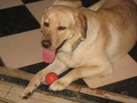
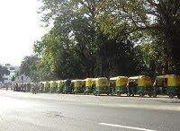

 

So here I am again, after two whole months of no blogging. The gloom of recession had cast a shadow around for me to think rationally.There were only a few words in our dictionary.Retrenching, downsizing, pink slips,wage cuts to name a few.

After the insanity of all this and a saturation point reached, I turned my attention to the smaller pleasures of life. What the heck ! Don't want to think about the days to come anymore so have started noticing the newly visible greens dotted along the roadside which I failed to noticed on my way to work everyday, what an eye candy...how could I miss it all along ?

And then, my attention turned to, my constant punchbag, Roger.He's my 2 year old pet labrador.The way his eyes would try to ask for my attention when I would ignore him is pure melodrama. A rascal that he is, with all his mischiefs, he did have an adorable side which would show up now and then. Especially when he was denied the delicious carrot halwa ! He tries every trick on this earth, including sniffing your mouth, to get even a spoonful of which I would part with in a moment of pity.

And lo my day is made !
