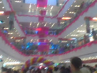

Baroda is mushrooming with retail malls, posh and welcoming to beckon the Gujju with a guarded pocket which threatens to tear at the seams any moment with heavy wads of cash. But one wonders what stops them from parting with their moolah lesser in these malls as compared to other Indians elsewhere in the country.

Knowing the nature of an average Gujju, especially the one that belongs to Baroda, he or she loves to dress well, eat well (not in a healthy way though!)and have a social circle to boast of.That explains those pompous farmhouse bashes, where every one who's a someone in Baroda, is seen dressed in the latest fads devouring the fat tandoori chicken which most Gujarati families would refrain doing in their own houses. And the open secret as it goes has best of the booze flowing in this dry state will find itself on the calorie count of most urban Gujjus.

But on the flip side Gujjus are known to be the best businessmen and hagglers, so they really are cost conscious as to when and where their money goes.Much to the grief of mall owners and retail giants All their extravagant attempts to generate sales have taken a dip.Wonder why inspite of all this demotivation there are new concrete commercial jungles dotting the cityscape?
