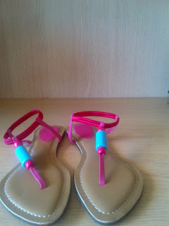
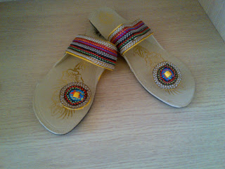
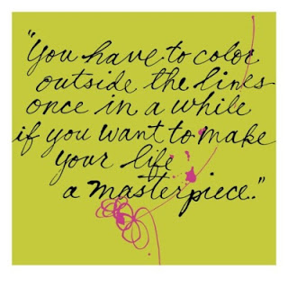

I am in mood for some happy colors! There's no better time than winter to go berserk with warm colors of the brightest hues. A stroll down Mumbai's Linking road, window shopping for nothing in particular but on look out for something interesting, landed me with two pairs of bright and cheerful footwear.

This one in shocking pink with blue beads had me drooling. It didn't help that there was a riot of colors to choose from, in this particular design...canary yellow, aquamarine blue, leaf green...wow! But this pink sure won my heart! These could be effortlessly teamed with a denim and tee for a coffee at the coffee shop down the lane. Or it could get dressier when clubbed with a funky fusion wear for an evening out at the club with loads of beads around the neck or wrist.

Just as I  bought and walked on happily with my first pair I spotted the second pair of  beauties bursting with color! Zigzags of rainbow colors ran merrily across the strap on this 'Khadau' styled chappals.

Although, I assumed that this pair would have limited clothing options to be paired with, I was wrong. They go amazingly well with my distressed Denim-Kurta-Jhola look as well as the traditional girl next door salwars with equal panache. And they are a hit when worn with harems and palazzo pants teamed with ganjis/racer backs !

These are definitely not extraordinary or unique footwear that I picked up but they sure make my feet happy and have temporarily satiated my hunger for instant mood uplifting colors!

                                                              -Colorfully yours !!
