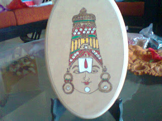

Mum, (Nirupama Parimi), has always been a keen learner.It’s a delight to observe a creative person like her, who wastes no time in learning an art/craft form and translating it into small pieces of creative collectibles. Among a long list of her creative pursuits like Quilt making, Tanjore painting,Decoupage and many more, her latest and most engaging stint has been with the art of Pyrography.

She came across this art form at a friend’s place.He had been practicing the art for years.So impressed was she by the medium, that she requested him to coach her on the same and within days she mastered it and also acquired a Pyrography pen, a pre-requisite to any Pyro-artist!

_**Pyrography** or **Pyrogravure** is the art of decorating wood or other materials with burn marks resulting from the controlled application of a heated object such as a poker. It is also known as **pokerwork** or **wood burning**. The term means "writing with fire", from the Greek pur (fire) and graphos (writing). It can be practiced using specialized modern Pyrography tools, or using a metal implement heated in a fire, or even sunlight concentrated with a magnifying lens._ _The result is a sepia toned image but many Pyrographic artists add colour using pastels, watercolor or acrylics. The best Pyrographic works successfully combine the subtle wood grain textures with beautiful line work and shading._

Sourcing the right equipment for her was not a big challenge, since I happened to be travelling abroad around that time, I could get her the exact thing required. There is a vast range of Pyrography tools available online but the basic equipment required is the Pyrography pen which is available in single-temperature, solid tip burner as well as variable temperature burner. But the bottom line is that they are all designed to do Pyrography on a variety of materials.

_A large range of tones and shades can be achieved. Varying the type of tip used, the temperature, or the way the iron is applied to the material all create different effects. After the design is burned in, wooden objects are often colored. Light-colored hardwoods such as sycamore, basswood, beech and birch are most commonly used, as their fine grain is not obtrusive. However, other woods, such as pine or oak, are also used. Pyrography is also applied to leather items, using the same hot-iron technique. Leather lends itself to bold designs, and also allows very subtle shading to be achieved. Specialist vegetable-tanned leather must be used for Pyrography (as modern tanning methods leave chemicals in the leather which are toxic when burned), typically in light colors for good contrast._

 _Pyrography is also popular among gourd crafters and artists, where designs are burned onto the exterior of a dried hard-shell gourd, usually with dramatic results._

<table class="tr-caption-container" style="margin-left: auto; margin-right: auto; text-align: center;" cellspacing="0" cellpadding="0"><tbody><tr><td style="text-align: center;"></td></tr><tr><td class="tr-caption" style="font-size: 13px; text-align: center;">&nbsp;Pictures,Courtesy&nbsp;: Nirupama Parimi</td></tr></tbody></table>

<table class="tr-caption-container" style="margin-left: auto; margin-right: auto; text-align: center;" cellspacing="0" cellpadding="0"><tbody><tr><td style="text-align: center;"></td></tr><tr><td class="tr-caption" style="font-size: 13px; text-align: center;"></td></tr></tbody></table>

<table class="tr-caption-container" style="margin-left: auto; margin-right: auto; text-align: center;" cellspacing="0" cellpadding="0"><tbody><tr><td style="text-align: center;"></td></tr><tr><td class="tr-caption" style="font-size: 13px; text-align: center;"></td></tr></tbody></table>

<table class="tr-caption-container" style="margin-left: auto; margin-right: auto; text-align: center;" cellspacing="0" cellpadding="0"><tbody><tr><td style="text-align: center;"></td></tr><tr><td class="tr-caption" style="font-size: 13px; text-align: center;"></td></tr></tbody></table>

<table class="tr-caption-container" style="margin-left: auto; margin-right: auto; text-align: center;" cellspacing="0" cellpadding="0"><tbody><tr><td style="text-align: center;"></td></tr><tr><td class="tr-caption" style="font-size: 13px; text-align: center;"></td></tr></tbody></table>

A month of patient experimentation later, mum slowly gained mastery over controlling the pressure and temperature of the pen. The result was a production of a series of beautiful sketches as seen above. She draws inspiration for the composition from wildlife and Indian mythology.Most of these sketches have been either gifted away to friends and relatives or made on order for some known people. She has never got around to exhibiting these works but continues to make new ones with the same zeal and enthusiasm she exuded when she held the heated nib against the wooden surface the very first time.
