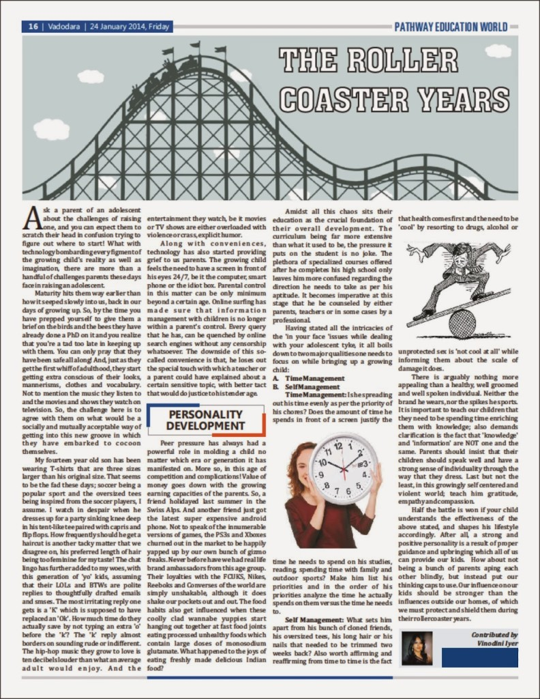

_Not my first article to be printed and published so far.Most of the other stuff that I have written in the past were published much before my own roller coaster years, thanks to my enterprising mother.She would meticulously file the dreamy amateur poems that I would scribble and forget about, at the back page of my notebooks,during particularly boring classes at school.And these, she would send in to the newspapers to be printed in the local kiddies talent section.She continued this tradition of filing my articles through my college life, until I finally stopped writing on paper!_

_This particular article, was written after being prompted by a friend who works with the particular publication group to write for their developmental and educational newspaper, 'Pathway Education World'.The subject I have written on, is a topic which is close to my heart, since I currently have a first hand experience in dealing with some of the issues mentioned in it.Scroll down further below the image if you don't wish to strain your eyes reading this scanned version of the print!_

Ask a parent of an adolescent about the challenges of raising one, and you can expect them to scratch their head in confusion trying to figure out where to start! What with technology bombarding every figment of the growing child’s reality as well as imagination, there are more than a handful of challenges parents these days face  in raising an adolescent. Maturity hits them way earlier than how it seeped slowly into us, back then in our days of growing up. So, by the time you have prepped yourself to give them a brief on the birds and bees they have already done a PhD on it and you realize that you’re a tad too late in keeping up with them. You can only pray that they have been safe all along! And, just as they get the first whiff of adulthood, they start getting extra conscious of their looks, mannerism, clothes and vocabulary. Not to mention the music they listen to and the movies and shows they watch on television. So, the challenge here is to agree with them on what would be a socially and mutually acceptable way of getting into this new groove in which they have embarked to cocoon themselves. My fourteen year old son has been wearing T-shirts which are three sizes larger than his original size. That seems to be the fad these days; soccer being a popular sport and the oversized tees being inspired from the soccer players, I assume. I watch in despair when he dresses up for a party sinking knee deep in his tent-like tee paired with capris and flip flops. How frequently he takes a haircut is another tacky matter that we disagree on, his preferred length of hair being too feminine for my taste! The chat lingo has further added to my woes, with this generation of ‘yo’ kids, assuming that their LOLs and BTWs are polite replies to thoughtfully drafted emails and smses.The most irritating reply one gets is a ‘K’ which is supposed to have replaced an ‘Ok’.How much time do they actually save by not typing an extra ‘o’ before the ‘k’? The ‘k’ reply almost borders to sounding rude or indifferent. The hip-hop music they grow to love is ten decimals louder than what an average adult would enjoy. And the entertainment they watch, be it movies or TV shows are either overloaded with violence or crass, explicit humor. Along with conveniences, technology has also started providing grief to us parents. The growing child feels the need to have a screen in front of his eyes 24/7, be it the computer, smart phone or the idiot box. Parental control in this matter can be only minimum beyond a certain age. Online surfing made sure that information management with children is no longer within a parent’s control. Every query that he has, can be quenched by online search engines without any censorship whatsoever. The downside of this so-called convenience is that, he loses out the special touch with which a teacher or parent could have explained about a certain sensitive topic, with better tact that would do justice to his tender age. Peer pressure has always had a powerful role in molding a child no matter which era or generation it has manifested on. More so, in this age of competition and complications! Value of money goes down with the growing earning capacities of the parents. So, a friend holidayed last summer in theSwiss Alps. And another friend just got the latest super expensive android phone. Not to speak of the innumerable versions of games, the PS3s and Xboxes churned out in the market to be happily yapped up by our own bunch of gizmo freaks. Never before have we had real life brand ambassadors from this age group. Their loyalties with the FCUKS, Nikes, Reeboks and Converses of the world are simply unshakable, although it does shake our pockets out and out. The food habits also get influenced when these coolly clad wannabe yuppies start hanging out together at fast food joints eating processed unhealthy foods which contain large doses of monosodium glutamate. What happened to the joys of eating freshly made delicious Indian food? Amidst all this chaos sits their education as the crucial foundation of their overall development. The curriculum being far more extensive than what it used to be, the pressure it puts on the student is no joke. The plethora of specialized courses offered after he completes his high school only leaves him more confused regarding the direction he needs to take as per his aptitude. It becomes imperative at this stage that he be counseled by either parents, teachers or in some cases by a professional. Having stated all the intricacies of the ‘in your face ‘issues while dealing with your adolescent tyke, it all boils to two major qualities one needs to focus on while bringing up a growing child:

**A. Time Management**

**B. Self Management**

**Time Management:** Is he spreading out his time evenly as per the priority of his chores? Does the amount of time he spends in front of a screen justify the time he needs to spend on his studies, reading, spending time with family and outdoor sports? Make him list his priorities and in the order of his priorities analyze the time he actually spends on them versus the time he needs to.

**Self Management:** What sets him apart from his bunch of cloned friends, his over sized tees, his long hair or his nails that needed to be trimmed two weeks back? Also worth affirming and reaffirming from time to time is the fact that health comes first and need to be ‘cool’ by resorting to drugs,alcohol or unprotected sex is ‘not so cool at all’ with the scale of damage it does. There is arguably nothing more appealing than a healthy well groomed and well spoken individual. Neither the brand he wears, nor the spikes he sports. It is important to teach our children that they need to be spending time enriching themselves with knowledge; also demands clarification is the fact that ‘knowledge’ and ‘information’ are NOT one and the same. Parents should insist that their children should speak well and have a strong sense of individuality through the way that they dress. Last but not the least, in this growingly self centered and violent world; teach him gratitude, empathy and compassion.

Half the battle is won if your child understands the effectiveness of the above stated, and shapes his lifestyle accordingly. After all, a strong and positive personality is a result of proper guidance and upbringing which all of us can provide our kids with. How about not being a bunch of parents aping each other blindly, but instead put our thinking caps to use? Our influence on our kids should be stronger than the influences outside our homes, of which we must protect and shield them during their roller coaster years.
