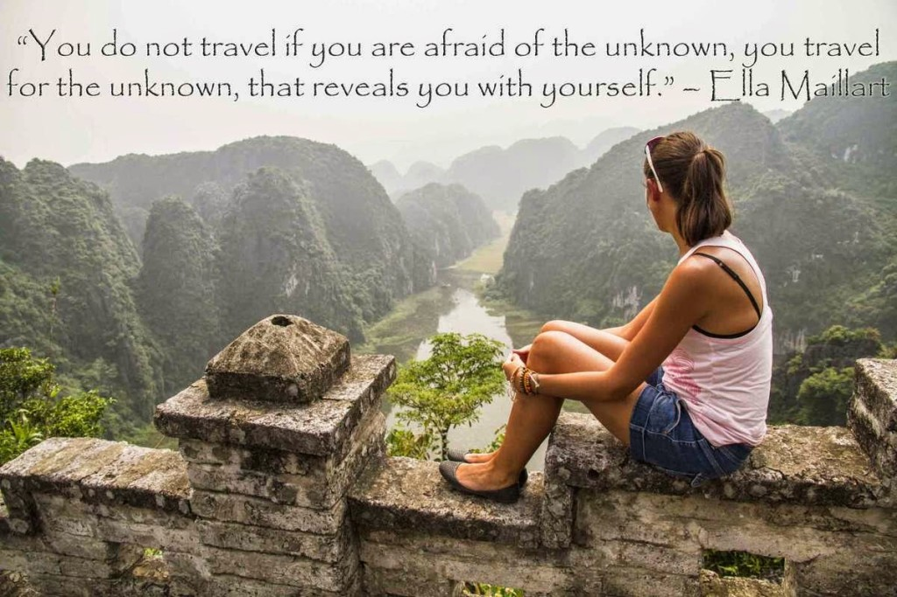

They say: _'Not all those who wander are lost.'_

....but who cares about getting lost if the whole journey and experience is worth it!

There's something about traveling that gets me excited! I am a sucker for new experiences.Throw in an adventure or two and that makes it a jackpot.

Though, I do not enjoy the procrastinating ordeal of packing and unpacking and yet again packing...you see, no matter how much I agree with the advantages of traveling light, I can never bring myself to pack my stuff light.I love to indulge in my choices when I am on the go.So its a tough battle to exclude that one extra pair of clothing that makes the bag bulge so badly that you can no more zip it up without using all the required skills of coercion.The logic I give myself is: 'Who knows..I might end up splashing in the water somewhere and wet my clothes...might require the extra pair.'

The fun begins on boarding the means of transport.I use this time to study strangers, in trains,flights and buses.The manner in which people behave in the middle of public glare is definitely a put on act, most of the times.Trying to decipher the 'real them' is my favorite pastime. It doesn't take much to figure out.Just notice the way they talk to the flight attendants if they failed to provide a non-vegetarian meal as requested.Or when someone's child is bawling non-stop on the berth opposite.And when the filthy urchin on the sidewalk brushes accidentally past them.The way they react spontaneously to such situation is enough to gauge the true side of a person's nature.

Destination reached.The first thing I absorb is the local culture,markets,food and other experiences....all the unique sights, sounds and smells that the place distinctly offers.Exerting my mind and energy absorbing too much historical info and tedious sightseeing excursions is something I tend to avoid and keep it to a moderate measure.Exception to this rule could be something truly off beat and not worth missing.I succumb to the local flavors of food and shopping, if given a choice between exotic lifestyle malls versus the former.A foodie at heart, with a penchant for accquiring new tastes gives my appetite a new dimension altogether when I am at a new place.I usually would have done my homework before I started off for the place on the local delicacies that I should not miss sampling.

Not to speak of the innumerable pictures I capture.It is my way of freezing the moment into a memory by means of clicking photographs.So, the obsessive shutterbug in me gets into action at every given opportunity worth capturing.

Anything that gets me close to nature at its untouched best wins me over hands down.Nothing compares to losing yourself in the magic of glorious sunrises and soothing sunsets.And if wilderness is where I find myself in midst of, straining my ears to the call of night birds under starlit nights or discovering the occasional scampering mongoose from the middle of nowhere would be something that drives me for more.Winding through the misty mountainous slopes and valleys, humming my favorite song absentmindedly is yet another experience I cherish.I recently realized, that most often a proximity to water bodies brings out two sides of a human...its either the day dreamer or the hidden child.In my case, I take turns with both sides of me.I can sit by the lapping waves of the sea and dream on with my eyes open for as many sunsets as I can possibly sit through.Or unleash the child trapped inside me when I get splashing in the river with a few fun people.

They also say: _'Travel makes a man wiser.'_ But I say: _'Travel brings a woman closer to herself.'_

....So, where are we going next?

 

[A to Z Challenge.](http://www.a-to-zchallenge.com/)

