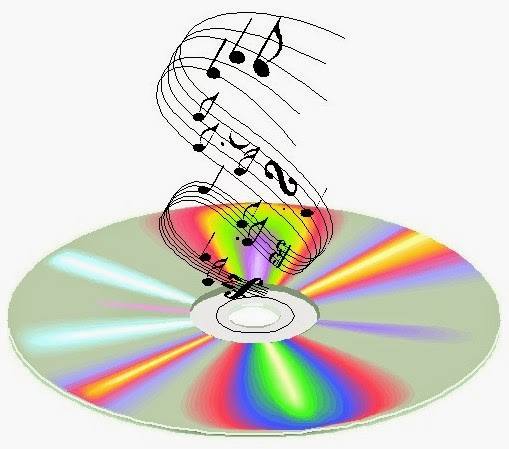

Have you ever walked into a store and made a quick exit just because the music being played there happened to be loud, blaring, cheap in taste or had offensive/abusive language?

As a visual merchandiser, the one detail I always get my attention to is the music that plays in the particular retail store. Insignificant as it might seem, one cannot undermine the impact of the music played in a retail environment on the sales generated. Many a time, I have discreetly observed customers getting turned off by the music played in particular stores and leaving in a huff for the same reasons without making a purchase. At times it is the volume that is several notches higher than appropriate, and at times it is the quality and content which is either unacceptable or boring. Hence, a walk-in that could have beautifully got converted into a sale ends up as a loss of potential customer-all because of the ignorant overlooking of such seemingly inconsequential details.

There are various details one looks in to create a particular look and feel or rather an atmosphere that boost and generate a sale. Space is consciously created to create certain effects on consumers and influence their purchase decision. The atmosphere consists of various elements such as brightness/lux levels, size, smell, temperature, music, softness, smoothness, and shape.

Sound impacts people in four different ways-physiologically, psychologically, cognitively, and behaviorally. But 'playing music because everyone else does' should not be a retailer's rationale. The audio played within a store should be appropriate both to the brand values and to the customers. If the motive is that the customer dwells around, playing fast-paced music would be a mistake, because it tends to make people do things more quickly rather than at a relaxed pace which the retailer intends to encourage.Although the important thing to realize here is that the same solution does not work for everyone. Function, physical environment and equipment, culture, and brand value all play a part.

Understanding a retailer's brand and aspiration there becomes mandatory before choosing the playlist. A playlist could be segmented by objectives and location. Some chains want a different or more exclusive feel for their flagship stores in urban/metropolitan cities, therefore the frequency of updates and also access to the latest music is preferred at such places.

In food retail, retail communication is an important element and radio-style transmissions have become popular, especially as they can help a retailer to point shoppers towards promotions, special offers and reinforce a company's ethos.

A lot of retailers tend to leave a playlist to loop for years on end. Things change all the time. It doesn't matter how well researched a playlist is, nothing beats testing, reviewing, and refreshing the sound to make sure it is producing the results a retailer is looking for.

A lot of specialized software has been designed keeping in view the growing need by retailers for the right kind of music that would help them achieve a conducive atmosphere to generate sales. This software help classify and choose music content and create a default schedule that gets programmed to play in blocks, typically called 'dayparts' in the retail industry. This will play pre-defined sets of music and messaging media content at scheduled times during the day, enabling customer-targeted content to be tailored to trading patterns, and employee communications to be tailored for pre and post-opening hours.

Music can do wonders in making the shopping experience a delightful one for the shopper and also help the retailer create the desired brand imagery. It just needs to be conducive enough for the customer to let his hair down and enjoy the shopping experience which in turn would help the retailer achieve his targets.

Happy Selling!

You may also want to check out the links below: [5 Immediate impacts of music in retail.](http://www.immediaplc.com/5-immediate-impacts-music-retail) [Suffer.Spend.Repeat.](http://www.nytimes.com/2012/12/09/opinion/sunday/suffer-spend-repeat.html?pagewanted=1&_r=0) [Sound Advice.](http://moodmixes.com/advice)

[Ultimate Blog Challenge](http://ultimateblogchallenge.com/)

[A to Z Challenge](http://www.a-to-zchallenge.com/)

