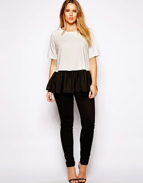
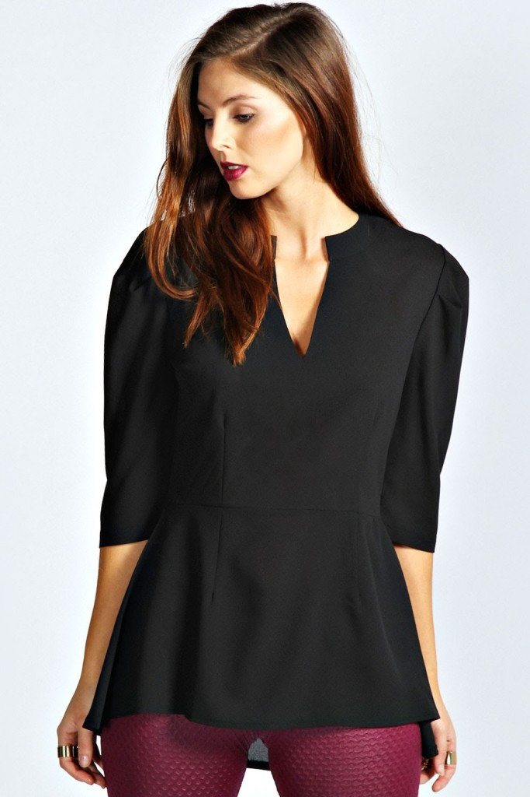
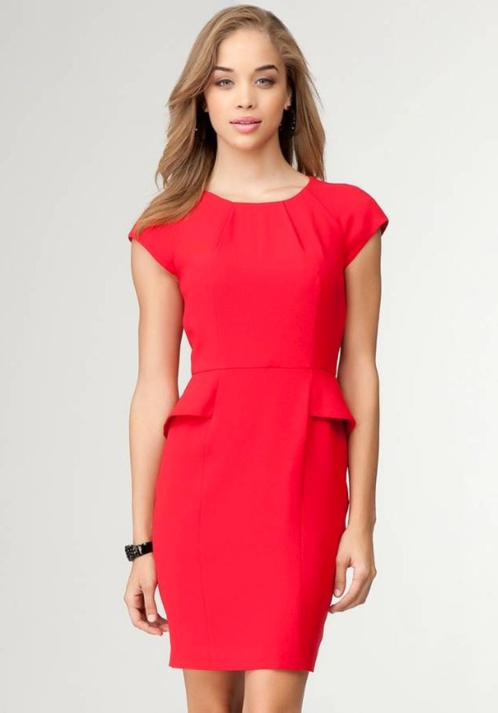
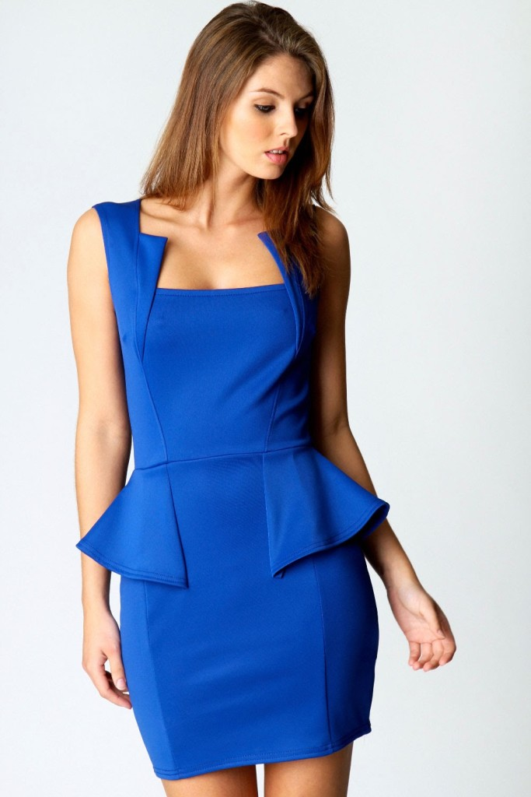
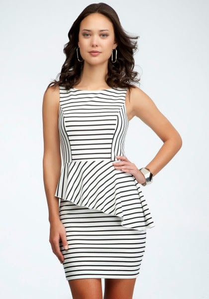
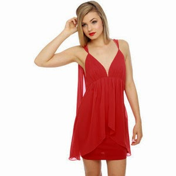
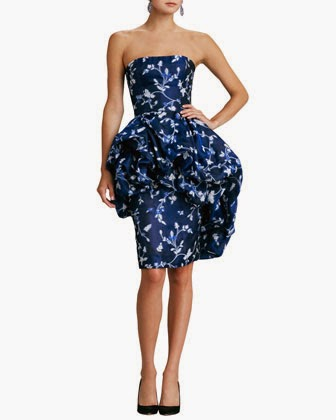
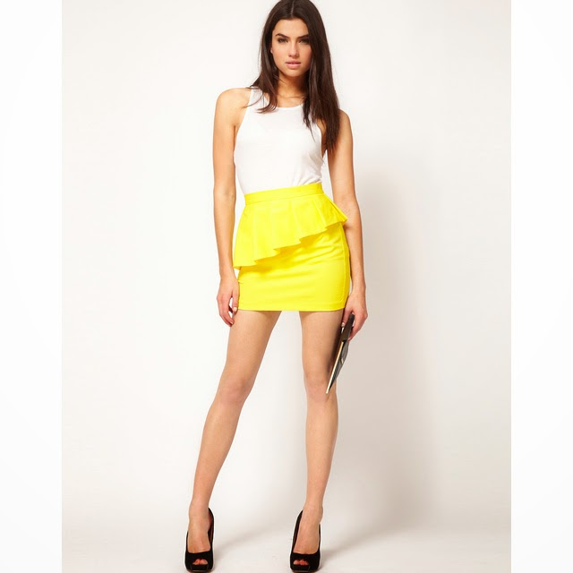

The peplum has been around for a while now.This style is a comeback from the 1940s to 2012.Essentially it is a flared ruffle attached to the waist of a jacket, bodice, top, dress or a trouser.I am not a big fan of this particular silhouette.But it has been around for quite a while now to be ignored.One can easily go wrong with it if worn without giving much thought.It comes across as a bit costumey and tends to get crushed easily on the rear.Not the most flattering silhouette but yet has a lot of potential to be experimented with.  
  
When the peplum began its comeback, it was speculated that it was just another catwalk trend that would probably make for a few showstoppers and move out from the ramp itself.But this year this trend has gotten only bigger.After being seen as a trend to reckon with for a fairly long period, most retailers worth their salt, put one into production to ensure that their visibility on the trend pages does not suffer.But not many would vouch for it as a commercial hit.  
  
Yet, peplum is everywhere! From peplum dresses to tops, skirts, shorts and even pants.Peplums add fullness to the hip area and cinch the waist.Hence its really important to know which style of peplum would flatter your figure.  
  

**If you have a curvy body...**

Opt for woven fabrics instead of knits.Pair them with tapered,cropped or woven trousers instead of skinny jeans.Darker colors should work better for you.  
  

  

**If you are short...**  
Choose a peplum with less volume.The width of the peplum should be less than eight inches.A single color outfit will help you look taller.  
  

  
**If you have barely there hips...**  
Structured or flared peplum create an illusion of a curvier behind.Opt for ones with prints and stripes.  
  

  
**If you want to conceal your tummy...**  
Go for peplum bodices that have slightly higher waists...just an inch or two above the natural waistline.Does wonders to conceal a midriff you might be less than thrilled to show off.A flowy outfit should be a better bet than a structured one.  

  
**If you want to slenderize your legs....**  

Choose a knee or mid-calf length skirt or dress.Else pair a peplum top with tapered trousers.This helps draw the eye upwards.  
  

  

I haven't yet had the chance to pick a peplum for myself though.Time to get into one!  
  
[Ultimate Blog Challenge](http://ultimateblogchallenge.com/)  

  
  
  

  

  

  
  
  
  
[A to Z Challenge](http://www.a-to-zchallenge.com/)  

