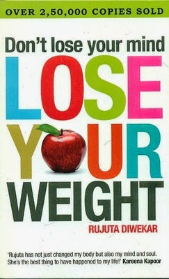

About 3 years back I was gifted a book by a friend. It wasn't unusual for me to receive books from him, since he happened to be a well read gentleman and would often send me books as a token of his goodwill. Only this time around, when I opened the wrapper, I freaked at the title of the book. 'Don't lose your mind, lose your weight!' I quickly scanned myself top to bottom, in the nearest mirror available! Really? Had I put on so much that I would require a book to help me lose weight? Still unsure, I called him immediately to confirm my apprehension, and all he said was, 'just read the book.'

I did not take him seriously then and did not read the book for the next couple of months. On one lazy weekend, with nothing better to read, I started flipping through the book that I had carelessly tossed aside. And in no time, I was hooked to it!  'Don't lose your mind lose your weight' is a book written by Rujuta Diwekar, a celebrity dietitian who was  responsible for the much hyped 'size 0' figure of the famed Indian actress Kareena Kapoor Khan and a lot many other celebs who owe her for their weight loss and increased vitality. Unlike most diet books, this book gave practical solutions for overall health benefits as against only losing weight. I felt it was quite doable and decided to give it a try.

It did require a bit of will power and self motivation but I started seeing results very soon. Not only did I observe renewed energy levels, but from the first month itself, I started losing approximately 1 kg every month. I looked forward to checking my weight on the weighing scale every morning. That itself was quite rewarding. It wasn't that I was obese by any measure, but losing a few pounds would have definitely been great! Within six to seven months I lost about 8 kgs. Although there are a lot many helpful tips in the book, the ones that I remember and really could adhere to and follow like a bible are the ones I would like to share as below:

- Rujuta stresses the importance of not depriving the body of food unlike other diets which would starve you. On the contrary this diet finds you having food almost all the time! When the body knows it is going to get food at a periodic break, it starts demanding less and thereby the consumption breaks up into small quantities (the ideal quantity per meal should be just enough to fit in your cupped palms) and at regular intervals working wonders on your metabolism.

-  Decrease the intake of sugar (only 2 tsps a day, that includes sugar in the tea/coffee you take too. I stopped taking my tea and coffee with sugar ever since then, coz I compensate the 2 tsps with my craving for desserts!), maida (processed white flour) and white rice(substitute with brown rice), and deep fried stuff. The intake of oil should be limited to 2 tsps a day. She does not advocate abstaining anything completely since the body requires all of these in moderation.

- Have freshly cooked food. The time between the food reaching you from the pan to the table also decides how soon your body will digest it. So out go the ready-to-cook instant food, cereals, white bread, bottled pickles, jams and sauces.

- Don't start your day with a cup of caffeine. Caffeine jump starts the body into alertness but that very action slows down your metabolism. She limits the intake of caffeine to 2 cups a day, ideally in the first half of the day. You could substitute the caffeine craving with green tea, which also works wonders to stabilize your metabolism. The best thing to have once you wake up in the morning is a whole fruit (not fruit juice). The body is in a better state to absorb the goodness of the fruit first thing in the morning. If you are too hooked to having caffeine have it after an hour of having the fruit.

- Have a healthy breakfast within 2 hours of getting up. Not the processed variety. But the piping hot variety that we make in Indian households - 'poha',' upma', 'idlis', eggs minus the yolks and so on.

- After two hours snack on something healthy like peanuts or roasted chickpeas.

- Break your lunch into parts. Have the heavier part of your lunch early. Say if you have had your breakfast at 9, have your proper lunch at twelve. Two hours after this lunch have something light (your second lunch). You could have a bowl of sprouts or some salad at this time.

- At tea time, 2 hours later, have some healthy snack. I always had small packs of peanuts and roasted chickpeas in my bag for these in between snacks.

- Yet another two hours later have a healthy yet filling snack like a 'dosa' or 'poha'. Now, this used to be a challenge for me coz I would be traveling back home from work at this time. So I did cheat here and would have energy bars made from natural ingredients like puffed rice, honey and raisins.

- Dinner should be had 2 hours before the time you go to sleep. But ideally having dinner around 7 pm is supposed to be a healthy option.

- Have a glass of milk or buttermilk before you go to bed. Do not sleep with an empty stomach, since dinner was early and your body needs that last drink to last till the next morning.

- Above and all this, she advocates having cheese, ghee (clarified butter), nuts in moderation and whole fruits (as opposed to juices) for the host of benefits they provide to your body besides lubricated joints, glowing skin and healthy hair.

- Do not cheat yourself by eating snacks available in the market which claim to be fat free and sugar free. These can never replace the goodness of natural and unadulterated fresh food.

- Make sure you eat your food quietly and chew it slowly. Avoid eating in front of the television and talking while eating your food.

- Exercise a bit. I would brisk walk for half an hour, 3 days a week. Not only does it help you kick calories but it also releases those feel-good endorphins that make you glow with health!

- If you can manage a day in a week when you can go saltless, do it.

- Once in a week, you could indulge in a sin of your choice. Maybe a bowl of your fav dessert, a slice of pizza or a samosa, whatever you felt deprived of, but have it in moderation. Once you do this, its easier to be strong the rest of the week, since you know that you really aren't depriving yourself!

- She strongly advocates the benefits of freshly made Indian food which is balanced in all ways.

As expected, doing all this came with a host of advantages and disadvantages.

**Disadvantages:** People scorned at me at work, for the fact that I was constantly eating and also for the fact that 'I was on diet'. I stopped eating out at restaurants and places that wouldn't cater to 'my kind of food' - so down went my social life as well. But soon I found my way around these things and situations and took it in my stride.

**Advantages:** I looked healthy and felt energized. My craving for all the wrong food went down and I developed a taste for the healthier options. People who scorned me noticed my weight loss and started taking notes from me on the diet I followed. I could fit into my clothes from college days. I had a new haircut and new wardrobe.

When I look back, I realize it wasn't really a diet, it was lifestyle change which most of us could benefit from. After about an year I bumped into the gentleman who had gifted me the book and he could not believe what he saw! I had lost 8 kgs and did I look different? Oh yes I did!

Pssstttttt...2 years later I moved from the city I used to work in, to my hometown and kinda slipped into a lethargic mode. I have gained back some of the weight I had lost then. I continued with a lot of the above points but have been cheating on moderating the intake of sugar, maida/white rice and deep fried stuff. While writing all this, I have been making a mental list of what all I need to correct, since I intend to start with my previous lifestyle very soon again and get back to the ideal weight I had achieved back then. Wish me luck!

Check out Rujuta Diwekar's website to know more about her:

[http://www.rujutadiwekar.com/](http://www.rujutadiwekar.com/)

[Buy Rujuta Diwekar's books online.](http://www.amazon.in/s/?ie=UTF8&keywords=rujuta+diwekar&tag=googinhydr1-21&index=stripbooks&hvadid=29469905654&hvpos=1t1&hvexid=&hvnetw=g&hvrand=18326885106149210864&hvpone=&hvptwo=&hvqmt=b&hvdev=c&ref=pd_sl_3kkqociyom_b)

[Ultimate Blog Challenge](http://ultimateblogchallenge.com/)

[A to Z Challenge.](http://www.a-to-zchallenge.com/)

