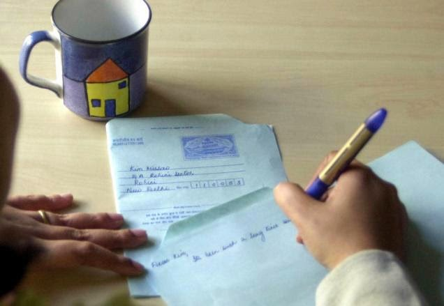

The art of letter writing is dying a slow death with the advent of the internet. And with it dies the personal touch one could add to our communication. No doubt, emailing and social networking options are faster and more convenient but they can never replace the joy of receiving a handwritten note.

It has been ages since I've last seen a postman. Remember those days when he would stop by to deliver your mail? No email can substitute the kind of anticipation an unopened letter with colorful stamps pasted on it generated back then. Anticipation about the content that lay folded in secrecy till the envelope was ripped open. The communication I am talking about is those personal ones that you would receive from friends and relatives. Not the ones that you still receive from your credit card companies! Those were days of having pen pals. I remember having a pen pal from Japan. We would write to each other almost every month. The thrill of receiving a note from someone from a different ethnicity was novel in those days. Until the community of online messengers invaded our lives and shrunk the distances across the globe to 'just a click away'!

A fond memory of letter writing from my childhood which remains close to my heart is the monthly letter-writing ritual that my maternal Grandpa had inculcated in me and my brother. He had retired from his services as a district magistrate and had settled in the south of India. We would only see him twice a year when we visited him during the holidays. Those were times before we got connected with a telephone line. Since he loved to hear from us regularly, he disciplined us to write him a letter on our own, every month without taking help from an adult or the dictionary. We would do so.Diligently.But that was not all. After a few days, my letter would come back to me dotted with red circles around those words which had spelling mistakes! I would have to look upon those words in the dictionary and rewrite each of those words, corrected, five times and send it across to him again, so that he knew that I got them right! I would it, grudgingly, every single time. But you can't argue with a 'Judge', can you?!

Thanks to the spell check function now, one doesn't need to rack their brains too hard while punching on the keyboard. The downside being, the dependency we have developed on our gadgets. My once beautiful handwriting is no more the same, coz I don't seem to be using the pen as often as I used to. As we find ourselves increasingly deprived of the human touch in a lot many ways these days, with our smartphones and computers becoming our best helping allies, we yet remain to figure out how many more human functions, technology might take over from us and render us with increased attrition.

[Ultimate Blog Challenge](http://ultimateblogchallenge.com/)

