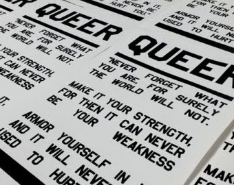

_**Queer** are the ways of this world_ 

_and queerer are the people who inhabit it_

_**Queer** is that friend, who claims to be your close friend,_

 _yet plays games with you for their own selfish interests_

_**Queer** are you, to watch the game yet pretend like all is fine_

 _and let it be, coz you don't want to lose them_

_**Queer** is that guy, who chases a girl to the moon to woo her till she gives in,_ 

_only to dump her a few days later for someone new_

_**Queer** is the girl, to take this guy back again_ 

_when he gets dumped_ _by the girl he dumped her for, coz she thinks she loves him_

_**Queer** is the child, who gives up on his parents who taught him how to walk,_ 

_just when they become too frail to walk coz his spouse can't stand them_

_**Queer** are the parents, to forget all said and done by their child and help him yet again_ 

_when he expects a chunk of their hard earned wealth coz they love him no matter what_

_**Queer** is the person, who's jealous of his sibling's happiness and success_ 

_coz he couldn't make it for himself_

_**Queer** are you, to still help your jealous sibling when they go through a rough patch_ 

_coz you want to see them happy_

_**Queer** is the man, who finds faults with the very qualities in his spouse_ 

_that once drew him to her_

_**Queer** is the woman, who still puts up with it_ 

_and strives to meet the expectations of her spouse and family to feel accepted_

_**Queer** is the boss, who gets insecure with his subordinate's excellent performance_ 

_coz he feels the credit will go to the subordinate instead of him_

_**Queer** is the subordinate, who inspite of being treated shabbily by the boss_

 _still helps the boss achieve his targets with all his genuine efforts_ 

_coz he believes that they still are a team_

_**Queer** is the society, that offers false empathy and pseudo help_ 

_just to get a better seat to watch your struggle_ 

_and secretly feel relieved that it wasn't happening to them_

_**Queer** are you, to share your worries with a world full of people **Queerer,**_ 

_in spite of knowing that most of them will judge you_

 _but very few will help you._

[Ultimate Blog Challenge](http://ultimateblogchallenge.com/)

[A to Z Challenge](http://www.a-to-zchallenge.com/)

