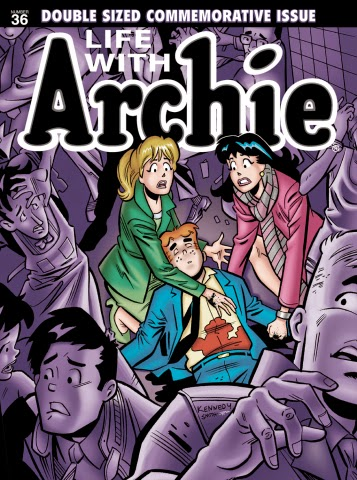

One comic series that colored my imagination right from childhood to teens, through adulthood, was the Archies series. I still flip through an Archie comic on random days, when I require a hearty dose of laughter! The light-hearted banter of the fictitious characters of Riverdale High often sounds almost real and existent in some part of the world. Loverboy Archie Andrews, and his girls, the modest Betty and the super-rich Veronica. Jughead and his food obsession.His awkward Big Ethel.Reggie and his wicked ways.The possessive Big Moose and his 'duh'.The studious Dilton.The harrowed Mr.Weatherbee.Pope Tate's yummy burgers and so much more!! Each of these endearing characters was etched with so much precision that you could almost guess what they would think and do next!

In the year 2009, Archie got married. To Betty.And to Veronica.In two separate issues that covered both versions of the stories much to the surprise of their avid readers. And if this bit was not enough to derive an exclamation from you, the news that Archie is soon going to die might just grab your eyeballs! Yes, this shocking news was announced by the group recently. It was a strategy planned long back. The July issue covers the part where Archie dies trying to save a friend's life. This piece of news has me heartbroken, the way I would mourn the loss of a dear friend!

If I'd ever get a chance to choose my rebirth, I would love to take birth in an Archie comic as one of the characters. Anyone of them. The whole gang rocked! In Riverdale, amidst the eccentric chaos that composed of the life of Archie Andrews.RIP Archie Andrews...you shall be dearly missed!

Read on for more:

LEGENDARY COMIC BOOK CHARACTER ARCHIE ANDREWS DIES IN JULY

 Archie Comics, the acclaimed and bestselling comic book publisher that is home to some of the best-known pop culture creations in the world, including Archie, Jughead, Betty & Veronica, Josie & The Pussycats, Sabrina the Teenage Witch and the hit AFTERLIFE WITH ARCHIE series, announced the unthinkable today: Legendary comic book character Archie Andrews will die to conclude the hit LIFE WITH ARCHIE comic series.

 The iconic comic book character, beloved by millions around the globe for over 70 years, will sacrifice himself heroically while saving the life of a friend in the pages of July’s LIFE WITH ARCHIE #36, the final issue in the flash-forward series, which spotlights Archie’s adventures after high school and college.

 “We’ve been building up to this moment since we launched LIFE WITH ARCHIE five years ago, and knew that any book that was telling the story of Archie’s life as an adult had to also show his final moment,” said Archie Comics Publisher/Co-CEO Jon Goldwater. “Archie has and always will represent the best in all of us—he’s a hero, good-hearted, humble, and inherently honorable. This story is going to inspire a wide range of reactions because we all feel so close to Archie. Fans will laugh, cry, jump off the edge of their seats and hopefully understand why this comic will go down as one of the most important moments in Archie’s entire history. It’s the biggest story we’ve ever done, and we’re supremely proud of it.”

 The story will be available in multiple formats, including an extra-large magazine-size LIFE WITH ARCHIE #36, two comic-sized issues—LIFE WITH ARCHIE #36 and #37—and a trade paperback collecting the entire story, written by regular LIFE WITH ARCHIE writer Paul Kupperberg, with art by Pat & Tim Kennedy and Fernando Ruiz.

 While LIFE WITH ARCHIE #36 shows readers Archie’s final moments, #37 leaps a year into the future, showcasing how the remaining members of the Riverdale gang—including Jughead, Betty & Veronica and Reggie—have honored the legacy of their dear friend. Both stories will be collected in the double-sized LIFE WITH ARCHIE #36 magazine and upcoming trade paperback.

 In addition to the acclaimed regular LIFE WITH ARCHIE creative team, the two comic book issues—sold exclusively at comic shops in July—will feature a pantheon of artistic luminaries contributing covers to the historic issue, including Francesco Francavilla, Fiona Staples, Ramon Perez, Walt Simonson, Jill Thompson, Mike Allred, Cliff Chiang, Adam Hughes, Tommy Lee Edwards, and Alex Ross.

 **ABOUT ARCHIE COMICS:**

 Archie Comics is the leading mass-market comic book publisher in the world and the home to a wide array of the most popular humor, action-adventure and superhero characters in entertainment, including Archie, Jughead, Betty and Veronica, Reggie, Kevin Keller, Josie, and the Pussycats, Sabrina the Teenage Witch, Afterlife With Archie, The Fox, The New Crusaders, The Shield, Li’l Jinx and many more. Archie Comics have sold 2 billion comics worldwide and are published around the world in a number of languages. In addition to comics, Archie characters have been featured prominently in animation, television, film, and music.

Source:[http://www.archiecomics.com](http://www.archiecomics.com/)

[Ultimate Blog Challenge](http://ultimateblogchallenge.com/)

[A to Z Challenge](http://www.a-to-zchallenge.com/)

