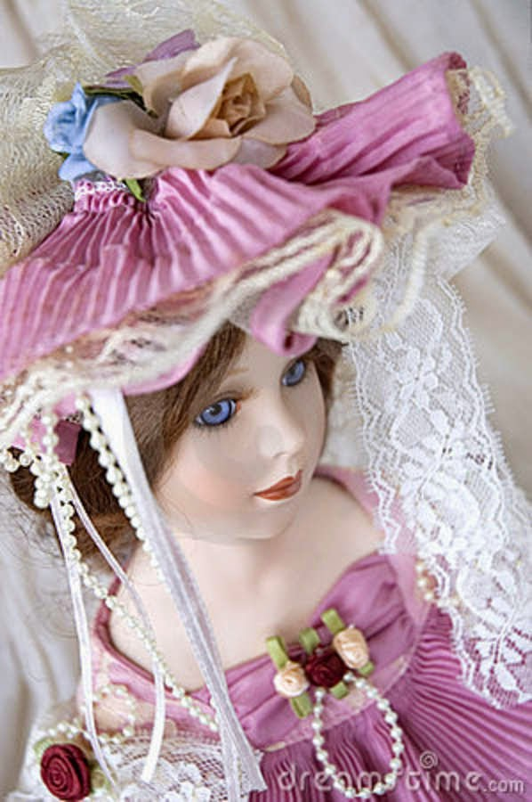
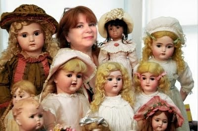

No matter how old you grow there's always a hidden child in you that peeks out spontaneously when you happen to visit a toy store. Every time I visit the High Street Phoenix Mall at Lower Parel, in Mumbai, the huge life-sized teddy bear waving out cheerily from the balcony, to the people passing by the entrance of 'Hamleys, The Toy Store', just tempts me to step into their store. Not for the want of buying anything, but just for the fuzzy warm feeling of excitement that accompanies childhood memories of playing with those toys.

<table class="tr-caption-container" style="margin-left: auto; margin-right: auto; text-align: center;" cellspacing="0" cellpadding="0" align="center"><tbody><tr><td style="text-align: center;"></td></tr><tr><td class="tr-caption" style="text-align: center;">Hamleys Toy Store at High Street Phoenix, Mumbai</td></tr></tbody></table>

But really, back then we had such limited options of toys, as compared to the magnitude of assortment offered in today's market. Be it educational toys, puzzles, toy trains, dolls, stuffed toys, or good old Legos. Welcome to the current world of Beyblades, action figures, PS3s, and of course the incredibly commercialized glamour doll 'Barbie.' Some of them are so ridiculously priced that you end up wondering if you were better off in your days with those handfuls of toys that you went on to play with for years on end. I had a huge doll that originally belonged to my maternal granny who passed it on to my mum, who again played with it through her childhood and dutifully passed it on to me. That was the last generation the doll went to. My butter fingers ended up damaging her permanently. I had my fair share of playing with it though! Can you imagine doing the same at this age? Passing on your kid's toys to the next two generations?! I doubt it.

A secret I am not shy to share openly is that my fascination for dolls did not end with my childhood! I still love collecting dolls from all over the world. Not the Barbie variety. But those authentic classic ones with beautiful long and curly hair, thick eyelashes and girlie frills, laces, and bows. Some day I dream of having a large collection of dolls from across the globe, which I should be able to showcase proudly and in a proper way. In my current scenario, I'm unable to do so coz of space constraints. Often people accuse me of being childish to have such whims, but who cares. They probably don't know the difference between being childish and being childlike! _Being childlike liberates you to grow mature yet letting the child in you live on its dreams, untouched, without being weighed down by the bindings that come with adulthood._

**Kathy Libraty, an antique doll collector from Brooklyn, New York, has spent the last 25 years searching for antique dolls, and now has an inspiring collection of over 1,000 objects worth around $2 million.**

<table class="tr-caption-container" style="margin-left: auto; margin-right: auto; text-align: center;" cellspacing="0" cellpadding="0" align="center"><tbody><tr><td style="text-align: center;"></td></tr><tr><td class="tr-caption" style="text-align: center;">Kathy Libraty with her doll collection. Image Sources: http://chairforcengineer.blogspot.in, http://thumbs.dreamstime.com</td></tr></tbody></table>

I once worked with a well-known retailer who tied up with a brand that enabled their customers to make their own stuffed toys. The brand offered to help you choose the body, the machine fills it with the stuffing of their choice, and later dress and accessorize the finished product. The gleeful expressions that showed up on both, the kids and more so on the adults while doing this were such a delight to watch! So much to prove that the child in us never dies, it just lies dormant in some corner of our psyche. All it takes is a fun childhood memory or maybe a toy to bring out that child in you!

I still go awwwww...when I see a particularly cuddly teddy! In fact, most of the stuffed toys I have been gifted in the last few years have been from my son!

_Did you know that the teddy bear derives its name from Theodore 'Teddy' Roosevelt, the famous hunting President of the USA? The history of how the first teddy bear originated and evolved as a toy is rather interesting. Read on here:_ [History of the Teddy Bear.](http://teddy-bear-artists.com/TBhistory.htm)

Do you have a memory of that one special toy that still brings a smile on your face when you think of it? Leave me a comment...I would love to know about it!

[Ultimate Blog Challenge](http://ultimateblogchallenge.com/)

[A to Z Challenge](http://www.a-to-zchallenge.com/)

