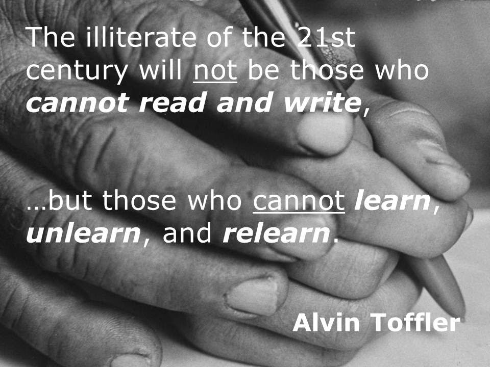
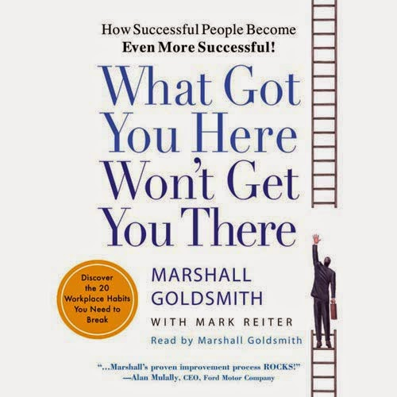
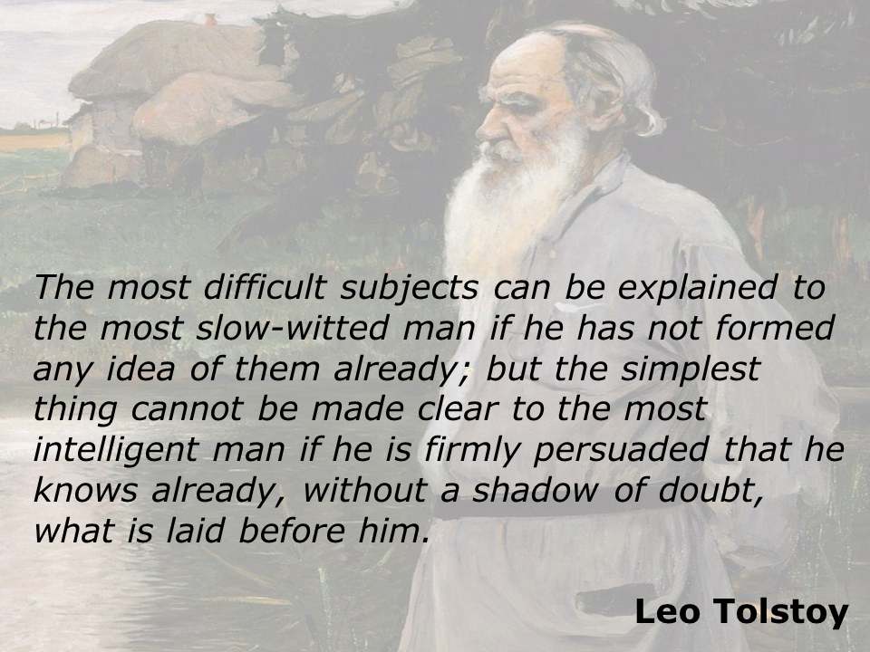
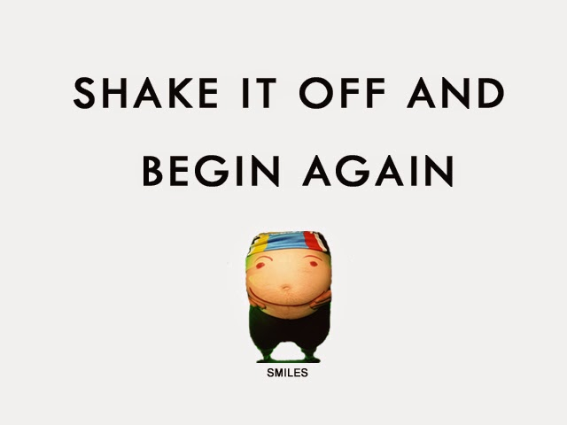

The lines above resonate deeply with me. More than once in life, have I had the opportunity to learn, unlearn and yet again relearn. I have been transported to new places, experiences, skill sets that I honed, exposed me to radical thinkers, some who influenced me, corrected me, and few who mentored me. And it did not end there. I still strive to evolve in every sphere of my life, with a never-ending quest for the best ways to do so.

I'm unsure if many get the same kind of opportunities to go through this whole roller coaster ride of learning new things. Only to discover a few days later, that the good old learning no more works as well as it used to, in the days we have traveled into- the present. Perhaps the learning was good for the duration it served everyone well. But over a period of time, the same learning can be challenged with the evolution of a diametrically different/opposite concept in the same context of knowledge and information. Thus it becomes mandatory to unlearn what we learned in the past, to relearn what has proven to work better in the current scenario.

The process of learning and relearning is relatively a cakewalk as compared to that of unlearning. Certain habits, thought processes, lifestyle changes die hard, are stubborn to change and you often start questioning and doubting the whole theory you are trying to relearn. How well you address these doubts and questions is what decides the extent of unlearning you have achieved. Quite a cathartic process actually!

A senior ex-colleague of mine often used to quote the title of this book,**' What Got You Here Won't Get You There'** by Marshall Goldsmith. He would state this quote every time he wanted his team to think of out-of-box solutions, to further add value to their task at hand. The essence of the book is indicated in the title itself. What it says essentially is that what gets you to the top won't take you further because sometimes we develop or rely on habits and practices that may hinder our future growth. Simply put, our previous success prevents us from further success. Marshall states examples of how people's habits stop their growth.

The problem is that even if people do understand that there is a behavior that needs to be re-looked at, they may not be willing to change because they tend to believe that this behavior is essential to their success. Once you identify the habit you need to change, start with a renewed commitment to get better, the process of unlearning starts. He also advises you to advertise the fact that you are changing and enlist help from people who wish to see you change. Then, start listening with the body, heart, and soul. Be grateful. Express gratitude. Research and follow up on what you have begun or learned, even at the cost of hiring a coach, else what you end up gaining is just knowledge, not the much-needed information along with the reasoning.

**Learn.Unlearn.Relearn.Evolve.**

**Good luck!**

[Ultimate Blog Challenge.](http://ultimateblogchallenge.com/)

[A to Z Challenge.](http://www.a-to-zchallenge.com/)

