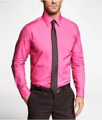
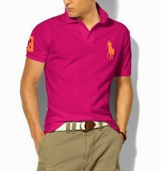
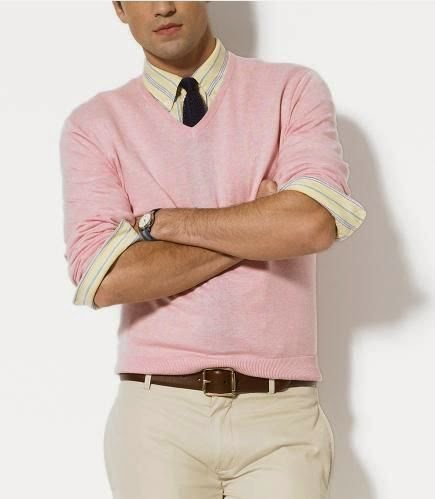
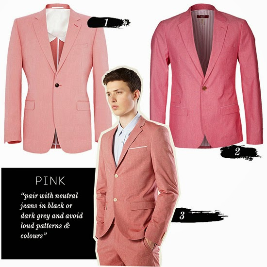
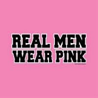

Have you ever seen  a man dressed in pink and wondered? What is it about men in pink clothes? The moment a man reveals his affinity for the so-called feminine color he gets written of in more than many ways.The new Oxford English Dictionary even defines pink to mean 'of associated with homosexuals!' Isn't that weird?!

Back in history, it was considered a strong and manly color, whereas blue (associated with the Virgin Mary) was seen as delicate and feminine.It is found that men who wore pink shirts typically earned £1,000 more per year than those who avoided the color altogether. Men who wore pink shirts were also better qualified, on average, than their more soberly dressed colleagues.

Being considered largely a girl's Barbie dream color, pink seems to have got a step treatment in a lot of conservative conformist men's wardrobes.But things have changed.The emergence of the metro-sexual guy has pushed aside many myths with his bold and experimental side that he carries with much aplomb.Its not about being subtle or having nothing else to wear that this new generation man has embraced this color.He kinda flaunts it with a 'devil may care' attitude.Not to forget that this is one color that can be disguised cleverly in florals, strips, checkers and any other print to speak of.For a color formally eschewed by macho men and perceived to be too frivolous and girly, pink seems to be everywhere in men’s clothes! Pink shirts, pink jackets, pink scarfs, pink ties, pink caps, pink shoes even the rare pink pants.

I know a guy who has an amazing collection of pink tees of myriad shades in his wardrobe, from the palest of baby pinks, the most shocking of hot pinks to the richest of mauve.And boy, he does turn heads....in a good way! Interestingly, it is his wife who picks up these pink pieces for him.

There is something alluring about pink. Probably because it is known to have a calming effect psychologically speaking. Also because pink is complimentary to most skin tones, unless you already have a lot of pink tone in your skin. A man who wears pink exudes confidence, yet is sensitive. Pink is also a easy color to coordinate with almost every color in your wardrobe...it goes amazingly well with grey, tan, black, navy and other blue tones. And if you're still not convinced how great pink is, women love pink and are more likely to give you a second glance.So do give pink a try if you haven’t already!

[Ultimate Blog Challenge](http://ultimateblogchallenge.com/)

[A to Z Challenge](http://www.a-to-zchallenge.com/)

