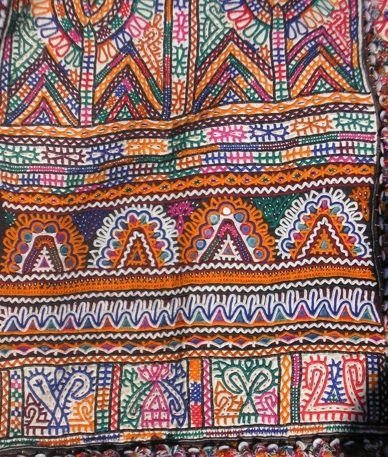
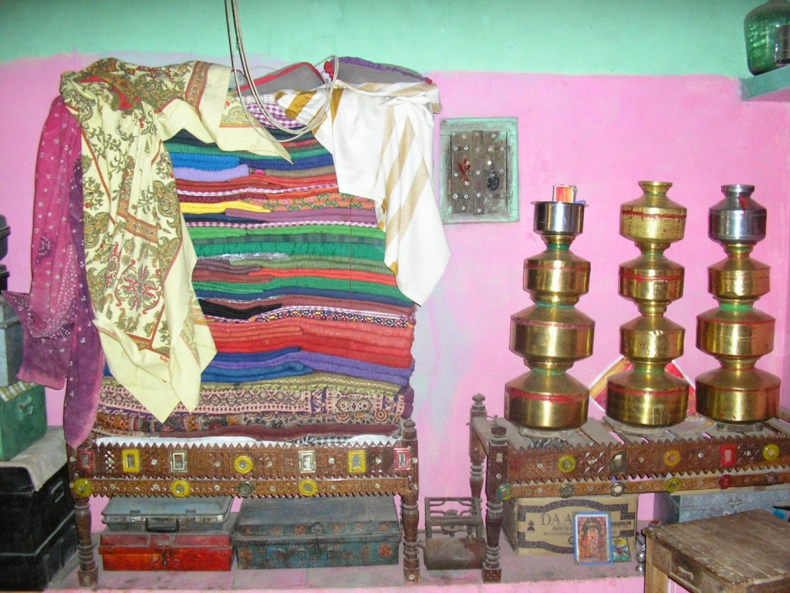
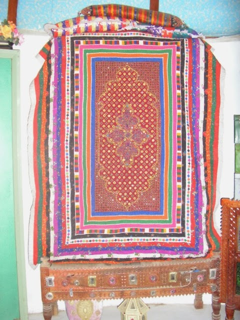
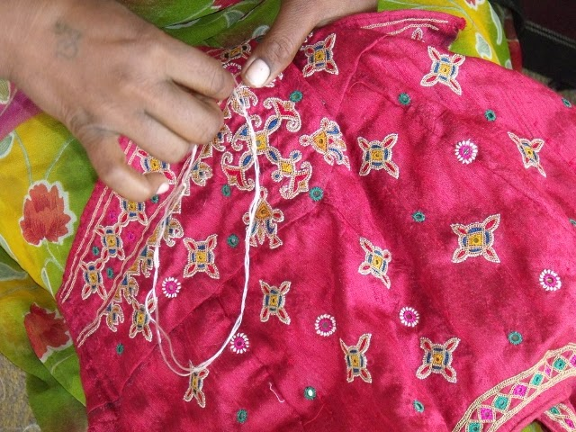
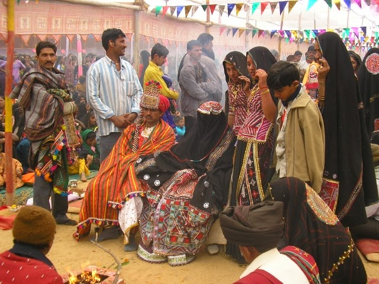
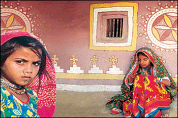

  

<table align="center" cellpadding="0" cellspacing="0" class="tr-caption-container" style="margin-left: auto; margin-right: auto; text-align: center;"><tbody><tr><td style="text-align: center;"></td></tr><tr><td class="tr-caption" style="text-align: center;">Image Source:&nbsp;http://travelsintextiles.com</td></tr></tbody></table>

A skill set that manifests itself as a unsaid form of communication is the Kutchi embroidery and needlework. Successfully providing livelihood for so many craftswomen in Kutch over a long period now, it deserves to be given the reverence of an art form.It can aptly be described as a language that binds together the diverse communities in India's largest district.Although I had visited this earthy haven, rich in color, texture and art forms long time ago the visual treat of aesthetic abundance stayed with me for a long time. Their elaborate huts with mirror work twinkling in the midst of the tribal motifs that adorn their rough textured walls, the antique vessels and dramatic silver jewelry are more picturesque than words could describe.But the profusion of colorful embroidered paraphernalia is what sets the place apart.  
  

<table align="center" cellpadding="0" cellspacing="0" class="tr-caption-container" style="margin-left: auto; margin-right: auto; text-align: center;"><tbody><tr><td style="text-align: center;"></td></tr><tr><td class="tr-caption" style="text-align: center;">Image Source:&nbsp;http://travelsintextiles.com</td></tr></tbody></table>

  

<table align="center" cellpadding="0" cellspacing="0" class="tr-caption-container" style="margin-left: auto; margin-right: auto; text-align: center;"><tbody><tr><td style="text-align: center;"></td></tr><tr><td class="tr-caption" style="text-align: center;">Image Source:&nbsp;http://travelsintextiles.com</td></tr></tbody></table>

Their tryst with embroidery begins right from their birth,when the child is named on the sixth day of its birth, in a ceremony where the baby is put in a cradle which has a heavily embroidered cradle cloth.Hereafter begins the infant's life long relationship with embroidery.The child is adorned with embroidered caps, sleeveless jackets, long sleeved top and ballooned drawstring pants.By the time he's 10, his shirts are solid colored and the loose pants are white with colored embroidery on them.And by 15 the boys are phased out of heavily embroidered clothes and they shift completely to white.But they still eat, sleep and breathe embroidery which reflects heavily in their home decor and the accessories they use.So much so that they even sheathe their animal horns with embroidered cones!  
  

<table align="center" cellpadding="0" cellspacing="0" class="tr-caption-container" style="margin-left: auto; margin-right: auto; text-align: center;"><tbody><tr><td style="text-align: center;"></td></tr><tr><td class="tr-caption" style="text-align: center;">Image Source:&nbsp;http://travelsintextiles.com</td></tr></tbody></table>

Whats has me intrigued is the stories of how women from these communities communicate through their dressing.A woman is expected to embroider her own wedding trousseau right from her childhood days.  
So that's how it becomes vital for the women to learn embroidery at a very tender age.The trousseau would comprise of her richly embroidered wedding dress, skirts, blouses, veils and many more items which the girl had embroidered over the years till she reached her marriageable age.Other items of the trousseau like a set of home decorations, purses,bags would be brought out on the first festival of colors 'Holi' after she had given birth to a son.The glittering pieces that a girl embroidered for her dowry were considered wealth, a contribution to the marriage exchange. Furthermore, embroidery was often a basis for judging a girl’s capability. Many of these communities specified a set number of items of clothing and textiles for domestic use to make up their dowries.The traditional dowry embroidery requirements for girls was so arduous that it was causing serious social and marital problems within the community.To rectify this, some years back the community elders banned all embroidery and embroidered dowry. This also means that many  of these young women now have no knowledge of their own traditional embroidery.  
  

<table align="center" cellpadding="0" cellspacing="0" class="tr-caption-container" style="margin-left: auto; margin-right: auto; text-align: center;"><tbody><tr><td style="text-align: center;"></td></tr><tr><td class="tr-caption" style="text-align: center;">The wedding.Image Source:&nbsp;http://travelsintextiles.com</td></tr></tbody></table>

A woman's entire personal history can be gauged from her clothing. An unmarried girl's skirt could be black with tie-dyed red dots, it could be printed or one solid color. But a married woman's will be embroidered. Here again, if she is newly married it will be colorful and profusely embroidered. But once these skirts wear out, she shifts to more sedate ones. The complexity in dress is quite deep. While an unmarried girl's skirt is as described above, she is allowed to wear lavish ones if she is going to a fair or is attending a wedding. In such a case, it is the blouse that becomes the giver of messages. An unmarried girl's blouse will not have the bust panel that her married counterpart's has. More personal profiles can be gleaned from the color of the head shawl, its border, the design on the bust panel or specific motifs.As women get older, the lavishness of the embroidery decreases though color remains an integral part of their clothes. Of course, when the occasion demands it, clothes with an abundance of needlework are seen in profusion.While widows wear no jewelry or embroidery, they are free to wear at least one colored garment. Here too, a dress code lets others know more details about her without having to ask because the color she wears will depend on her age and the subgroup of her community. It would be unusual for a young married girl not to have an embroidered skirt. But if she is dressed in an unadorned skirt, it could be that she has taken a vow to give up embellishments because she has suffered some personal loss.  
  

<table align="center" cellpadding="0" cellspacing="0" class="tr-caption-container" style="margin-left: auto; margin-right: auto; text-align: center;"><tbody><tr><td style="text-align: center;"></td></tr><tr><td class="tr-caption" style="text-align: center;">Image Source:&nbsp;http://design-flute.com</td></tr></tbody></table>

These communities do not think of dowry pieces and personal adornment in terms of commercial value; they feared showing them lest outsiders would try to purchase them.It is this very quality of ownership, that has not let any kind of outside influence mar their art form.An art form that communicates through every stitch that embroidered into a motif, and many more such motifs, each of which, representing the dreams of the young girl needling away in wait of her suitor.  
  
  
[Ultimate Blog Challenge.](http://ultimateblogchallenge.com/)  

