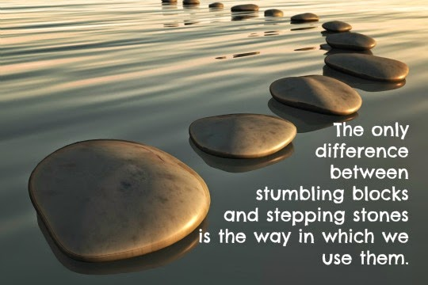

_Sometimes, there comes a point in our life when things just don't go right.You stumble.And at times you're standing firm on the ground but there's water rising above you.You're about to sink.Either ways, you've got to save yourself.And even as you panic, the universe has started throwing a few stepping stones somewhere along your way.You might notice them if you don't let the panic override you.Slowly rising above the whirlpool of the situation, you find yourselves in calm waters discovering one stepping stone after another.You might fall again on the way.But rise again you must.And you will.If you look for the next stepping stone.It might be a difficult path to tread.There could be hindrances.People might pull you down in a bid to save themselves, or push you aside to keep themselves dry at your expense.But that is their journey.Not yours.You need to brave these hindrances, gently release yourself off their grip, give them a smile and move ahead.You could feel your energy draining but do not lose sight of the light ahead.Notice the water around you receding.And your spirits rising.You're almost there.Don't let the surge of over-confidence deter you.Keep your head firm on your shoulders, low enough to keep looking out for the next stepping stone, yet high enough to keep your sight focused on the goal.It might take you seconds, minutes, hours, days or years to reach there.God has placed the next stepping stone ready for you.But, with your eyes wide open and your energies in sync-you  need to keep walking.Till you reach the light that shone above that last stepping stone, which looked like a little mound from a distance, but was actually the highest mountain you feared to climb.Only when you reach there shall you see the situation you surpassed below, tiny as it really was from to the height you've reached.Just because even after you stumbled, you picked yourself up, looked for your stepping stones, and most important... you walked._

_[Ultimate Blog Challenge.](http://ultimateblogchallenge.com/)_

[A to Z Challenge.](http://www.a-to-zchallenge.com/)

