I had been particularly grumpy since morning today. The unbearable heat of Indian summers plus the zillion chores piling up for days together, was getting on to me. But some made me smile this evening, yet again, thanks to a naughty young guy! A few months back another fellow from the same community had entertained me for a couple of hours, so much so, that I had to turn it into an info-graphic storyboard with proper scenes to narrate my story.

Before you start jumping to conclusions, let me brief you a bit about him. He's one of the bunch of monkeys seen frequently around my house, literally speaking, we do have a lot of stray monkeys hopping around in this part of India. And mind you, it is a well-developed city that I live in, but owing to a lot of trees around here, these guys are frequent visitors to our living rooms. These black-faced monkeys turn out to be quite a menace at times, jumping over our terraces, disrupting wires and pipes, sneaking into the kitchen and getting off with food and yes last but not the least bullying everyone around! Only this time he wasn't bullying me....you have to see this to believe it!

[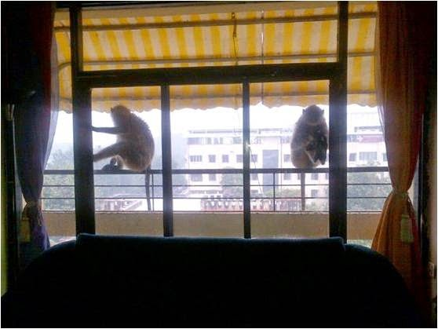](http://ifsbutsandsetcs.com/wp-content/uploads/2014/04/1.jpg)

**Scene-1** She peers in at me.

While he looks away trying to appear unaffected by my presence.

[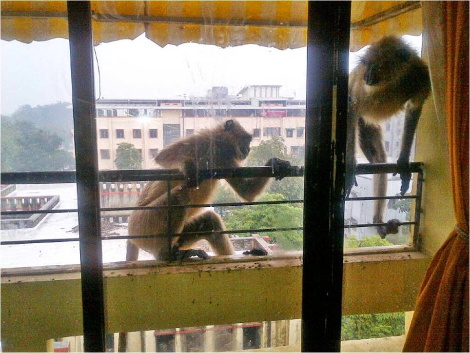](http://ifsbutsandsetcs.com/wp-content/uploads/2014/04/2.jpg)

**Scene-2** "Why the hell is she clicking your pictures?

I don't like this one bit!" she scolds him.

[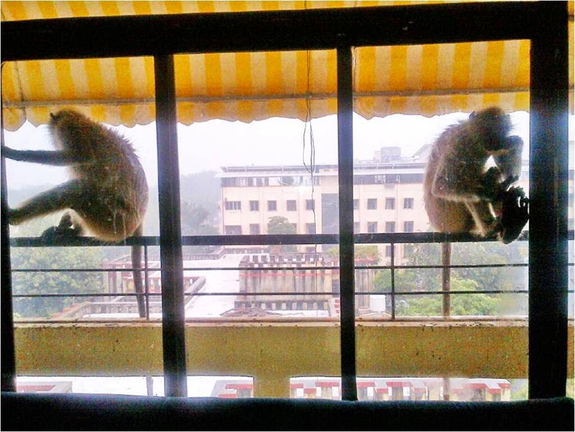](http://ifsbutsandsetcs.com/wp-content/uploads/2014/04/3.jpg)

**Scene-3** "Oh cmon...not again!"

says he rolling his eyes "Gimme a break will you??"

She continues to sulk.

[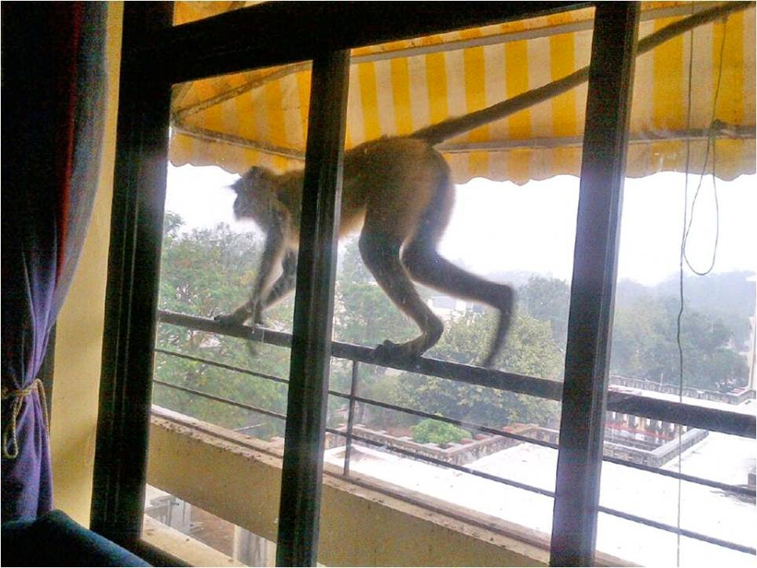](http://ifsbutsandsetcs.com/wp-content/uploads/2014/04/4.jpg)

**Scene-4** "Okay I'm gone" and she walks off in a huff!

[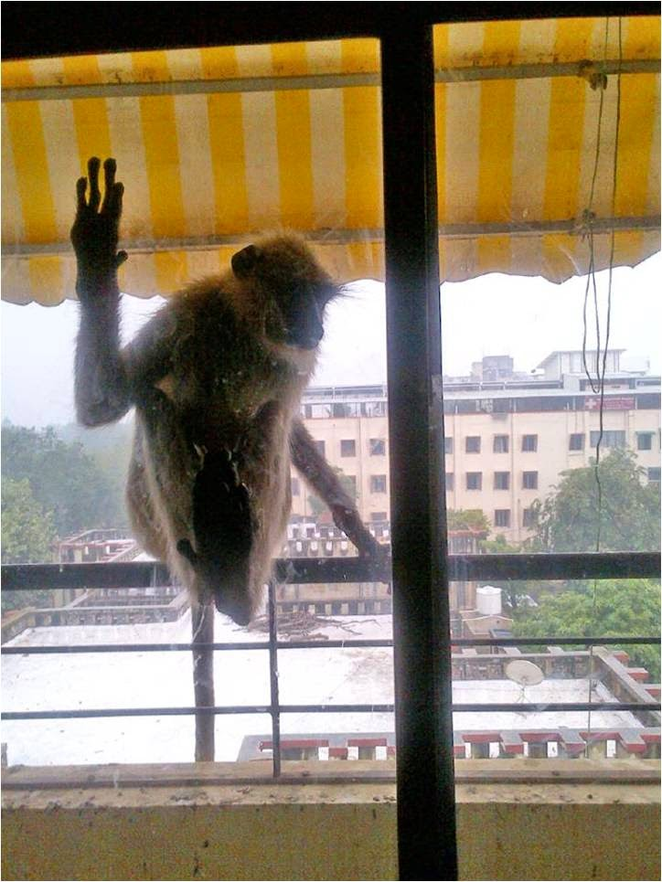](http://ifsbutsandsetcs.com/wp-content/uploads/2014/04/5.jpg)

**Scene-5** "Really?? Has she left??"

 he looks around.

[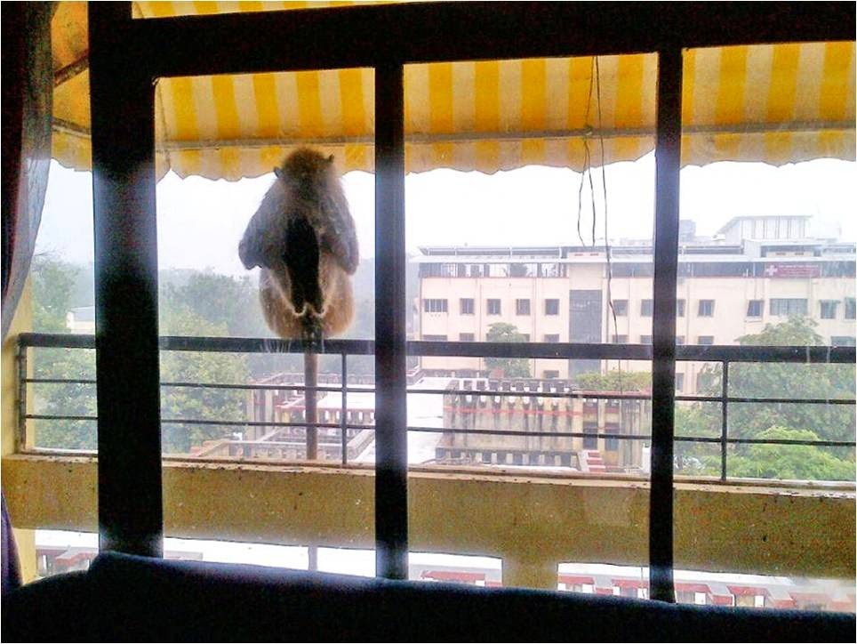](http://ifsbutsandsetcs.com/wp-content/uploads/2014/04/6.jpg)

**Scene-6** "Jesus...not again!!

...why the hell are these women so insecure??"

 [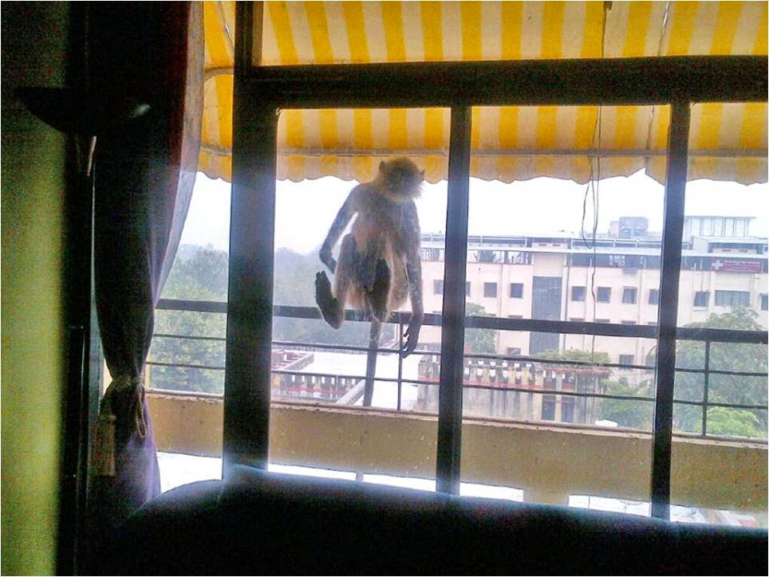](http://ifsbutsandsetcs.com/wp-content/uploads/2014/04/7.jpg)

**Scene-7** "Well anyway, the dude's here by himself

 ...click as much as you care" he tells me, turning his charm on.

[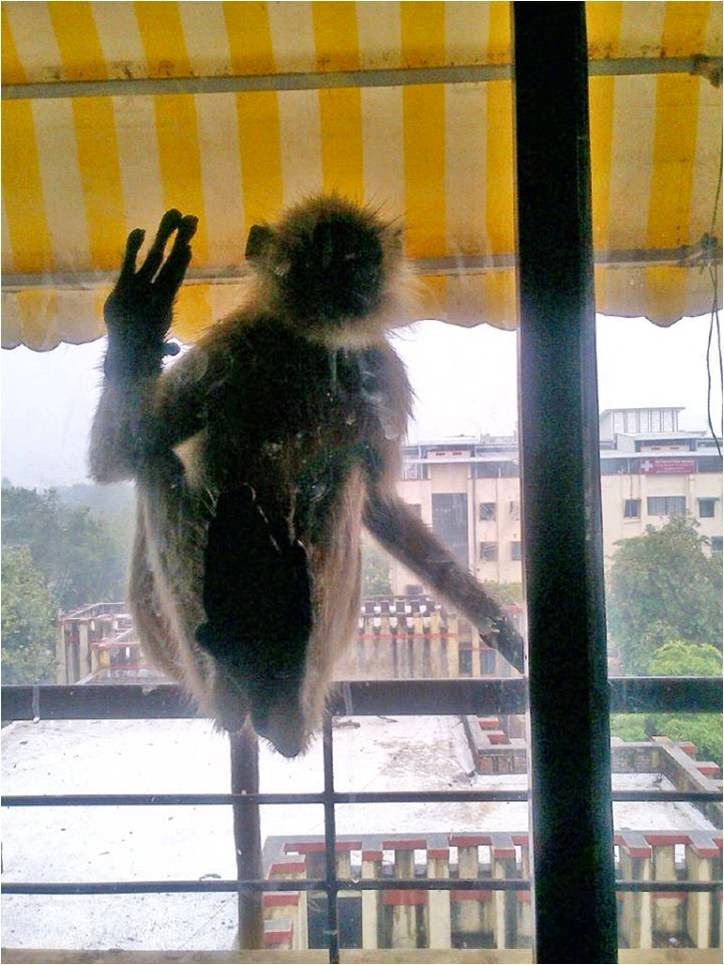](http://ifsbutsandsetcs.com/wp-content/uploads/2014/04/9.jpg)

**Scene-8** "Okay now lemme in..."

**Scene-9** "Plssssss....lemme in babyyyy....pretty plssss?!"

[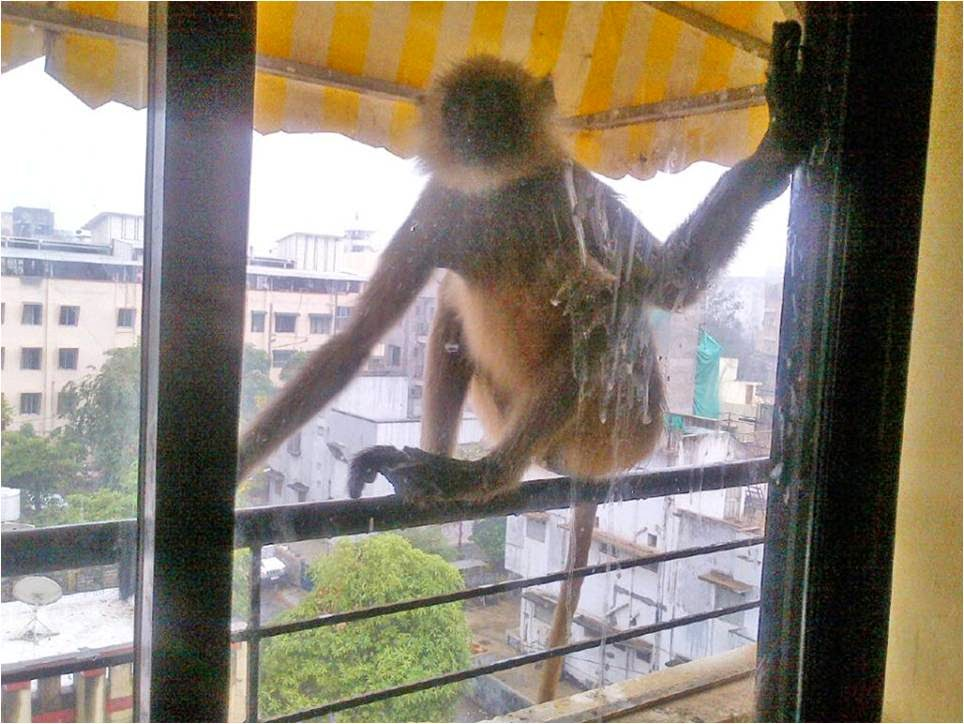](http://ifsbutsandsetcs.com/wp-content/uploads/2014/04/11.jpg)

**Scene-10** "So you won't lemme in? Sure?...think again.."

[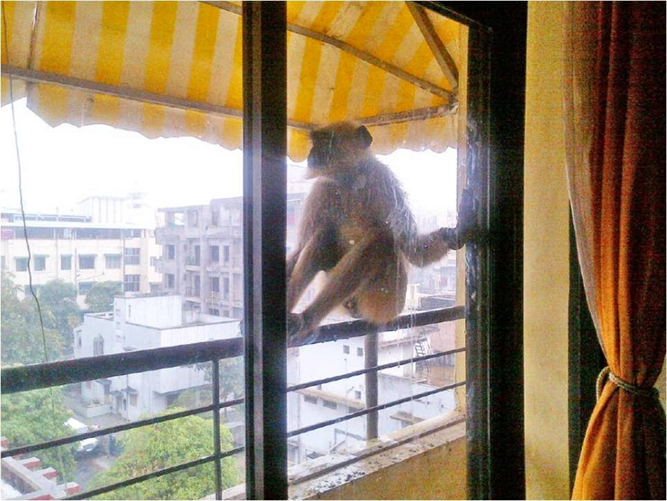](http://ifsbutsandsetcs.com/wp-content/uploads/2014/04/12.jpg)

**Scene-11** "Guess I'll have to go looking for her again....

I'm out of luck today ...sigh!"

This was a drama that had unfolded right in my living room. Fortunately, the window panes were shut tight and that's how I was brave enough to find humor in the situation and click to my heart's content from the other side of the glass! Well, I do enjoy studying animals trying to gauge their thoughts and whatever it is that they try to communicate through their expressions and gestures. And instinctively my imagination goes rampant, as my mind starts weaving a story, trying to comprehend what really could be, had they actually opened their mouth and started to speak! I'm sure they yearn to put it in words like we do....but have not other way to give an outlet to their yearning but through their gestures.

So, after a few months past the above instance's occurrence, today when I reached the parking area of the building where I reside, I was met with a rather funny yet baffling sight! Watch this picture closely and help me comprehend what's happening. Tell me what you think is happening...who's saying what?

[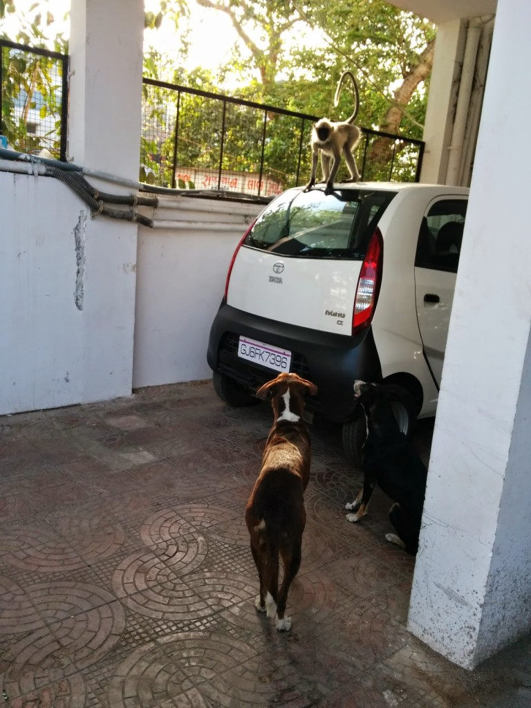](http://ifsbutsandsetcs.com/wp-content/uploads/2014/04/IMG_20140426_171722-768x1024.jpg)

 

**My side of the story:** 

He tells them "Back off! This is my car from now on!"

They to each other: "Gosh what a bully!...what do we do now?

Naps up there on the car roof had always been uninterrupted. There goes our bunk bed!"

Over to you...tell me the story you would have made out of this scene.

[Ultimate Blog Challenge.](http://ultimateblogchallenge.com/)

