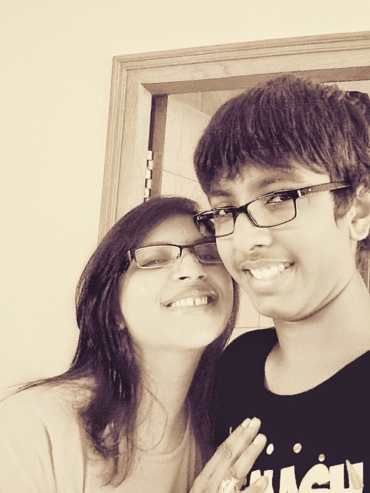
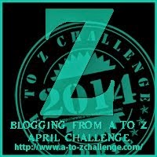

For the past 15 years now he has been the zing, zest and zeal of my life. As he celebrates his 15th birthday today, I can't help but write about him.About the glorious 15 years of motherhood that he has gifted me.

 A memory so clear and close to my heart, is of when he arrived. The first time that his beady eyes probed mine was with a frown of scrutiny...such a vulnerable moment that was...that one expression of his will remain deeply etched in my memory forever.They handed me this little bundle of joy, to someone who was not a bit familiar with holding an infant as tiny and delicate as him, leave alone take care of it.But as days went by, it was his little quirks and mannerisms that completely took over me by a feeling so exquisitely indescribable. Soon I was soothing his cries to sleep with the warmth of my cuddles and he was rewarding me with his special dimpled smiles which were reserved only for me! A language of our own that needed no words.Nothing would have ever prepared me for this major phase of transformation which took me from the naivety of girlhood to the maturity of motherhood.It swept me off my feet and changed me into a different person altogether.A mother.I finally got insight in the profoundness of the statement: _A child gives birth to a mother._

 The first time he looked up and smiled at me, pausing in the middle of his feed, the first time he gurgled with laughter-a strangely cocky but hilariously adorable burst of laughter, the first time he clumsily rolled over to crawl on his four and the first time he said "Ma" are special memories of his first year milestones.And within the next year he was rattling away so many words. One fine day he was on his feet, taking his first step forward.And there was no looking back after that.He's come so many steps far...farther than I ever imagined!

Call it a proud mother beaming at her son...but year after year he never ceases to amaze me with his natural ingenuity and inborn curiosity of looking at things.He doubles up as an artist, musician cum music lover, sportsman, computer gaming geek, mathematician,scientist and more recently as a gourmet chef plus a literary enthusiast.And he doesn't simply go by the book here, thanks to his curious nature...each topic of his interest ends up under the microscopic nature of questions that his mind pops him with, which need to be answered to by his extensive explorations.The list sure is exhaustive but I'm not trying to be modest with praises for him either!Academics and interests apart, I consider myself  fortunate to be blessed with a son who is shaping into a compassionate and loving human being.His best quality is his unbiased nature and the ability of balancing and maintaining relationships beautifully without the need of taking sides with anyone in particular.I need to step in at times to tone down his giving nature that often gets exploited by certain people.His sensitive nature is rare to his gender but lends its personal touch in every action of his.Even to something as simple as the cheese fondue that he fondly made, not turning out creamier than his expectations! My professional commitments often kept me away from him for long periods.But it never really came between our bond.Rather the distance only strengthened our bond and his independence.

All this said, he does have the knack of bugging the hell out of me with numerous habits of his, which I'm afraid are not going to change for a long time now.The processed food junk that he loves to eat, the length of hair and nails he prefers to keep till he finally decides to trim them, endlessly pulling my leg for my weak Mathematics, his obsession for over sized tees and flip-flops, his absolute displeasure at my posting pictures of him on social media platforms and so much more.Let me not elaborate on this further, considering the fact that it is his birthday today!

We enjoy similar tastes in food, music, fashion, books, television shows and movies.But off late he's been veering towards things more boyish than what my feminine side can cope with, although I do try to keep pace with him as much as I can.At times when the disciplinarian in me goes on a holiday, our relationship appears to many as that of siblings than of a parent-child.I strive to be his friend no matter how old he is...and for these very reasons, he finds himself comfortable confiding in me with things that bother boys at this turbulent adolescent age.Our days are made up of pillow fights and petty squabbles but the last hug of the day is what matters the most.

The one memory I have of him from his toddler days that I still laugh at, is of the times he would get angry at me, he would rush to my dresser and pull out all my cosmetics and threaten to throw them out of the house! So much to irk him further, I used to find this act of his so amusing every single time....considering the fact that I don't really consider myself that cosmetically inclined a person.And I would wonder how he formed that impression of me...did I really come across as such a vain person?! Now, when he's old enough to answer that question, when I question him about it...he tells me that he felt that those pots and tubes of cosmetics were my only precious possessions at that point.To which I reply, that nothing was, is or will be more precious to me in this world than my son and my bond with him.

Happy Birthday Sweetheart...God bless you.[Ultimate Blog Challenge.](http://ultimateblogchallenge.com/)

[A to Z Challenge.](http://www.a-to-zchallenge.com/)

