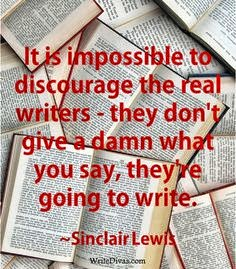
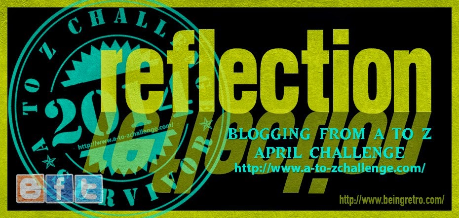

I used to have a blog which got updated only once in a year or since the last one year, once every month, although I have been blogging for more than 6 years now. I love writing but my consistency in the regularity of writing always depended on my temperament and mood swings. So when I came across this challenge in the second week of April, it did sound interesting. But then I was late by almost 12 days. It also set me wondering if I could cater to the requirement of two posts a day (since I had to make up for the 12 days I had lost out on). Would my mood swings let me stick through? But then wasn't that a part of the challenge? Mood or no mood, I would still have to write. And I came to a conclusion that the challenge was actually of me against my own habits. I had to fight this one, for my own sake.

And off I got swept in the whirlwind of the A to Z Challenge. I pushed aside most of my priorities to give myself to it completely. Glued to my computer for hours, I was a zombie for the remainder of April. Sleepless nights pondering on which topic to write on next, checking, rechecking on drafts, researching, reading so many interesting blogs, commenting on them, replying to the comments on my own blog took up the entire 24 hours of each day. On some days the words just tumbled out effortlessly, and on other days I would be blankly staring at my computer screen for hours trying to figure out what it was that I was intending to write!

Where was the time to do anything else? There was so much insight, so much exposure that I just could not afford to lose out on any of it. Each of the blog that I read of other participants just opened my eyes to yet another perspective. The versatility of writing styles mingling into a communion of this scale left me much richer in experience than I could have ever imagined.Connecting with people from different walks of life and making new friends from across the globe was the icing on the cake. And I do intend to stay connected with them. Nothing boosts a writer more than honest feedback and genuine appreciation, both of which I received in plenty from this community of bloggers.

In the middle of the challenge, there was a time, when I faced technical glitches with power cuts for long hours in the area where I lived. There was no way I could have progressed without electricity and internet. I was almost about to give up. But this challenge has an addictive edge to it. One cannot rest in peace without writing, after having started off! So I had to do it and I did with my smartphone and its internet services. Wonder what my service provider is going to charge me for all those days of extensive internet usage on the phone?! But well, I managed to stick through the challenge and that was more important.

I managed to write more than 26 posts in 18 days and enjoyed it to the hilt! It just left me with a conviction that a consistent effort always yields  desired results. A lot of my Facebook friends saw my increased activity in posting these blog posts and ended up thinking that I had gone nuts to be suddenly writing so much, more so coz they did not have any clue about the challenge...the close ones were brave enough to ask me what the hell was wrong with me. But it was only later when I proudly flashed the survivor badge on my Facebook status could they make sense of what it was all about!

Today, when I reflect on what I actually gained through the challenge. I realize that my biggest fear of my mood swings not complying with the challenge worked exactly in the opposite direction. My mood swings on the contrary kept me off everything else but my writing. We may not realize, but sometimes our biggest weakness can turn into our strongest plus point. The A to Z Challenge did help me figure that out!A big thanks to the people who managed, encouraged and participated in the challenge with full vigor. Kudos guys...you rocked!

