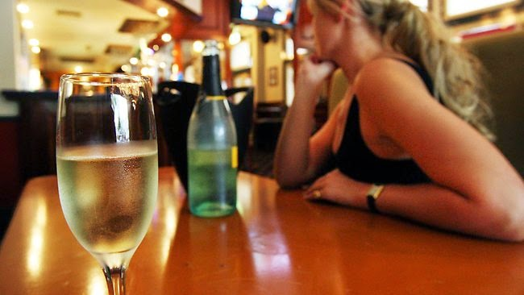

_This post has also been featured on [AdviceAdda.com](http://adviceadda.com/read-article/102-nightlife-precautions-for-women-better-safe-than-sorry),_ 

_India's First online advice portal for youth & teenagers_

I was out one evening catching up with a few close friends over dinner at the cozy little friendly neighborhood resto-bar in Mumbai. This place is known for the amazing music it plays and is frequented by a lot of call center employees due to the proximity of call centers around the area. My only preference to be a regular to this place was for the love of the music played there which peps me and refreshes me several notches higher.

A few tables across, I saw a young girl, who looked like she was barely out of school. Her clothes and makeup screamed for attention. Not that I judge people by what they wear, but in this particular case, it was a bit off the limits of decency. She sat there sharing puffs of cigarettes with a group of young men, presumably her colleagues at the call center she worked in. It is not difficult to separate the call center crowd from regular people for their fake accents and distinct fashion consciousness. The whiff of marijuana floated across the room from where they were seated. Swaying to the music and engrossed among themselves, this bunch of yuppies were oblivious to my quiet observation. I did not mean to pry but couldn't help taking interest coz something seemed fishy.

As the evening proceeded, I lost count of the number of vodkas with red bulls she had guzzled down. Her friends kept refilling her glass inspite of her protests after a few and insisted that she give them 'company' in drinking. I suspected that her drinks were being spiked with drugs without her knowledge. In no time this girl was dangling off her seat, unaware of the state of her clothes, giggling away with her eyes glazed in a state of severe intoxication.She did not even notice that her cell phone and purse were lying unattended on the unoccupied table next to them and could get flicked at any point. The men around her were in various states of drunkenness themselves. We were done with our dinner but I requested my friends to stick around since I was increasingly getting worried about the safety of this young girl.

It was well past midnight and soon came the time for the place to shut down. The music had stopped and the lights dimmed in a bid to make the last few customers leave. To my shock I noticed that one of the guys from the group fished out a credit card from her purse without her noticing it and swiped it to pay the check, which I am sure was not less than five digits, considering the number of bottles that were downed at the table. Most of the men on the table had dragged themselves out and left the girl with a boy from their group, who I presumed was her boyfriend. Turned out that I was wrong. As soon as this group left, the girl in her state of slur requested the guy to drop her home. Since the music was not playing and it was quiet enough, I could overhear the guy forcing her to come with him and check into a hotel to spend the night. It was pretty obvious that the girl was protesting. And even as the staff at the bar watched on, this guy had the audacity to pull the sozzled girl close to him and start mauling her.

Before anybody could intervene, I rose up and strode across, pulled the guy and slapped him hard right across his face. The staff got into action and there was a minor scuffle after which the guy was thrown out of the place. The girl although was out of senses, had tears streaming down her eyes. She was numb. I took her cell phone and searched for a number that I could reach on, to have her safely transported back home. My first instinct was to look for her mother's number in her phone book.I thanked my stars when I found a local number saved under the name of 'mummy.' A brief conversation with a shocked mother and I was off with her looking for her house which was not very far. She sat in a daze in the car, while me and my friend struggled to find the lane where her house was.

Soon we figured out the building that her mother had given us directions to. We were met with a panic stricken mother who displayed a myriad emotions as soon as she saw her daughter safe. Relief, followed by shock after seeing her daughter's intoxicated state, sorrow and then fury. She shook her daughter in anger to question her, but the girl had already collapsed on the couch close by. Apparently, the girl had lied to her mother. She had told her that she was going to a her girlfriend's house for the night to do group study. She was a college student and had been working part time in a call center since past six months, to support her single mother who was a widow. Her mother worked in a tailoring shop to make their ends meet. My heart went out for the mother who felt that she had failed in her duties to raise her daughter with the right moral values.

I don't entirely blame the mother. The youth of today are far better equipped to get away with a lie and to get influenced by external forces, inspite of a healthy upbringing. I only hope that the girl realized how much risk she had put herself into, by acting so irresponsibly. There is no harm in going out with friends, or having the freedom to dress as one feels appropriate, but a certain amount of decency can help ward off unwanted overtures (sad but true). Not that it guarantees your safety but chances are that you attract less of the wrong kind of attention. But going out without being truthful on her whereabouts, drinking without limits and qualms plus indulging in drugs, that too with near strangers (after all how much would you know colleagues of six months of acquaintance?) can invite the biggest of the troubles at the safest of the places. Not to mention the huge credit card bill that she incurred in complete ignorance. In a bid to be accepted she had dressed in a manner that would make her appear hip and had indulged in the ridiculously copious amount of intoxicants to come across as a sporting person to the people who had accompanied her. Her poor mother was not even aware of where the girl changed her clothes, since she had left the house in  her regular clothes that she wore to work.

_With the rapid growth in crime levels, one definitely needs to be wary and keep oneself safe. That doesn't mean that you give up on your freedom of being out at a certain time or dressing the way you wish to. But making smart decisions and heeding to cautions will go a long way in keeping you safe from untoward incidents. Be very cautious and choosy on the kind of people you decide to hang out with, no matter how friendly they appear. It always pays to keep an ear open and be on a watch for trouble. Do not indulge in intoxicants of any kind which you might not be able to handle beyond a point. If at all you do need to have a friendly drink or two, limit it to that._ _Most important, never leave your drink unattended if you are in the company of fairly new people. Letting_ _your guard down can leave you open to hazardous results. Always ensure that you let family members or close friends know if you are going to be staying out late and let them know the details of the person who would be dropping you home, his details, phone number etc. Leave an additional number they can get in touch with you, either of the people you are going out with or best still the address of the place you are visiting. There are smartphone apps and helpline numbers that can be reached on in times of need, but sticking to these few basic guidelines could save you from getting in such situations in the first place._

We need not live in the constant fear of something untoward happening provided we do our bit to be cautious. Healthy and practical choices can go a long way in keeping us safe from wrong doings, people and habits that can land us into the worst of the crises. Let us make the most of the democracy that has been bestowed to us by our country but in a responsible manner.

_Pic source: Google images_
