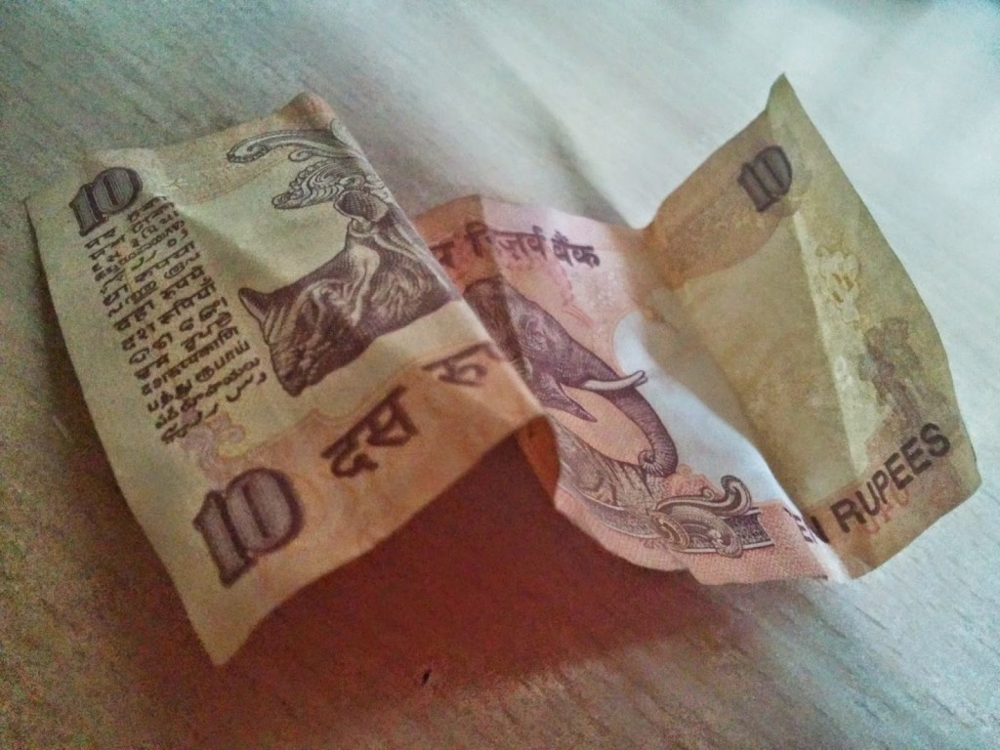

Climbing up the steps of Borivali railway station after I landed in Mumbai, I found a soiled and crumpled ten rupees note lying abandoned on the steps. Even as I picked it up, I wondered whose pocket or purse it must have accidentally slipped off from. Was it one of those office-goers who were perpetually hurrying to catch the fastest local train in time? Or the obese old lady who was huffing and puffing up the steps with great difficulty.It could have been a coolie who must have dropped it unknowingly while trying to balance the ridiculous weight of bulging suitcases on his head. Or worst still, it could be the street urchin who was forced to beg on the station platforms to feed himself.

 With all these thoughts, I felt guilty about picking it up. But I couldn't bring myself to leave Goddess Lakshmi lying there waiting to be trampled by thousands of ignorant feet climbing up and down the stairs in their hurried abandon. I kept the tenner safely in the pocket of the denims I was wearing, with a resolve that I would spend it on a needy person. I had not earned this money to spend it on myself, hence I decided to put it to use by helping someone in a small way.A tiny amount though, it is enough to feed a hungry soul. I'm almost tempted to add a few more notes and make it a decent amount to do the needful.But an eccentric part of me has taken it up as a personal challenge to use only that ten rupees note and no more added to it to help someone.I know...sounds weird...but I keep challenging myself from time to time with such unusual small eccentricities.It stimulates a loony side of me in an odd way!

I do not advocate the idea of giving money to beggars, no matter how piteous their sight is. I feel it only encourages laziness.Despite ailments, handicaps and age factors, every human has other dignified choices to earn their bread from, other than begging. Also, with the common knowledge of the human trafficking racket that exists in cities like Mumbai, where all sorts of tortures are meted out on numerous innocent children to get them to beg, I would never give money to these kids, with the awareness that the money does not go into their pockets but to some inhuman underworld don who is forcing them to beg. Instead, I would prefer to buy them a pack of biscuits or a small tetra-pack of juice which would give them some respite from their hunger or thirst.It has been four days since.I am back from Mumbai, and I have yet not chanced upon a begging child for whom I could buy that pack of biscuit or juice.

Many a times I have come across beggars who stink of liquor and yet people offer them money.Don’t these people realize that although the beggar might be physically handicapped, weak or old, he is not going to utilize the money they gave him to feed himself or treat his handicap? He will go ahead and have yet another bottle of cheap country liquor when he collects enough money from the day’s begging.

A few months back, as a weekly ritual, I used to offer food to roadside beggars in a bid to donate a a certain amount from my personal kitty to the needy. On one such occasion, when I went to a temple in Mumbai where beggars flocked every evening, I had an experience that made me discontinue this activity. I had carried loaves of bread enough to feed at least twenty beggars. As I started distributing the loaves, the horde of beggars only kept increasing, to the point that I had to buy twice the number of loaves that I had carried, to oblige the beggars who had joined in after getting to know from their community that I was distributing food. In the process, there was a mad chaos as the beggars jostled and struggled to get their share of loaf before I was short of them again. They pushed, pulled and abused in desperation to get their hands on that one loaf.

Among them there was a pregnant woman with a tiny undernourished looking infant hanging onto her hip. She was trying unsuccessfully to reach out for a loaf. None of them gave way to the poor woman to come near me. When I noticed this, I saved one loaf for her, so that I could prioritize and give it to her later. The shops around me had run short of bread for me to buy more from them.Not to mention that I also was short of money to buy more. So when I had exhausted all the other loaves, and when the other beggars started turning away, I called the pregnant woman aside and gave her the loaf I had saved for her. She blessed me with a smile of gratitude. Filled with joy and contentment when I started moving away with the sense of a mission accomplished; I heard wails of the woman. My joy was short lived.When I turned back, I saw a major scuffle break out, in which the other beggars I had turned down were beating her up. The packet of bread lay shredded with the bread slices scattered all over the footpath. The beggars were carelessly stomping on the slices as they overpowered and showered abuses on the helpless woman. I did not dare to go back and intervene in the fight with the fear of getting physically hurt.

This incident has left me wary about helping beggars. Although they evoke sympathy and pity at times, you do not know if the money is going to the right person and for the right cause.And if it has reached the right person, is he able to get help from it or is it going to some other greedy money sucker? Instead I prefer to donate the money to charitable organizations and homes with established credibility.At least it assures me that my money has been of some help to a person in need. Although, it has taken away from me the simple joy of giving to that random needy on the roads and has planted in me a sense of prudence.

I still have that ten rupees tucked away in a corner of my wallet. And I have yet to find a needy person on whom I could spend it without any underlying suspicion.On second thoughts, its high time someone deserves a treat of biscuits.The stray dogs in my neighborhood...who greet me with unconditional love every time I step out have not been pampered in a long time now! What say people?

_Do you have any other ideas for me to use this ten rupee note wisely in helping someone genuinely? Leave me a comment if you do._

This post was written for [Wednesday Prompt](http://writetribe.com/) at Write Tribe.The prompt given out this Wednesday was to pen a free write post of at least 500 words, minus the use of filler words, specifically: "Just, Quite, Really, Very, Literally, Perhaps, In order, Rather, Actually, Stuff." Phew!... Managed to do it without those killer fillers :)

