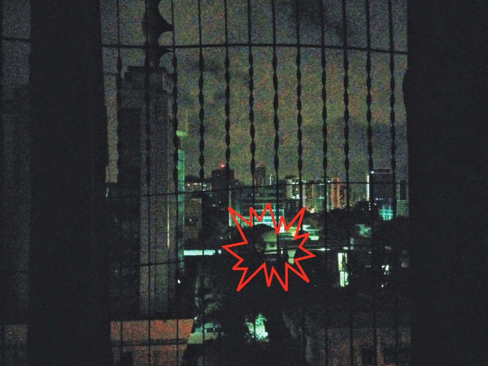
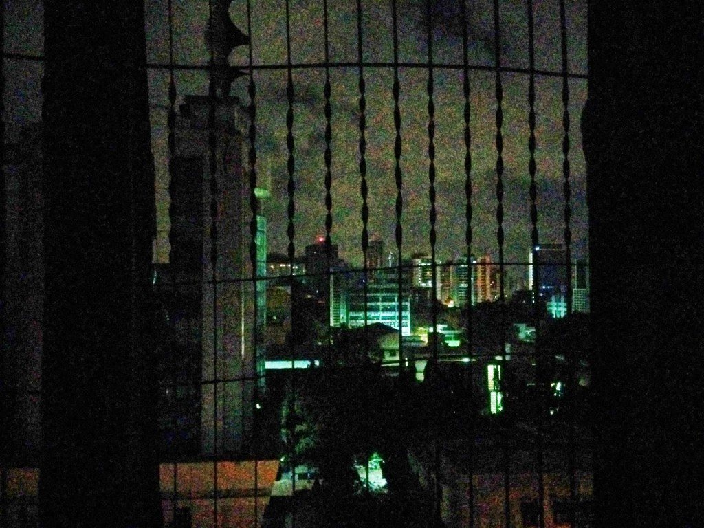

_Was this real?!_  _Were her sleepy eyes deceiving her?_

She saw his chalky white face looming outside the window again. His piercing gaze on her. Drawing the curtains she shut the night out. It spooked her enough to vacate the flat and move into the building right across the street.

From the window of her new habitat she spotted the window of her previous flat. **She wished she had known then what she knew now.** _The eerie face she had seen every night was actually a play of light and shadow of this old building she had now moved into!_

Linking this to [100 Words On Saturday](http://writetribe.com/) at [Write Tribe](http://writetribe.com/) for their prompt this week **'s/he wished s/he knew then what s/he knew now.'**

