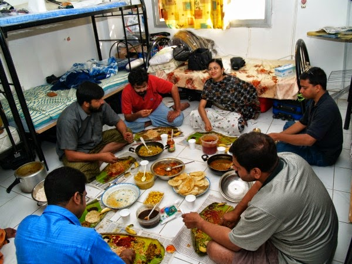

Apeksha stole yet another anxious glance **at** the wall clock to see how much time had passed since they had started eating. Her brothers were having a hearty meal that she had prepared with all her love. She had made sure she included each one's favorite dish **in** it. It took her a lot of effort to suffice **on** the meager rations and vessels available **in** the dormitory of the guest house they had finally found refuge **in**. This was the fifth place they had shifted to **in** the last six months. After all, they did not want to leave behind a trace of their whereabouts. They had been working **on** their masterminded mission for over an year now.

A little over an year ago they had lost their precious little sister **in** a gory incident. Their darling sister Aarti. She was the youngest and brightest, an ambitious journalist with a leading newspaper. So dearly was she loved by each of them, that they would happily have given up their own lives to save her. If only one of them had escorted her when she had gone to that heinous minister's house to interview him that fateful evening...they would probably have saved her from the agony of the torturous rape which took away her life. The minister and his associates had taken turns **in** venting out all the furore that she had brought out in them, when **in** due course of the interview, she had rashly brought out the video clip she had with her which captured his corrupted activities under the mask of a godfather. It was an impulsive act. Hot headed that she was, she realized a tad too late, the implications of revealing such sensitive information to the culprit **in** his own den.

Late **in** the night, she was dumped in a mangled state **on** a deserted street across their house. Leave alone strangers, not even their own neighbors of years offered to help her get back home as she lay bleeding **on** the road there. The brothers rushed to her help when one of neighbors bothered to inform them. But it was too late by then. The family was shattered to see her in that state. Helpless, angered and broken. **In** her battered state she had given her statement. An FIR was lodged. Tests were done followed by other formalities that normally occur in such cases. There was a large hue and cry about the whole incident. Various dignitaries and reputed NGOs visited and offered to help them get justice.The family was hopeful that their dear Aarti would get justice. She fought for her life for the next two days but soon succumbed to her injuries.

While the case proceeded against the culprits, there was a twist **in** the tale, the minister and his associates had furnished some fake information which turned the finger towards Aarti and her character. Her already devastated parents could not deal with the filth that was being slung **at** their late innocent daughter. Two months after her death, crunching under the prolonged stress, their father had a massive stroke and breathed his last. Within the next three months her grieving mother also met with the same fate. That was the last blow. The siblings desperately ran from pillar to post seeking justice. But as days passed the case was losing its former vigor and it was clear that the culprits would manage to push it under the carpet **in** the due course with aid of their strong political contacts.

Unable to cope with the unjust state of affairs, the brothers finally decided that enough was enough. They had to seek revenge for their beloved sister's tragic death, even if it meant giving up their own lives. Her memories and the images of her in pain during her last few moments kept flashing **in** front of their eyes and haunted them forever. Finally they came up with a plan to kill the minister and his associates. They did all the ground work **in** the next few months **at** procuring the weapons and training themselves to use them. They had to change their residence a couple of times to keep away from suspicious and nosy neighbors.

Apeksha was not happy with this sudden turn of events. From the very beginning she had been dissuading her brothers **in** taking up such risky propositions. After all, each one of them were dear to each other. They had already lost their beloved sister and parents. The high probability of them making the tiniest of mistake could lead to wiping away the rest of them **in** a single sweep. A minister of his cadre would have top notch security which could easily crush their amateurish plans. Plans that were plotted **in** moments of dark anguish and white fury. But her pleas went flat and unheard. The brothers were high **on** revenge mode. She had no choice but to be a silent partner to their intentions so as to keep them happy.

Finally came the chance for them to proceed with their mission.  The minister was scheduled to address a large gathering. It had to be done **in** a public scenario, since that would mean that he would be accompanied with all his associates there. They did not want even one single culprit to escape their target. It was a big event and the brothers traced the minister's detailed itinerary through their sources. He was to arrive **at** five in the evening **at** the venue. The brothers carefully plotted their plan of action the day before. While doing so, the youngest of them caught the worried expression **on** his sister's face and pulled her into the conversation.

_"You look worried di....relax. Everything will go as per our plans. Our Aarti will smile from up there when we hack those bastards! Won't that make you happy...for Aarti?"_  he said pulling her into the comfort of a warm embrace. "

_"No. I still feel we should wait till the court hearing takes place._ _Don't you people see, it is not our job to take up law in our own hands? I just don't feel this is right!"_ She tried yet another futile attempt to make them change their minds.

She wanted justice for her sister, but not by snatching it **in** this manner. After all, some things should be left to _God_....nobody escapes _his_ justice, if not today...some day **in** future. If not in this life, maybe **in** their coming lives. Their karma would take care of that. She couldn't bear the thought of her brothers playing with their own lives. What if things did not go as planned and all of them got sentenced for a lifetime behind bars or got hung to death? Worse still what if they got shot **at** sight by the security even before their mission got accomplished? Her mind was clouded with these anxieties. But little did her brothers want to hear any of it.  _"Can you prepare for us our favorite dishes for lunch tomorrow di...?"_  her youngest brother asked her with moist eyes.

He and the rest of them knew, that if at all something went wrong, that was going to be their last meal together. Apeksha nodded her head, weighing the implications of the request in her head. She scanned the faces of each of her brothers for any underlying emotions that she could detect behind the determination to avenge. She could see traces of sorrow and uncertainty **in** their eyes but also sensed a strong attempt to cover up those emotions.

It was all planned smoothly. They were to leave for the venue in a four-wheeler **in** various guises with the weapons carefully concealed under their clothes. They decided to mingle **in** the crowd which would stand **at** the entrance to receive the minister. Apeksha was to feign a sudden heart attack while she was **in** the middle of the crowd just as the minister arrived. Two of the brothers would join her **in** the act by pretending to help her and create a stir to distract the crowd, so that the eldest brother could shoot the minister right **in** his head while the two other brothers would shoot his associates. After they had nailed it, they planned to escape **in** the middle of the chaos. They would flee **in** their four-wheeler to reach the airport from where they had plans to fly off to their maternal uncle who lived **in** Canada. Their uncle had offered to help them during this tough period, both morally and financially. Everything was taken care of. The fake passports as per their new guises, visas, tickets and the rest.

In another hour they were to leave for the venue to proceed with their mission. Apeksha spread out the delicacies that she had prepared with all her soul **in** it. It was authentic Punjabi food but it had to be served **on** plantain leaves the way traditional south Indian cuisine was served, since the spread was large and they did not have such big plates to accommodate so much variety. Sitting on the floor **in** a circle, as they started eating the food and praising it, making fake attempts to lighten the atmosphere by making fun of each other and laughing at silly jokes just like old times, **in** the midst all the banter anxiety hung heavily **on** each of them. Apeksha checked the time yet again. This time, she couldn't see it clearly as her eyelids drooped heavily, the time seemed to have frozen **in** a blur. All she could see was that her happy family was slowly drifting off to join their beloved sister and parents up there. It was time. The poison would start acting **in** a few seconds now. She had made sure that she had laced it **in** each and every morsel of their last meal together.

Linking this to [Write Tribe](http://writetribe.com/) for their [Wedneday Prompt](http://writetribe.com/) which involved using **'prepositions of places specifically: _in, on, at_' with reference to the picture seen above** which was provided by them for the same.

