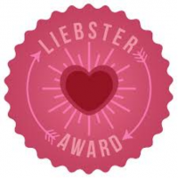

I started blogging somewhere around six years back. But all these years, this blog was more of a diary that I updated intermittently. It was a journal, a scrapbook of sorts, where I used to jot down my thoughts and a random sprinkling of poetry which I would at times share with friends and family. This April 2014, I came across two major blogging challenges online. On the spur of the moment, I decided to join these challenges although I was late by two weeks. It wasn't easy to write so much in half a month but I sailed through it with great effort. It did give me a huge exposure though. It was through these challenges that I connected with a lot of interesting writers in the blogosphere who wrote on varied genres, some of them being professional novelists and writers. Their thoughts intrigued me, tickled me, and further stimulated me to get inspired by them. It was a turning point for me. I am completely hooked to the habit of regular writing now. Two months through and I haven't looked back ever since.

An award nomination from a fellow blogger whose writing resonates with my thoughts is a lot more than an award. It reflects her interest in my writing and also my respect for hers. It confirms my affirmation that I am on the right track._The word 'Liebster' is of German origins and it has several definitions: dearest, sweetest, kindest, nicest, beloved, lovely, kind, pleasant, valued, cute, endearing, welcome, sweetheart, and boyfriend, being among them. Some describe this award as a daisy chain. You get nominated for the award and if you choose to accept, you get to nominate additional bloggers for the award. You answer their questions, the new bloggers nominated answer yours, and so the chain of happiness continues to grow and expand._

<table class="tr-caption-container" style="margin-left: auto; margin-right: auto; text-align: center;" cellspacing="0" cellpadding="0" align="center"><tbody><tr><td style="text-align: center;"></td></tr><tr><td class="tr-caption" style="text-align: center;">My Liebster award!</td></tr></tbody></table>

I am elated to announce that I have been nominated by [Stephanie Bird](http://stephanierosebirdstudio.blogspot.in/) for the Liebster award! This gesture of hers comes as a pleasant surprise to me. We have been following each other's blogs regularly for quite some time now and in the process, I have discovered a lot of common interests with her. It is her paintings, yoga, healing, and a host of other topics I connect with, besides of course her writings which take me to her blog every time she posts something new. Thank you so much, Stephanie! The fact that you liked my blog enough to nominate it for this award is quite encouraging.

So, what is this all about? You may be wondering what the Liebster Award is right about now. Here is a description:

_**The Liebster Award Official Rules**_

_**If you have been nominated for The Liebster Award AND YOU CHOOSE TO ACCEPT IT, write a blog post about the Liebster award in which you:**_ _**1\. Thank the person who nominated you, and post a link to their blog on your blog.**_ _**2\. Display the award on your blog — by including it in your post and/or displaying it using a “widget” or a “gadget”. (Note that the best way to do this is to save the image to your own computer and then upload it to your blog post.)**_ _**3\. Answer 11 questions about yourself, which will be provided to you by the person who nominated you.**_ _**4\. Provide 11 random facts about yourself.**_ _**5\. Nominate 5 – 11 blogs that you feel deserve the award, who have less than 1000 followers. (Note that you can always ask the blog owner this since not all blogs display a widget that lets the readers know this information!)**_ _**6\. Create a new list of questions for the blogger to answer.**_ _**7\. List these rules in your post (You can copy and paste from here.) Once you have written and published it, you then have to:**_ _**8\. Inform the people/blogs that you nominated that they have been nominated for the Liebster award and provide a link for them to your post so that they can learn about it (they might not have ever heard of it!)**_ _**\*Shared from the [Wording Well Blog](http://wordingwell.com/the-liebster-award-the-official-rules-my-first-blog-award-and-a-few-personal-secrets-revealed/).**_

**These are the 11 questions that Stephanie had asked me:**

1\.    What is your favorite day of the year and why? _My favorite day of the year is the first day of the year, January 1st since it brings with it a sense of a new beginning and resolutions. It's like a fresh new start every year._

2\.    Which fairytale resonates with you the most? _My personal favorite fairytale is Cinderella. It makes you believe in a better tomorrow if you're on the right track. No matter how tough your current situation is._

3\.    What is the most important thing for you to do daily? _The most important thing I do daily is consciously trying to feel grateful for all that I have been blessed with. It keeps me away from negativity and opens my eyes to all things positive._

4\.    What do you wish you had more time to do? _I wished I had more time to read and write. There's always a paucity of time to do the same in the desired measures._

5\.    If money was no object what would you spend your time doing? _If money was not an issue I would have spent my time traveling and exploring the world._

6\.    If you could have one magical ability what would it be? _If I could have one magic ability, I would want to know what the other person is thinking through my magical powers. That would help in so many situations!_

7\.    With which animal do you feel the most affinity? _I adore dogs for their loyalty and unconditional love._

8\.    Where do you go for inspiration for your blog? _I get inspired to blog by about anything. A mundane incident, interesting experiences, a quote, a picture, or just random thoughts and opinions._

9\.    If you could have a one-on-one interview with any author, poet or artist, living or deceased, who would you interview? _If I would have got a chance, I would have interviewed the late renowned dancer Protima Bedi. Her autobiography is truly inspirational._

10\. What would you most like to try that you have never done before? _I would like to travel all by myself to an unexplored destination. I've had it on my mind for long but am yet to do it._

11\. Pick one word that sums up your work? _Experiences._

**Okay...so its now time to reveal those 11 random facts about me! Stop yawning, will you?!**

1. _I try hard to behave my age._
2. _I absolutely love the smell of wet earth and the first showers._
3. _I need my morning cup of coffee just as much as I need air to survive._
4. _My smartphone is my best friend these days._
5. _I am super phobic to lizards. If I ever die of a heart attack... it could be because of a lizard!_
6. _The painter in me has been procrastinating for quite some years now._
7. _I  can never have enough of seasonal fruits particularly mangoes and lychees._
8. _I need my daily dose of music to keep me going well._
9. _I get weird dreams._ _One repetitive dream is the one in which I'm on a train which falls dramatically when the bridge is crossing collapses._ _All this happens when I am blissfully sleeping on the train!_ 
10. _There's a die-hard foodie in me who loves exploring new cuisines._ 
11. _I'm a gypsy at heart and it's hard to pin me down in one place._

**And here are some awesome blogs that I am nominating for the Liebster Award:**

These are blogs I regularly follow for the simple reason that I connect with the thoughts of the writers. Some of them probe me to think deeper. Some amuse me with their element of humor. And some leave me speechless with the sheer power of words. My own inspiration to write gets a boost every time I read an amazing post by one of these writers. I have connected with some of them only recently, but nevertheless I do enjoy reading the posts that they write. There are some more people I would have liked to add to this list, who again have a beautiful way with words, but I am not nominating them only because of the knowledge that they are refusing award nominations for their own reasons, which I fully respect. If you have enjoyed reading my posts, I am sure you would love reading the blogs mentioned below. Do visit them. Leave them a comment if you connect with their posts. They do deserve a much larger audience!

1. **Stephanie Bird-**[Stephanie's Studio](http://stephanierosebirdstudio.blogspot.in/) (I can't help but nominate Stephanie again! She deserves it)
2. **Donna Falcone**\-[The Brighter Side](http://thebrightersideblog.blogspot.in/)
3. **Krithika Rangarajan**\-[Mindful Marketing](http://dialmformarketing.co/)
4. **Shailaja V**\-[The Moving Quill](http://shailajav.wordpress.com/)
5. **Sophie Bowns**\-[Shine On](http://sophiebowns.wordpress.com/)
6. **Renu Vyas**\-[The Turning Point](http://www.renuvyas.com/)
7. **Sahiti Janaswamy**\-[Euphorian Dreams](http://sahitibloggin.blogspot.in/)
8. **Sabeeha Parack**\-[Midnight Scribbles](http://midnightscribbless.blogspot.in/)

Congratulations to all of the well-deserving nominees in advance! Even if you choose not to accept the award.

**Now here's the set of questions I have for the bloggers I have nominated:**

1. _Which is the topic you always wished to write about but haven't yet?_
2. _What is that one thing that uplifts your spirits instantly when you're feeling low?_
3. _What is the first thing you notice when you visit a new blog?_
4. _If given a chance to choose who and where would you love to be born as?_
5. _Which is your favorite musical instrument, to play or listen to?_
6. _Which is that one particular habit that sets you apart from the rest?_
7. _Any favorite words that you unconsciously use more often than required when you speak or write but would consciously want to reduce use?_ 
8. _Which is that one book, movie, or incident that changed your life?_
9. _If you find yourself on a magic carpet where would you want to escape to?_
10. _What is your pet phobia?_
11. _What's your favorite quote?_

For the bloggers whom I have nominated-Please see the rules listed above. Let me know if you are accepting the award. And if you decide to accept, please take it forward as per the rules.

Stephanie, thank you once again for this. Hugs!
