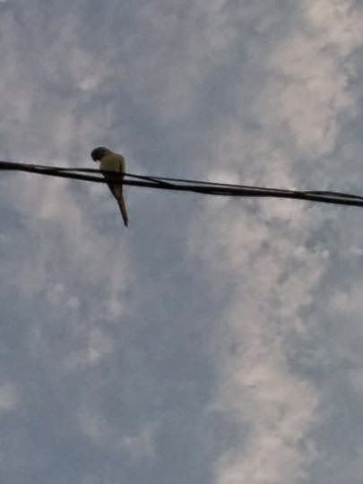
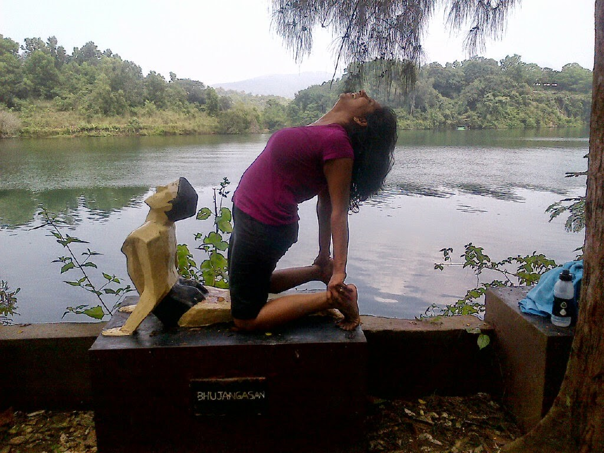
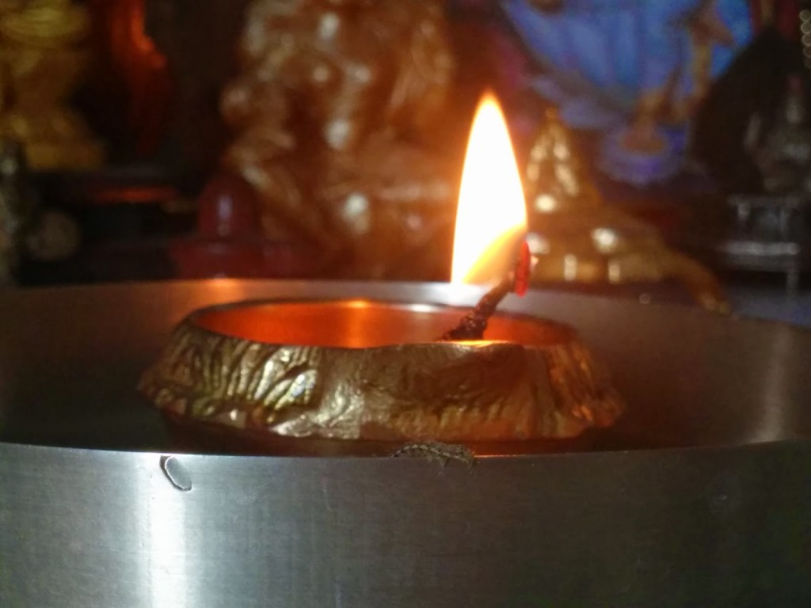
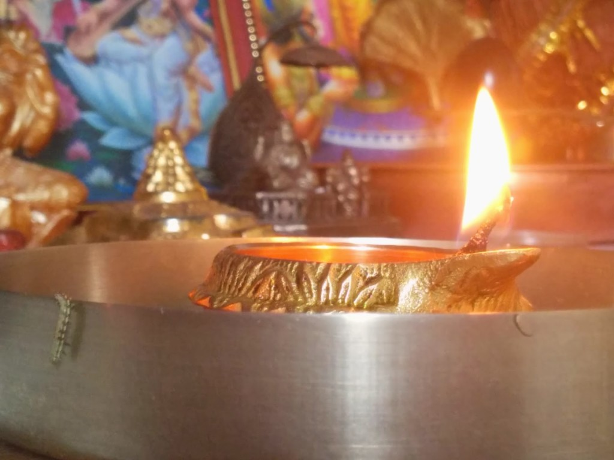
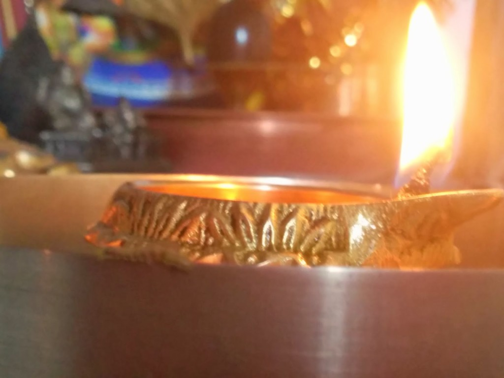
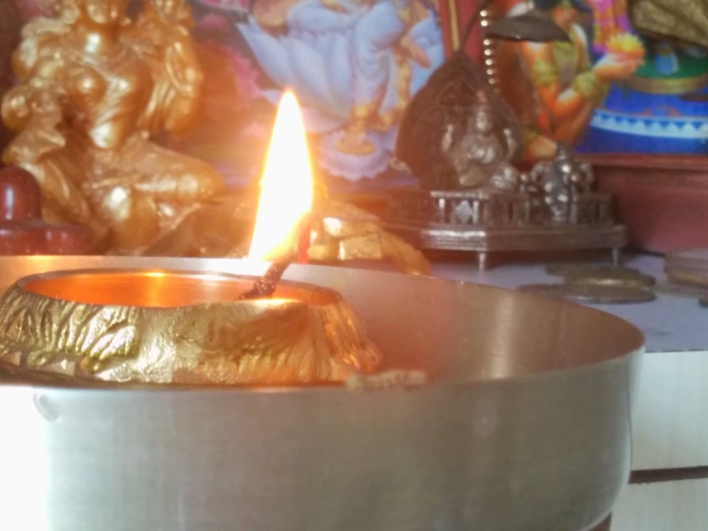

_'My best friend these days is my smartphone.'_ This is what I mentioned in one of the random facts that I was asked to state about myself recently on a blog post. If you ask me why, I'd say, no it is not only for the internet. I mean, yes, Facebook and WhatsApp do keep me connected with my friends and are a few of the bigger perks besides of course the phone calls. But the actual reason is the brilliant clarity and resolution of the pictures clicked with the camera on my phone. A camera which is forever on a standby mode on _my best friend-'my smartphone.'_ This one does not require you to carry a heavy instrument slung from your neck along with other apparatus to give you the desired effects to get a good snapshot. Besides the occasional selfies that are viral these days and the wonders of natural landscapes, there are some spontaneously clicked offbeat images that I love to treasure in my phone memory, just so that I can relish at leisure the memory of the experience and write about it if I feel inspired to.

There are many of those moments. Be it the parrot seen below sitting on the wire when I am sipping my morning coffee on the terrace, which would religiously fly away by the time I would run to get my phone, until one fine day when I was luckier than the parrot to finally manage to click it. Then there is my pet Labrador, 'Rowdy Roger', is what I call him, who gets framed when he's up to his antics which you can see and read about [here](http://ifsbutsandsetcs.com/2014/04/26/yearning-to-heard-monologues-with-mr/). My first ashram experience in Kerala that I captured on the lens and in words [here](http://ifsbutsandsetcs.com/2014/01/10/memoirs-of-sivananda-ashra/). Or the mouse that I trapped several days after it went frolicking in my kitchen feasting on all the goodies that it could lay its fangs on, which you could read about and see [here](http://ifsbutsandsetcs.com/2014/05/29/confessions-of-hoarder/). And at times it is about a couple of silly monkeys trying to entertain me and inspiring me to write an info-graphic story as you can see [here](http://ifsbutsandsetcs.com/2014/04/26/yearning-to-heard-monologues-with-mr/).

<table class="tr-caption-container" style="margin-left: auto; margin-right: auto; text-align: center;" cellspacing="0" cellpadding="0" align="center"><tbody><tr><td style="text-align: center;"></td></tr><tr><td class="tr-caption" style="text-align: center;">The day I got luckier than the parrot!</td></tr></tbody></table>

<table class="tr-caption-container" style="margin-left: auto; margin-right: auto; text-align: center;" cellspacing="0" cellpadding="0" align="center"><tbody><tr><td style="text-align: center;"></td></tr><tr><td class="tr-caption" style="text-align: center;">My first ashram experience at Kerala.</td></tr></tbody></table>

<table class="tr-caption-container" style="margin-left: auto; margin-right: auto; text-align: center;" cellspacing="0" cellpadding="0" align="center"><tbody><tr><td style="text-align: center;"></td></tr><tr><td class="tr-caption" style="text-align: center;">This was clicked from the window of a moving train.</td></tr></tbody></table>

**But well, the least expected and my most beautifully inspirational capture to this date has been the one I talk about below.**

_Standing in front of the small carved wooden temple mounted on the wall of my house, as I folded my hands and brought my palms closer to each other to say my daily prayer I saw something moving in midst of the riotous colors of marigolds and roses. It was a slight movement but yet it had caught my sharp eyes. I squinted to get a closer look. And what do I see? The tiniest worm I'd ever come across, was slithering along the edge of a rimmed silver plate kept inside the temple. My first reaction was alarm and a sudden instinct to roll a newspaper and brush it off the pious vicinity._ _But then I noticed something fascinating which made me halt. It looked like my little companion in my prayer was taking ['pradakshinas'](http://en.wikipedia.org/wiki/Parikrama) (a religious Hindu ritual of walking in circles around a holy fire, monument, or deity) along the rim of the silver plate on which stood the dainty brass Diya that I had lit. Slipping and tumbling from time to time did not deter him. This minuscule creation of God was just going focused in one direction round and round... continuously. Several idols and frames of gods and goddesses silently witnessed this small act which also had me captivated. I decided to do the same and watched on silently, waiting to see when it would get bored with the act and slip off to somewhere more interesting. But this went on for almost a good couple of minutes._

_I have this queer side of me which tries to read signs and messages in little things like these. It could be the lyrics of a song playing on the radio. At times it could be just that part of the book 'The Secrets' by Rhonda Byrne that I casually happened to flip through. When a popular sports shoe brand screams from the hoarding on the road 'Just do it!' and I happen to read it on my way to do something I am unsure of...I get the message. And so, I just do it! Or just a random incident like this which sets me thinking to find an intuitive message that I could decipher, unravel, or read into from what I saw. I mean, somethings just don't appear in front of you out of pure co-incidences, do they? If you are a believer...at times these can be taken as positive directions or messages that you could take forward and use wisely. At the risk of sounding cliched, I would like to share with you what came to my mind at that particular moment. **It felt to me like God himself had decided to embody himself in the form of that tiny worm and take a stroll along my temple to give me a small reminder that my prayers were being heard. It made me believe in the power of praying and keeping faith in the divine.**_ _And could I let the shutterbug in me let this opportunity slip by? No. Never! So, here are a few pictures that I clicked to capture the moment. Strain your eyes to detect the worm on the rim of the plate:_

<table class="tr-caption-container" style="margin-left: auto; margin-right: auto; text-align: center;" cellspacing="0" cellpadding="0" align="center"><tbody><tr><td style="text-align: center;"></td></tr><tr><td class="tr-caption" style="text-align: center;">Yes, that's how it looked.</td></tr></tbody></table>

<table class="tr-caption-container" style="margin-left: auto; margin-right: auto; text-align: center;" cellspacing="0" cellpadding="0" align="center"><tbody><tr><td style="text-align: center;"></td></tr><tr><td class="tr-caption" style="text-align: center;">A tumbling moment!</td></tr></tbody></table>

<table class="tr-caption-container" style="margin-left: auto; margin-right: auto; text-align: center;" cellspacing="0" cellpadding="0" align="center"><tbody><tr><td style="text-align: center;"></td></tr><tr><td class="tr-caption" style="text-align: center;">Nothing could stop it!</td></tr></tbody></table>

<table class="tr-caption-container" style="margin-left: auto; margin-right: auto; text-align: center;" cellspacing="0" cellpadding="0" align="center"><tbody><tr><td style="text-align: center;"></td></tr><tr><td class="tr-caption" style="text-align: center;">And we're still on!</td></tr></tbody></table>

It is common knowledge that such opportunities to capture experiences come up anywhere, not necessarily at home every time. And they are more likely to happen when you're on the move.  But then, the experiences stored on a smartphone device at times do require other advanced versions of technological aids to help smoothly collate, edit, write, blog, and share on social media. So while I have a smartphone to help me capture memories on the go, there's space for other wonders of advanced technology for further improvement. A sleek laptop/tablet comes to rescue at such times with the array of innovative software that can help me further improvise on my passion. And a kindle to read up on the things that would help me research on the topics I write on would be like an icing on the cake!

So now is the time for a _'transformation'._ A _'transformation'_ that would help me generate better results with the aid of the other wonders that technology has brought to us, those that I could befriend along with my smartphone to render better results in my endeavor to preserve and share memories. So then, after just one best friend of a smartphone all these days, it becomes a group of friends now...the more the merrier!

These are devices that would keep me hooked to them even when I am on the go provided they promise the crisp clarity and ingenuity of technology at its best that I require while I record these pictorial treasures of memories. Who would have thought that technology would provide us with smart devices like this a couple of years back? Ones that could not only keep you connected with the civilization but also be handy when _God_ appeared out of nowhere to let you capture and relive over and over the rare and rich experience of divine connect that existed for that brief moment only between you and _Him_.

This post is written for [ASUS "Time to Transform"](http://asusindia.co.in/T100/) contest at [IndiBlogger](http://www.indiblogger.in/).
