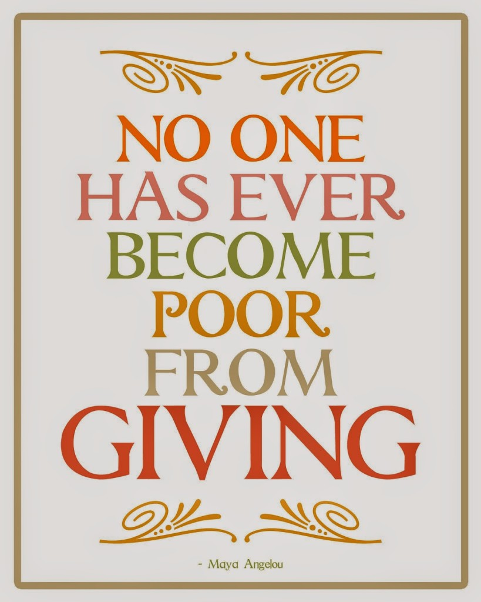
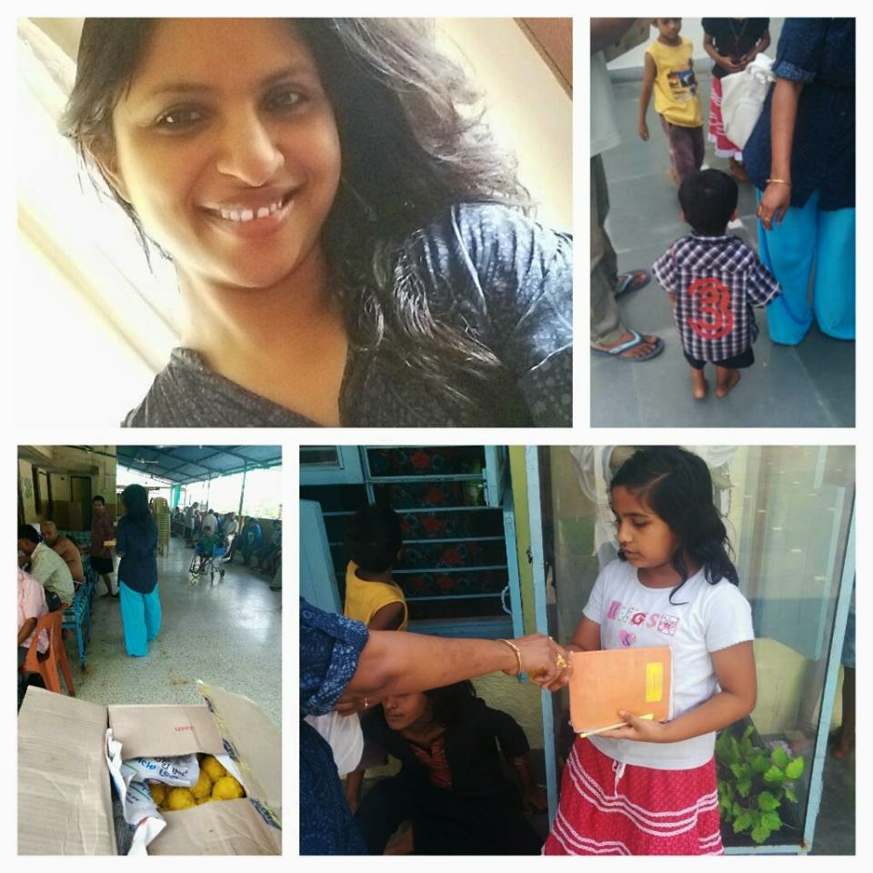

Death brought her doubled fame as compared to life. People who were not aware of Maya Angelou till she died, finally woke up to the fact that there were random quotes that they had been reading and following without much knowledge about the lady who had penned them. It was only after her death that a big section of the masses discovered the legend called Maya Angelou. A multifaceted woman, an author, poet, dancer, and singer, all beautifully rolled up in one.

**_"No one has ever become poor by giving."_** 

This quote by Maya Angelou resonates with me more because of the contradictions it poses in it's simple yet profound implications.

_**It is my birthday today. This birthday takes me to a milestone. A milestone that I do not wish to elaborate about here, but nevertheless it does hold significance in my life. So, I decided that I wanted a different kind of birthday celebration this time. Not the usual cake cutting, partying with friends, gifts, and family revelry that I have been blindly indulging in all these years.**_ 

_**I kept pondering over it for the whole of last month and finally decided what I wanted to do on this day to make it more special than my previous birthdays. Of course, I am not the first one to be doing this and I do not feel that what I did is some great act of benevolence on my part. It actually humbles me into accepting the fact that this is the least I could manage to do and there is much more for all of us to do yet in making our world a more compassionate place. And the reason I am sharing this with you is not with an intention of flaunting my generosity but the enthusiasm to share the feeling of fulfillment that I was blessed with after having enjoyed the best birthday of my life. I felt the need to celebrate this birthday by giving some kind of joy to people who needed it the most and collecting their smiles and blessings in return. Yes, it definitely was not an unconditional gesture!**_ 

_**Could I have received any better birthday gifts than the angelic smiles and blessings of homeless children and challenged senior citizens? I doubt.**_

_**So, off I headed this morning to the local 'Mother Teresa Missionaries of Charity' which housed a spirited bunch of 400 odd destitute people of all age groups. With them, I shared my joy over the sweetness of ladoos that I brought them. In return, they obliged me with the best collection of radiant and beaming smiles that I had ever come across. It was an experience worth a million words. But yet I fail to do justice now in shaping those words into a proper body of content that describes it to the best. Trust me when I say, the very act of giving made me feel so rich. Rich with gratitude for having been able to touch them with a spark of sunshine in the otherwise bleak lives of these people less fortunate than me. The contentment that filled my heart at the end of the day can never match any of those shallow birthday celebrations I had all these years.**_ _**It was a 'Happy Birthday' indeed!**_

<table class="tr-caption-container" style="margin-left: auto; margin-right: auto; text-align: center;" cellspacing="0" cellpadding="0" align="center"><tbody><tr><td style="text-align: center;"></td></tr><tr><td class="tr-caption" style="text-align: center;">My Best Birthday Ever!</td></tr></tbody></table>

If you cannot offer monetary help to the less fortunate, there are still a lot of things you possess which you could give them. Besides profound acts of kindness like donating your blood and organs, something as simple as offering a kind word, a helping gesture, sharing of knowledge, and least of all a genuine smile to a complete stranger also is an act of giving which could add value to somebody's life.

This experience that I had today only reiterated Maya's words in my head.

**_"No one has ever become poor by giving."_** 

On the contrary, the act of imparting a bit of sweetness in somebody's bitter life enriches you in a way as to make you feel richer than ever before!

Linking this to [Write Tribe](http://writetribe.com/) for the [Wednesday Prompt](http://writetribe.com/maya-angelou-wednesday-prompt/) which was to choose my favorite Maya Angelou quote and use it as a prompt to write a post on it.

