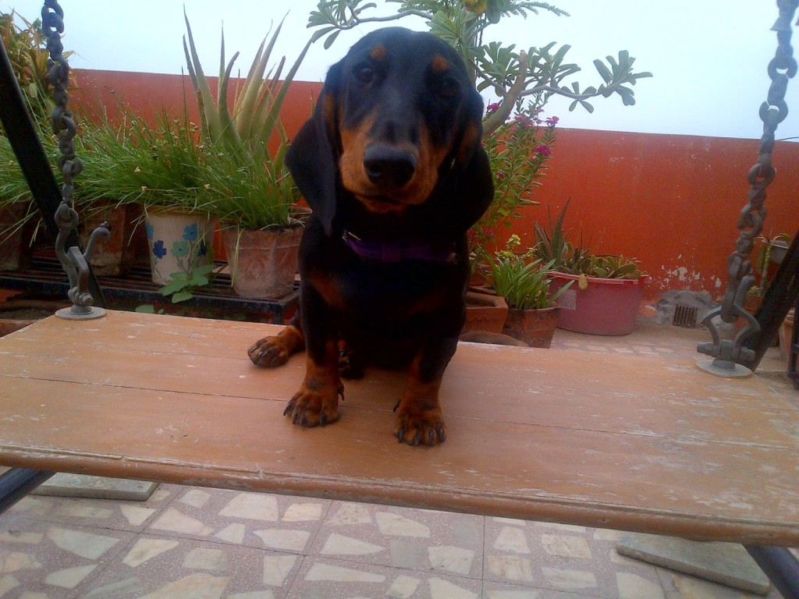
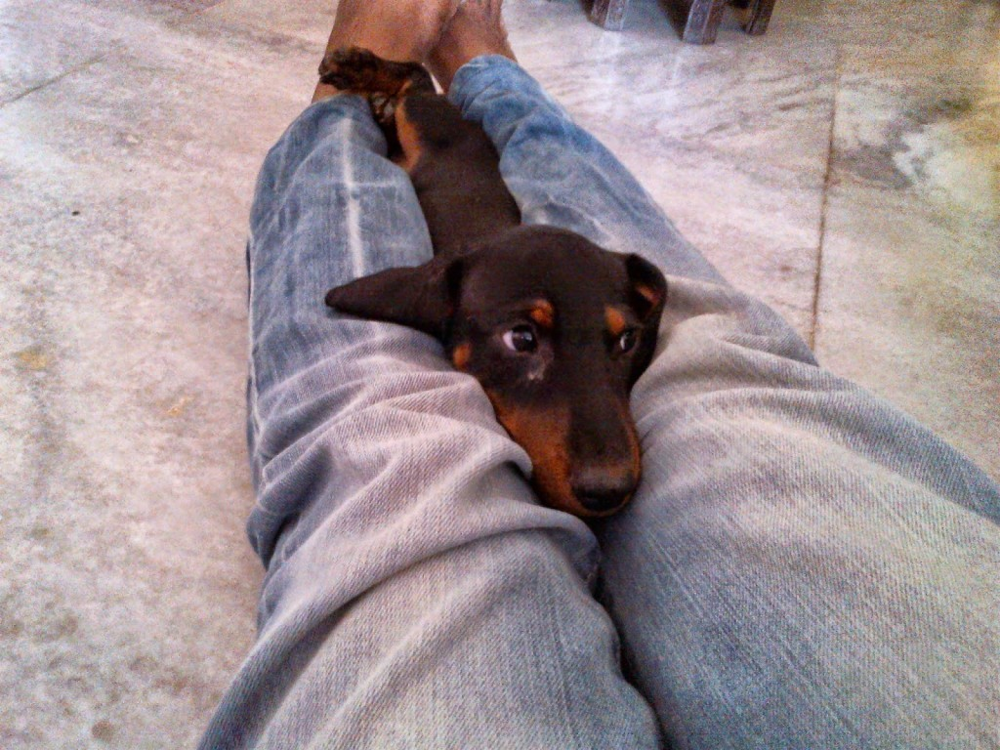

<table class="tr-caption-container" style="margin-left: auto; margin-right: auto; text-align: center;" cellspacing="0" cellpadding="0" align="center"><tbody><tr><td style="text-align: center;"></td></tr><tr><td class="tr-caption" style="text-align: center;"><b>&nbsp;Dhobi ka kutta | &nbsp;The Washerman's Dog</b> This picture reminds me of those 'Wanted Dead or Alive' posters! I posted this picture in a bid to advertise her adoption.</td></tr></tbody></table>

So well, I'm supposed to write about two of my favorite pictures as suggested by [Write Tribe](http://writetribe.com/) for the [Wednesday Prompt](http://writetribe.com/). So here goes. This post today is about this innocent looking puppy you see in the picture above. Don't get misled by her teeny size and docile looks! I did. And it was a BIG mistake.

She is a classic example of the popular Hindi saying:

**"_Dhobi ka Kutta. Na Ghar ka. Na Ghat ka."_** 

**(A washerman's dog belongs to no place, neither at home nor the washing pen)**

It refers to a person who belongs to two groups and not considered as belonging to either. I specifically chose these words to quote her since this less than one feet tall 5 feet elongated long bit of a nitwit dachshund actually belonged to our _dhobi_, Raju, the guy who irons our clothes regularly. Now, this guy is fond of dogs. So he managed to procure a well bred dachshund puppy from one of his obliging customers. In lieu of the pup he offered to iron the customer's clothes free of cost for a stipulated time period. In the consequent years, our _dhobi_ was blessed with a litter of pups from his fond acquisition.

One fine day when he casually got one of the pups to my place, I got so smitten by the deceitful looks of this imp of a bitch pup that I ended up gifting her to my mum on her birthday. More so, since she had fond memories of her pet dachshunds from back in her maiden days and had expressed her desire to adopt one again. I have had this cheeky habit of gifting pups to my mum since I was in school. Cheeky on my part, coz I could enjoy the perks of having a pet at home while managing to go scot-free of taking its responsibility. There were two cases before this in the past wherein my poor unsuspecting dog-loving mum had got hoodwinked into adopting pups gifted by me. Decisions which she later regretted. But I need a separate post on those two events to elaborate why. Coming back to this specific gift. Mum was overjoyed to receive a pet who she hoped would give them the much needed company after dad's retirement from his job. She lovingly called her Fenny. I suspect the name could probably have lent its nature of intoxication to this 'one and only item' of its kind that passed off as a dog. The size of the breed did deceive mum into believing that this one would be a breeze for her to handle.

Her joy was awfully short-lived though! The least she had expected was a pint sized flying monster traipsing around her house. Yes. Fenny was a flying monster. What else would you call a creature who could have easily won the Olympics gold medals in both, the long-jump and high jump rounds?  Her long flappy ears acted like wings in her acts of euphoric leaps. Specifically, leaps that converted into flights of amazing distances. Her favorite route being from the floor-to sofa-to dining table-to my dad's bald pate and back to the dining table!

Picture another scenario. Mum had just wound up with her day's chores and had comfortably settled in her easy chair with a glass of chilled water and the newspaper for her daily Sudoku solving session. And in the middle of a seemingly complicated puzzle she gets a rude jolt to find a neglected bit of yelping ribald Fenny, throwing herself into her lap.  Damned were the spilled glass of ice cold water, mum's displaced spectacles, flying newspapers and poor disheveled mum who was at loss of what had led to what, and how the hell had this dimwit of a chimp landed on her?! Well, that was Fenny's way of showing love.

Toilet training was resisted with the same passion with which she gulped away every morsel and titbit of food and a host of other non-edible items she chanced upon. I often wondered where all that food landed. I mean, looking at the size of her tummy, it was a valid question to mull on. But well, a lot of it got unceremoniously pooped and peed out at unsuspecting places and times. Expensive upholstery being her favorite place to relieve herself. On walks which were intended for this specific purpose and which could have been mutually pleasurable to both mum and her, turned out to be chasing marathons for mum. Fenny's excitement would break loose in wide-eyed wonder when she would step out of the confines of the house. And the next instance my stupefied mum would find herself clutching to a dogless leash. Our dear Fenny would have vanished in thin air. And suddenly, out of nowhere would come a woof prancing in delight, throwing a mischievous dare at mum to chase her. Poor panic stricken mum would skim her sari in a tight grip and run to grab her only to find her far within her reach making merry with the stray dogs across the road! Mum would manage to take help from kind and obliging people passing by, who would trap and assist Mum strap Fenny back to her back to the leash. Phew!

Not to mention the level of damage that came with her bagful of antics. Had I had a wee bit of idea of the scale of mayhem that was to follow I would gotten an insurance against this disaster. She chomped off in glee at mum's lovingly tended plants/saplings, her favorite armchair's backrest upholstery, mattresses, pillows, heirloom rosewood furniture, footwear, clothes, doors, our fingers, toes, hair, her own leash and much more. And man....were her fangs teeth sharp? No comments on that. Except that the she has left us with tell tale marks of the same which we discover in new places and objects to this day.

<table class="tr-caption-container" style="margin-left: auto; margin-right: auto; text-align: left;" cellspacing="0" cellpadding="0"><tbody><tr><td style="text-align: center;"></td></tr><tr><td class="tr-caption" style="text-align: center;">The only way to keep her calm, steady and straight.</td></tr></tbody></table>

The only way this turbulent creep could be controlled was as seen in the picture here, trapped between my legs with not an inch to budge. Every once in a while I would do this to her to calm the situation at home. But well, how long could that last anyway?!  My mum looked distraught at the state of affairs. She had mentally given up on expecting a miracle of a transformation in Fenny. So next few days saw me vehemently advertising and looking up for people ready to adopt Fenny. The first picture you see here at the beginning of the post, was splashed across my social media pages, like a 'wanted dead or alive' criminal's portrait. I conjured the most polite and convincing words to say _'Please. Someone please take this grief away from us!'_ without appearing to sound desperate lest no one would come forward to adopt her. So it read something like " Cute little dachshund pup available for immediate adoption." To which a lot of people of clicked on the 'like' button and Ooohed...Awwed and cooed in the comment box to exclaim how sweet they thought she was (if only they knew the reality!). A few did ask for details but no one ventured to come forward to adopt her. Guess they all figured out this prankster's personality in the snapshot I had provided.

Finally as a last resort, I went to our _dhobi_, the guy from whom I had got her. Pleaded him to take her back. He relented a tad grudgingly. Apparently ever since then, the poor guy has been trying to find her another home since he already has Fenny's mum to fend for and who's expenses was getting too much for him to bear. But unfortunately for him, all the houses Fenny went to, the harrowed people there brought back this brat who refuses to mend her ways even after growing up. Its been a two years since. So now you know why she is a _'dhobi ka kutta.'_ She belongs to no place!

I honestly love dogs and have nothing against them. I enjoy their naughty antics to bits. But this one's idea of mischief is way beyond our level of tolerance! Presently, I have a Labrador for a pet and he's adorable in his own rowdy ways.You can read about him here on [Rowdy Roger-"Don't Angry Me!"](http://ifsbutsandsetcs.com/2014/04/19/romp-ades-rogue-ades-with-roger/). Thankfully he's not as unmanageable as this witch seen here! After all these shower of expletives that I have used to describe Fenny, I must admit that we still smile fondly when we recollect those chaotic days spent with her. Only - we cherish her pictures and memories more than her in person. And now you know why!

Linking this to [Write Tribe](http://writetribe.com/) for the [Wednesday Prompt](http://writetribe.com/) which was to write about two of my most cherished pictures.

