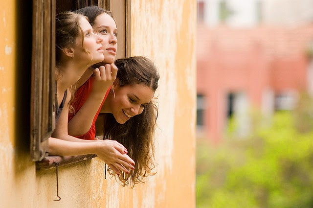
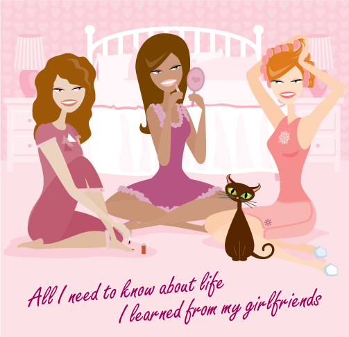

So well, [blogadda](http://www.blogadda.com/) prompted me to write about my role model yet again. I had dedicated two posts previously on my biggest role model, my mum, here as [Happy Birthday Ma!](http://ifsbutsandsetcs.com/2014/04/13/its-mums-birthday-today/) and here as [Ma and her bag of tricks - yet again!](http://ifsbutsandsetcs.com/2014/06/23/ma-and-her-bag-of-tricks-yet-again/) So this time I choose to write about my other set of role models...yes you read that right - role 'models.' That's quite possible, isn't it?  To have more than a few role models. The perfect and the top most on my list will always be my Ma, followed closely by my bunch of close girl friends.They say a woman is a woman's worst enemy. I choose both, to agree and disagree on this statement based on various experiences I have had with my gender pool. I have had my share of disappointments to exemplify this statement.  But when it comes to my girlies....I prefer to disagree on this statement.

There's not one perfect one among the whole lot...well none of us are anyway! Thus I prefer not to glorify any one of them but rather highlight random qualities of each of them that I admire and at times try to inculcate in myself to enrich my persona. For once, I never go by word of mouth about any of these women that I have befriended, no matter what people think or say about them. It is how they have made me feel and what I like about them that has made them tick in my life. These ladies have colored various stages of my life with their thoughts, counsel, support, actions and not to speak of the constant pump of morale boost that I receive from them when most required.

<table class="tr-caption-container" style="margin-left: auto; margin-right: auto; text-align: center;" cellspacing="0" cellpadding="0" align="center"><tbody><tr><td style="text-align: center;"></td></tr><tr><td class="tr-caption" style="text-align: center;"></td></tr></tbody></table>

Coming back to the random qualities that I like in them. Among my friends, I am blessed with a versatile range of women of varied age groups swinging between the normal girl next door to the most eccentric and wild social misfits. While I admire one of them's delusional ideas of a perfect married life which keeps her happy in the most daunting situations, just because she chooses to believe everything in her life is perfect. There's another one who's very expectations of the perfect life has kept her away from a perfect life. I owe it to a few of them for having gently nudged me to stop being frivolous and urging me taking life more seriously like they did. These are the ones whom I can credit for helping me refine my taste in music, films, books, art, fashion and much more. There have been some who have taught me to live life with gay abandon in the present moment. Chatting away with them into timeless infinity about everything and nothing in particular with spurts of giggles as also petty squabbles that meant no big deal later, have surprised me with some valuable insights. And then there are a rare few who've helped me connect with the spiritual side of me which lay dormant for a good part of my life. Some have rubbed their diva-hood onto me to bring out the fashionista in me, while there have been some who shared the enthusiasm of the foodie in me over numerous rounds of _panipuris_ followed by endless bowls of caramel custard. A few have helped me understand the mother in me and alongside discovered one in themselves. And yet a few more have got the best out of me in terms of my work as an exploring design professional and a thinking writer by displaying their passion towards their own work.

There are things we disagree on. But I tend to focus on things that I agree with them on and blur out the non-agreeable ones. There have been habits, thought processes, perspectives and lifestyle changes that I have consciously and at times unconsciously adapted from these girls. Whether it is that 3am friend that my panic call goes to or the one living across the globe, whom I haven't met in years but am still connected to regularly, thanks to the advent of internet and social media. Each of them has been a role model to me in their own small way without their knowledge.

It is their faults that make me realize what I do not want to be and it is their virtues that help me decide what I like to be. Knowing their perspectives while discovering my own have been precious milestones that has helped me reach where I am today. A person that I love being.

_Image Source: Google Images_

This post has been written about [#MyRoleModel](http://myrolemodel.blogadda.com/) as a part of an activity by [Gillette India](http://www.rewardme.in/tag/gillette-cricket) in association with [http://www.blogadda.com/](http://www.blogadda.com/).
