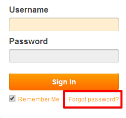
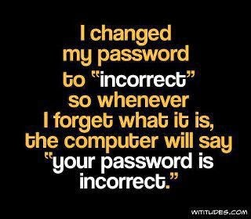

Today, I am angered beyond words.This is so demeaning! She's dumped me the way she had dumped the others before me. Dropped me unceremoniously like a hot potato! Is this what I get in return for all that I did for her in these last few months? My predecessors did warn me about her rash thoughtless ways. Only, I had assumed that I was stronger than those losers who did not have it in them to go with her the long way. After all, I was a combination of the best as compared to all those buggers who got tossed  out by her before me.

I did my best, though. I mean, what more could I have done for her? I guarded her precious confidential stuff, her darkest secrets, incessantly - day and night. I had kept her safe throughout. The time when her jilted lover tried to avenge her by trying to sneak in and create trouble for her. Another event was when I had protected some of her really private photographs from being leaked. That would have landed her in some serious trouble, if not for me. And yet again, there was a time when her snoopy boss wanted to confirm if she was applying for jobs elsewhere. No sir - it is not so easy to crack in with me around. Also the time when she escaped a major scam - well, she was blissfully unaware of it though, but I still managed to save her without her knowledge. She even trusted me with her financial dealings, her bank details and other important documents. Not to mention the innumerable times she had irresponsibly exposed me to the world, risking trouble for both, her and me. We made through such carelessness on her part too without any untoward incident, just because I believed that we were meant to be together. I was with her throughout. Protecting her privacy. A loyal companion for life.

All was good till that long spell when she did not need me. Some stupid vacation she had left for. I know coz that was the last time I was of use to her, when she had to inform people that she would be away and inaccessible. And what did I get rewarded with when she returned? Memory loss? How the hell could she forget me?! And hello, excuse me...it was she who had chosen me with careful contemplation and not the other way round! Still, even after so many prompts she did not recollect someone as effortless yet dependable as me. Isn't that ridiculous?! Utterly humiliating. What did she think I was? Just a bunch of stars strung together?  She's never going to find anyone better than me - for sure.

Once again, in the last few months she clicked on the button below her email login page which said:

**Forgot password?**

 There goes our short and sweet association...sigh! anyway,

 **'This too shall PASS.'**

_Image Source: Google Images_

Linking this to Day 3 of [UBC July 2014](http://ultimateblogchallenge.com/) and [NaBloPoMo July 2013](http://www.blogher.com/nablopomo-july-2014-blogroll)

