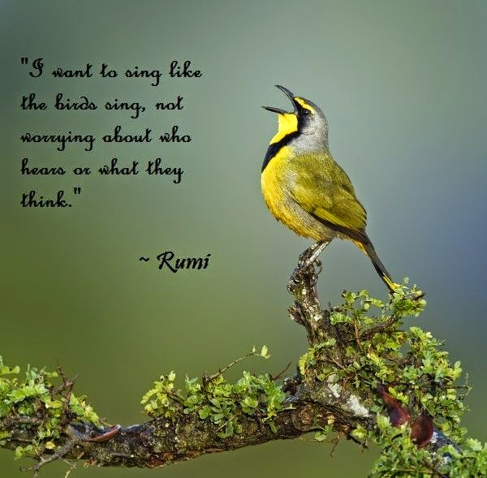

I wanted to sing...like a lark! Freely - without a single fear or worry in the world. In full spontaneity of my free-spirited nature. I usually did. In the shower, on my walks, but mostly to myself and with a sense of self-restraint. Years back I had picked the courage to sing in front of my family members at a relative's wedding. But from the corner of my eyes I had noticed their jeering smiles and suppressed giggles. So, I cut it short. No one said a word about it then. But after we were out of the wedding, they pulled my leg mercilessly for it. Not that I sang too badly. I probably drifted off from the tune for a bit, but no, it wasn't that bad. I just needed a bit of coaching and practice and I could be as good as the best of seasoned singers.

Coming from a typically orthodox Indian family, elders from my family often discouraged their children to be associated with anything that had to do with singing and dance in any form. The only reason stated to us was that people from decent families do not sing and dance! I failed to see their logic, until I was old enough make sense of their absurdly distorted thoughts on this topic. Apparently back in olden days, music and dance in India was associated with prostitution. Thus, the apathy towards it. What a pity? To be denied the natural need of indulging in something as soulfully joyous as music. It was criminal. But I never mustered the courage to fight it.

A good number of years later, one fine day I happened to be in a good mood and in my state of happiness I absentmindedly ended up singing to myself in the kitchen. Only, I was a little louder than usual. This time even before I could finish, the ladies in the kitchen promptly shushed me up, saying it would disturb people in the house and also loudly wondered what neighbors would make out of it. I shook my head in frustration and disappointment. What else could one expect from in-laws but scorns and taunts?

That incident shut me up for a long time after that. I assumed that I probably was not so good after all. I consciously suppressed my need to sing freely. Until one fine day a few years later, Mili heard me singing in the shower. I wasn't loud but somehow she had heard it. She had stuck her ear to the door to hear more. And when I stepped out of the shower, she was all smiles. "Woman...how come I've never heard you sing before?" she demanded, feigning a sulk. When I confided in her about my experiences in the past, she listened to me intently. After I finished she was lost deep in thought. Suddenly she broke out, _"Listen, I have a plan."_ 

Fifteen days later, I was dressed in the best of my silk saris with a string of fresh jasmine flowers around my hair bun. I stepped onto the stage with the confidence of a pro and started singing spontaneously, unperturbed by the astounded expressions of my clueless family who sat in the audience unprepared for the epiphany that awaited them. I sang with gay abandon, from my heart with my eyes closed, unmindful of how people were reacting. It was just me and the strains of melody...lost in a world of our own. It was an old classic number...one of my favorites.This unfolding event was the last thing my old husband, my two sons and daughter-in-laws had expected when they came to attend the annual function at the school. The school where my eight year old grand daughter Mili studied. After learning about my passion to sing, Mili had secretly arranged for her music teacher who lived close to our house, to train me to give this performance at her school's annual concert. I would leave the house on pretext of taking a walk and go for my music classes secretly without the knowledge of others at home. I diligently took the coaching for fifteen days non-stop and ensured that I made the most of it. After all, I couldn't let down the confidence that my sweetheart Mili had placed in me.

When I finished my song and opened my eyes, there was pin drop silence in the auditorium for about a second, after which a thunder of claps greeted me. My eyes glazed when I laid them on the set of people from my family looking at me in proud admiration, giving me a standing ovation. _"You rocked, my Lady Gaga!"_ exclaimed an excited and overjoyed Mili as she engulfed me in warm hug when I stepped down from the stage. "

 Four generations of resistance later, I could finally get rid of the **pebbles in my shoes -** pebbles that existed in the form of the rigid of thoughts of my ancestors, my own generation and my descendants. Today, decades later, thanks to my darling granddaughter who helped me hone my passion and give it an outlet, at the ripe age of seventy - I had arrived.

Linking this to Day 4 of [UBC July 2014](http://ultimateblogchallenge.com/), [NaBloPoMo July 2014](http://www.blogher.com/nablopomo-july-2014-blogroll) and [Write Tribe](http://writetribe.com/) for the [Wednesday Prompt](http://writetribe.com/) this week which involves writing about the _'Pebble/s in my shoe.'_ Since I have chosen to write a collection of short stories for UBC this time, I've used the prompt _'Pebble/s in my shoe'_ to write a short story around it.

