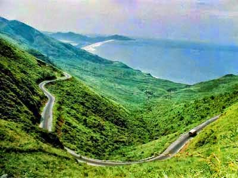

The van we were traveling in came to a sharp halt. Pumpkino, managed to stumble out of the front seat with great effort. It required some skill to push out that huge pot-belly from the restricted area of the front seat of a car. Stammerking left my side to join him. I was left with Hardrock giving me company in the backseat of the car. Thankfully, I did not have to leave the car. I was too sleepy to budge. It wasn't exactly entertaining to be in Hardrock's company. He never responded to my questions. As his name suggested, he would always have a hard stony expression on his face. But I still amused myself trying to imitate his grim ways. Also, I never understood half of what Stammerking blabbered because of his stammer. So, mimicking both of them in turns was a past-time that I indulged in while enjoying their grumpy discomfort to the core!

It had been nearly a month that we had set off traveling to places I had never been before. Of course, I have been on luxury vacations which involved staying in cold uninviting hotel rooms and visiting famous tourist destinations. But this was a vacation of a different kind. Nothing was planned. Neither the destination, nor the halts that we took at unknown places. Besides, I got to see some of the most scenic roads and landscapes. The kinds you get to see only in films and books. I never knew such places existed for real. I mean, I had only seen the sun peeping out of the mountains with V-shaped birds flying on the sides sketched only in sketchbooks till now. I was wide eyed in wonder when I saw this sight for real while winding down the road from a valley. Seemed like the crayon sketch from the sketchbook suddenly started to magically turn live, with those V-shaped birds actually flapping their wings in motion!

We ate different kinds of food. No burgers, pizzas, noodles or pastas here. But freshly cooked piping hot naans, with veggies, lentils and rice. None of which I ate willingly at home. I ate all of these without throwing any fuss for two reasons. One - we always ended up eating late...so by the time food came to us we would be ravenous, and two - the freshly cooked local food was deliciously flavorsome even without much spice in it. C'mon, I didn't even need tomato ketchup to go with it...it was that good! It was no wonder that I seemed to have got healthier. Within a few days my clothes already felt tight at the seams. The best part of this journey was that nobody forced you to get up early in the morning, brush your teeth or take your bath. When we stopped by a lake or a canal, we would simply splash in, wash ourselves and laze in the sun for a while to dry ourselves. And back we were on the road.

My friends back home and in school were quite different. Friends who dressed well and spoke courteously. But these were the friends who although were good to talk to, would do the worst imaginable things to me behind my back. They would laugh at the mole I had on my nose. And ridicule the shoes I wore, which were a cheap imitation of a branded sportswear. Only because they owned the original ones from that imported brand that costed a bomb. Whereas these guys that I was traveling with, were neither courteous nor friendly. They never judged me for what I wore or how I looked. In fact they hardly spoke to me. In spite of that, they would ensure that I would never go hungry or cold. There were occasions, where I was ordered to cover myself with a rug when it got too cold. We would be short of the rugs and one of them would suffer the biting cold but it wouldn't be me. To top it, these guys had amazing toys. Very real looking ones. One of them allowed me to touch his toy but wouldn't let me play with it. But that's okay, I get possessive about my toys too at times. One of them had a cell phone but he never let me play games on it. He used it occasionally, walking faraway from us so we couldn't hear him and bark into it furiously. I would get all curious wondering who it was that he spoke to, because he would always be in a foul mood when he ended the call. They would discuss the call among themselves in a strange language that I couldn't understand. I would shrug it off. Probably it was their little secret which they did not want to share with me. Big deal, I had mine too.

 We embarked on mighty mountains and spiraled our way through scenic valleys, sometimes crossing a gushing waterfall. At times we seemed to be lost in lush thickets of wilderness. I would  tip my head out of the window and enjoy the cool breeze. Imagine...no one objected to that! At times rolling by a dusty road that would be straight and boring we would suddenly cross strange looking hutments which I had never seen before with people in interesting costumes - as if dressed for a fancy dress event. Oh and I once spotted a hyena cross the road one night - a real hyena...can you beat that?! Isn't that awesome! Imagine how impressed my friends back home will be, when I tell them I was just three feet away from a real hyena! I wouldn't have known that it was a hyena had Pumpkino not pointed it out.Zoomerboy was my best friend among all the four of them. He was the one behind the wheel. I would simply have to cajole him a bit to race the car when I would get fidgety on a particularly dull and uninteresting road. And he would hit the accelerator with a vengeance that sent our vehicle zooming away at a thrilling speed that would get me all excited, cheering him while clapping in glee! There were days when Zoomerboy, got too tired to drive anymore and we would just park ourselves in the middle of nowhere and sleep on the road...under the stars! Man...I'd never seen so many stars before. It was a new day everyday. I was having a whale of a time!

 Coming back to where we stopped. Hardrock was back to the van. He ordered me to get out of the van. I assumed we had stopped for lunch but I did not see any eatery around the place. He led me to where Pumpkino was standing, brandishing his toy. They whispered among themselves for a while. Before I could fathom what was going on, they tied my eyes with a kerchief. Ah, so we were playing a game! Interesting...I'm in! But wait a minute, now they were tying a cloth around my mouth and my hands! What the heck...what kind of game is this?! And I was asked to move forward. So now we were up to some make believe filmy game huh? I racked my brains. Soon I heard voices, familiar voices...

_"Dipu!"_ cried Ma, sounding almost like she was bleating! I felt being tightly hugged by Ma and Pa. Someone tugged the binding off my mouth, eyes and hands. It was great to see them after so long. I did miss them. I reciprocated their hugs and kisses. I looked around for Pumpkino and Hardrock, so that I could introduce my new friends to my parents. But strangely they were nowhere to be seen. It then dawned on me that they had got bored of my company and had dumped me with my parents. When they first met me, they did not even tell me where we were going. Just whisked me into the van when I was on my way to school and took off. I didn't even know their real names, thus I ended up giving them names myself. A wave of disappointment crept over me. Seems like my adventurous vacation was over. My new friends had left me without even bidding me goodbye. But then they were never too great with manners anyway. Oh no...it was back to the same old  grind of school, books, homework and the monotonously predictable routine of city life! Even the prospect of watching the television after so many days did not seem to lure me anymore. Everything would pale in comparison to this one helluva trip I just had!

Ma was weeping. Okay, so I missed her too all these days...but c'mon...I was only away for a few days! What I failed to understand was why Ma and Pa looked so dumbstruck when I replied to their queries on what I did all these days. As I described to them about all the beautiful places we traveled to, the yummy food we ate, the rare sights I saw and lastly the interesting toys these guys had with them - those huge guns, which almost looked real, their jaws just dropped open. And back they were, to smothering me with those stifling hugs and kisses. Sigh!_Image Source: Google Images_

_**Note to my readers: This is a piece of fiction and bears no resemblance to any person or event from real life. For people who had got confused with my previous post - I am neither a Seventy year old granny nor a school going brat! These are characters of my imagination. But yes, they do have a bit of me, my experiences and observations in them! You'll meet more of such characters here this month through. But, none of them are me or my own real-life stories.**_

Linking this to Day 5 of [UBC July 2014](http://ultimateblogchallenge.com/) and [NaBloPoMo July 2014](http://www.blogher.com/nablopomo-july-2014-blogroll)

 

