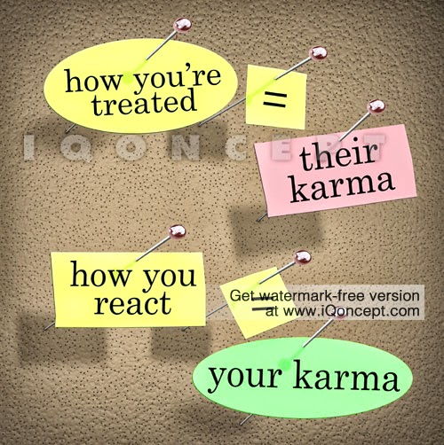
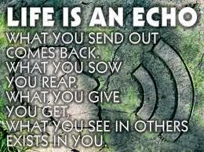

Shikha slammed on the brakes at the junction when the traffic light signaled red. Like always, people around her were admiring her sleek red Porsche. It always made her beam in pride, for she had strived hard to reach where she was to have been able to afford a life of contentment as luxurious and successful as this.

She looked around idly, drumming her fingers on the steering wheel, while she waited for the traffic signal to turn green. Her wandering eyes suddenly fell on the local bus that halted in the parallel line opposite hers, facing the direction that she came from. At one of the windows of the bus she saw a familiar face. She couldn't believe it. It was her school friend Ayesha. Was it really her? What was she doing in a local bus? And what had she done to herself?

Shikha and Ayesha were childhood buddies from school. Buddies in a weird way, because there existed wide attitudinal and economic differences between both of them. While Shikha came from a middle class family, Ayesha belonged to a rich and affluent family. A fact that Ayesha would heartlessly rub into Shikha in many ways, directly and indirectly by flaunting the luxuries that were bestowed on her by her wealthy parents. While Ayesha came to school in a chauffeur driven car, Shikha would be dropped by her dad on his old scooter. Although Shikha would not mind it, Ayesha would always poke fun of her dad's battered scooter. To which Shikha would respond by saying that she loved being dropped to school by her dad rather than being dropped by a chauffeur. Ayesha would always feel that it was Shikha's way of covering up her disappointment for her humble background. But, in reality Shikha indeed was quite content with what she had.

As years went by, after passing school, both of them had kind of lost touch when Ayesha went abroad to pursue her studies further. Years later, they bumped into each other at a common friend's wedding. Ayesha in her fully made-up socialite avatar was seen with a good-looking man, her husband, who apparently was a big industrialist. She had got off her swanky Mercedes with him, oozing of vanity and pride that had grown stronger in her with time. When she saw Shikha pay off the auto-rickshaw in which she arrived for the wedding, she faked a look of disbelief. And, when she learnt that Shikha was happily divorced, she was could not buy the 'happily' part of it. Ayesha gave her a sympathetic look and in her signature style put her down by adding that she had been more than lucky as far as her own marriage was concerned.Yes, Shikha was happily divorced, because she had refused to take the old-school mind-set of her ex-husband and in-laws who prevented her from living her dreams and pursuing her career. She felt stifled in just being a dolled up trophy wife. To add to that, she soon got a whiff of her husband's womanizing adventures. It did not take her much to walk out of the marriage, without a second thought. And today, she had no regrets for the decisions she had taken. Within a span of next few years, with sheer dedication and hard work, she had steadily climbed the corporate ladder. She was going strong with her ambitions to achieve all that she ever dreamed of. A beautiful house of her own, parents who supported her whole-heartedly, a secure future and a lot of interesting people to mingle with.

On the contrary, Ayesha now cut a sorry figure. Her face was sans makeup, hair in a state of disarray, with not a piece of jewelry on her body and clothes that did not do justice to the glory of the Ayesha of yesteryear. Shikha noticed with disbelief that the dress that she was wearing had worn-off and was also giving away at the seams. Suddenly her eyes met Shikha's. She took a second to recognize Shikha before she brought herself to respond to her old friend's cheery wave with a forced smile. But her eyes welling with tears had another story to tell. Before they could exchange any form of communication, the signal on the other side turned green and the bus moved forward, taking Ayesha away towards her destiny.

There was no way Shikha could get in touch with Ayesha after that. She was not accessible on her old numbers and neither did she respond to her emails. After much digging around, a few days later Shikha got to know the reason behind the state Ayesha was seen in. Apparently, Ayesha's husband and her father had tied up to setup a massive business venture. It was all going well till the time Ayesha's husband was alleged to have been involved in some dubious scam that left them bankrupt. Her husband was behind bars and her father had lost all his money in the venture. Her father could not handle the stress of the turn of events and passed away shortly. Each and every asset they had possessed was seized in the process. Though Shikha had heard of the scandal, she had not associated with Ayesha's husband, since she had met them only once in the recent years.

Ayesha was on the roads, rendered helpless. In spite of being well-educated she was rejected at many job interviews due to her husband's scandalous background. Ayesha now worked as small-time clerk in a small private company which paid her a paltry amount to fend for herself.

_Image Source: Google Images_

Linking this to Day 30 of [UBC July 2014](http://ultimateblogchallenge.com/) and [NaBloPoMo July 2014](http://www.blogher.com/nablopomo-july-2014-blogroll).

