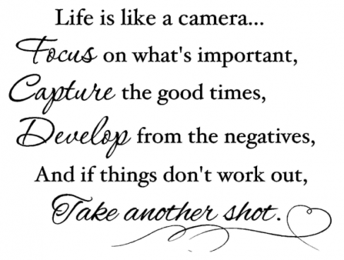
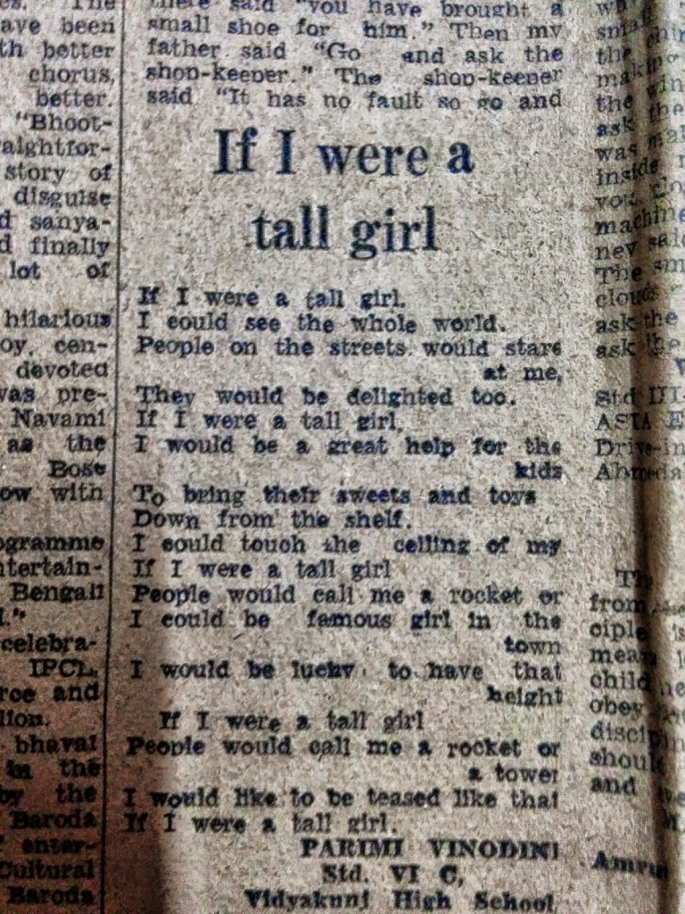
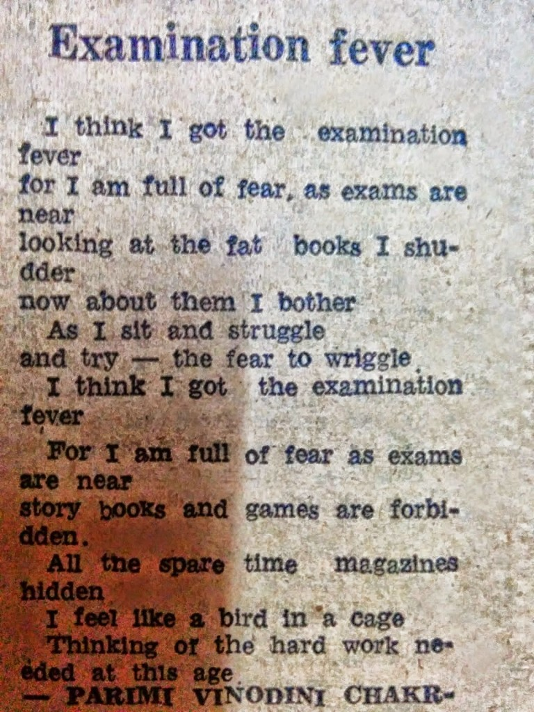

She was not the best student in her academic years. Her mind would always wander in a world of her own imagination. Her teachers would call her the 'perpetual dreamer.' She would often escape the rigidity of academics by doodling sketches and writing amateurish poetry behind her school notebooks. Fortunately, she had parents who could guide her and encourage her to pursue her interests and helped channelize it in a proper direction.After school, when the time came to select a subject that she could pursue for her further education, she was in a dilemma. Her English teacher wished that she should have gone for a degree in English literature, whereas her Art teacher wished her to explore the Fine Arts. Finally, the latter won. And she was off to the Art college learning the nuances of Painting. The Art college was her stepping stone to adulthood. It further shaped her into an individual with acquired finer sensibilities towards aesthetics and life in general.

Unfortunately, due to various personal reasons, she could not pursue Painting after her graduation. But in the meantime she dabbled with Fashion Designing, Illustration, Graphics and Animation. There was also a time when she was teaching all these subjects to degree students. But life had a lot more planned for her. Within a few years, a person who had never meandered out on her own from the safe cocoon of her hometown all her life, saw herself in the big bad city of Mumbai very much on her own. She started working with one of the biggest Indian retailers in Mumbai. You might wonder what a painter/writer was doing in retail. Well my friends, she was into a specialized field of retail design, called the 'Visual Merchandising,' which involved creating customer interest, through creative product display, effective communication, and overlooking the overall look and feel of the retail spaces so as to induce sales. She spent the next eight years working with some of the best retailers in the country, traveling places, meeting new people and making some interesting friends.

All was good, till two years back when she was forced to take a sabbatical for certain unavoidable reasons. Mind you, this was a sabbatical she 'chose' to take at the peak of her career. It wasn't that she was rendered helpless. She had consciously made this choice. But yet, the way people looked at it was as if she had lost out on something. Unsolicited advises and uncalled for sympathy greeted her everywhere she went.

These two years happened to open her eyes to some harsh realities of life. You see, in today's world, the value of a person is determined as per the money he or she makes. The moment people start assuming (and assumption are aplenty!) that person does not have a stable ground, professionally or personally, or has ventured to do something that does not agree with their understanding; their attitude towards that person unconsciously starts changing. I wouldn't say that people boycotted her downright. On the contrary, they were too good to her. Offering her a lot of counsel and comfort. But as time went by, the hypocrisy of their goodwill showed up in various ways, sometimes through actions, sometimes through words, both said and unsaid. Some of them offered to help her but the so-called help came with bitter implications. Sadly, some of them were people whom she considered her closest friends.

She observed, she listened, at times she fought it, but with time she simply became a silent spectator to the hypocrisy of it all. A lot many people provoked her to unfriend them through their thoughtless behavior. And, she did do away with those few with no regrets whatsoever. A few from her close set of pals that she counted on, let her down badly. But she still continues to be friends with them on a safe ground. She notices and understands their intentions but chooses to remain quiet, all in the name of some beautiful memories that they have shared in the past. Although, she knows now what to expect from each one of them.

But yes, the wrong ones apart, there have been some people who have pleasantly surprised her, genuinely stood by her, cheered her small victories, offering her a non-judgmental moral support throughout. These are the select friends and relatives that she can trust for life. These two years have ensured that she was able to filter the true from the fake and learn from her mistakes in understanding people. She is now thankful to each one of them for making her a much stronger and wiser person than she was in the past.

In the meantime, she found solace in her long lost passion for writing. She revived a blog that she used to hardly update, that served her as a journal of sorts till some time back. A few blogging challenges later, she was completely hooked to her love for writing. She could express, vent, wonder and visualize through this medium in her own space, at her own pace and with no fear of being judged by her professional or personal background. She met some wonderful people in these few months. Writers, bloggers, philosophers, healers and artists... people who encouraged each other and added a different dimension in her life altogether. She now focused her complete attention to the positivity that came from these interactions and translated it into her words. All of which has paid off, in the form of gaining some ardent readers, coming across some excellent blogs, her write-ups getting published on a website online, winning blogging contests, and one of her short-stories being selected to be soon printed in a book.

The perpetual dreamer has finally entered the world of her dreams to stay.

Tomorrow, is a new beginning which unfolds another chapter in her life. This time, she is a lot more enlightened and enriched from the recent lessons that she has learnt.

_Note to my readers: For people who have known me, I'm sure you've guessed who this story was about. Yes, this is not a work of fiction. The woman in the story is me. After a whole month of writing fictional stories for the Ultimate Blog Challenge, I thought it was about time I wrote a real story. And who else would I be able to describe better than me, myself?!_  

 

_Before I go on a short break from blogging after posting this last post for UBC, today I would like to share two of my many poems that got published in the kid's talent section of 'The Indian Express,' early in my school days, thanks to my encouraging mother, who found them scribbled behind my school notebooks and sent them to be published. Please ignore the typos and misprints if you find any!_  _They bring me a smile every single time I read them, for they remind me of the sheer innocence of life, back then. I hope they make you smile too :)_

<table class="tr-caption-container" style="margin-left: auto; margin-right: auto; text-align: center;" cellspacing="0" cellpadding="0" align="center"><tbody><tr><td style="text-align: center;"></td></tr><tr><td class="tr-caption" style="text-align: center;">&nbsp;<b>And lo, I really grew into a Tall Girl!</b></td></tr></tbody></table>

 

<table class="tr-caption-container" style="margin-left: auto; margin-right: auto; text-align: center;" cellspacing="0" cellpadding="0" align="center"><tbody><tr><td style="text-align: center;"></td></tr><tr><td class="tr-caption" style="text-align: center;"><b>Never had fever as bad as this!</b></td></tr></tbody></table>

_Image Source: Google Images_

Linking this to Day 31 of [UBC July 2014](http://ultimateblogchallenge.com/) and [NaBloPoMo July 2014](http://www.blogher.com/nablopomo-july-2014-blogroll).

 

