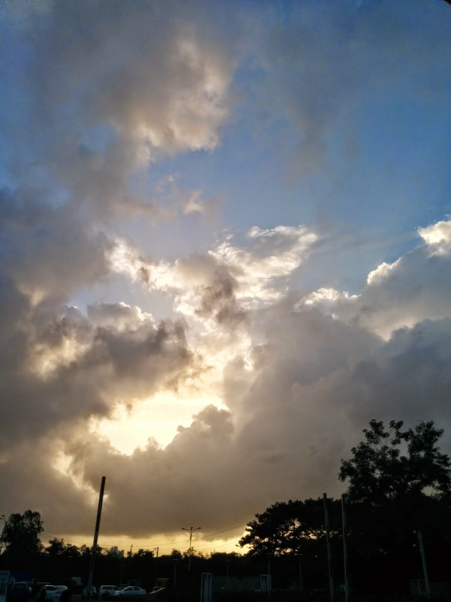

_**The security guard forbids me**_  _**as I capture you**_ 

 _**from where I stand,**_ _**mesmerized by your unfolding enigma**_  **_You're obliviously lurking above_**  _**a treasure trove that stands heavily guarded**_ _**I tell him you belong nowhere**_ _**So, click I will**_ _**As he looks away**_ **_Looming dark over the mighty corporate horizons_** _**Engulfing within your fluffiness, untold mysteries many**_ _**As, yet another eventful day of a new beginning ends**_ _**Can you be my wee bit of comfort in these new environs?**_ **_Say, have you by any chance drifted from above my home afar?_** _**Bringing me millions of memories to drizzle with...**_ _**The warm snuggle of my little one**_ _**The rich aroma of my morning cuppa**_ _**An eyeful of my garden, sprinkled with colored blossoms**_  _**The yearning look of the fur ball of a dog that misses me,**_ _**I'm sure...**_ _**The flavors of the spices sizzling in my kitchen**_ _**The sofa that warmly envelops me every time I plonk**_ _**doing nothing in particular**_ _**yet every bit important**_ _**The cozy familiar scent of home...**_ _**Carry within you yet another ambiguity this evening**_ _**Will you?**_ _**If you happen to find yourself wafting homewards again**_ _**Bless them with a generous shower of my love**_ _**Till we meet again.**_
