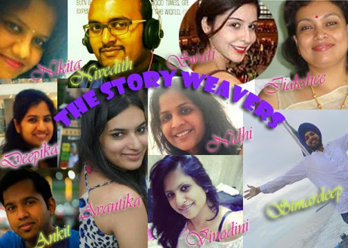

Last month was eventful! And trust me, I am not exaggerating at all. A few weeks back BlogAdda came up with the #CelebrateBlogging contest. The idea of co-authoring a story, which stood a chance to get published did sound tempting, especially since I always was curious about how the co-authoring bit worked. So, I signed up for a contest that was no less than a roller-coaster ride of sorts. Bumpy and challenging yet enlightening and enriching.I got to know the names and contact details of the ten people I was to share my excitement with for the next few days. The first one who started the ball rolling in initiating a chain of mails was selected as a POC. And soon we were eagerly shooting ideas. The fact that we had a majority of women in the group, brought up with story lines that were mushier, spicier and far more emotionally loaded than an Ekta Kapoor serial. So, we were told off by this ever-enthusiastic guy in our group, called Simardeep Singh. Being among the minority in the group in terms of his gender did not deter him at shooting down all our feminist story lines. I wasn't surprised when he suggested a terrorist angle to the post. Who else can turn a pen into a sword but a Sardar?!

Not many women were convinced with the idea and there came a point when our proactive POC (also a woman!) did the disappearing act stating that she was busy! And, in stepped the new POC...who else but the Sardar with the sword...oopss...pen...oopss keyboard! Well, there were a few more drop outs and new additions who replaced the dropouts. A Facebook page was created for brainstorming ideas, and also a WhatsApp group. Though, not many people preferred being connected by WhatsApp. Simardeep, Ankit, Nivedith, Nidhi, Avantika, IIakshee, Deepika, Swati, Nikita and of course Vinodini...what a super team it was?! Team 'Story Weavers' (that's what we called ourselves) was all set to roll! In spite of so many bright ideas, we were getting nowhere with a concrete story line and running out of time. Finally, after lots of agreements and disagreements each of us started writing our post with a loose story line that we had come to decide.

The biggest challenge we faced was that, most of us were 9 am to 5 pm (of course it goes without saying that we never get off at 5 pm...sometimes it is 10 pm or much beyond!) working professionals who would get back home in the crankiest of the states and try to organize our lives to keep up with the deadlines of the contest. We also had a soon-to-be mother in our group! Ridiculously, every time I asked for a slot to write my post, that very day I would invariably be working late and would end up dragging myself home. After a whole night of going through the previous posts to make sense of where the story was going, through sleepy eyes, I would get up early next morning and start typing my post in my groggy state, first thing in the morning before I got out of my bed! It did not help that I have a fetish for writing the last cliffhanger post, and I insisted on doing that.

It was super exhilarating when the results for the first round were announced! The suspense was killing us. The fact that we were 7th on the list of all 30 teams who made through the first round sent us riding high! The second round was more structured and we decided on the story's shaping step by step.**_' The Siege Saga'_** the title of our story, was shaping up into a thriller of sorts with a little bit of everything thrown in...violence, thrill, drama, suspense, fiction, terror, love, trauma, humor and a range of other emotions. And guess what? We made it to the third round! In spite of all the optimism we did not really expect to reach this far. There were commitment issues from some bloggers, since no one had expected this to stretch so long. Especially the very pregnant Avantika, with her due date coming closer. But hell...we all pitched in, motivating each other, pushing each other to go that extra mile!

There came a point when I had yet again self-designated myself to write the last post of the final round and the person who was supposed to write the post before mine fell ill! The second last post was all action laden with live bombs that Ankit had left throbbing in his post which were to be diffused by voice passwords and the works! Being a low-tech, peace loving person, I could hardly make the head or tail of the outline for that post. Thankfully Deepika stepped in, and so did the ill Swati swing into action at the last moment and the second last post was written...phew! While they were at it, I had already completed my last post with a sweet little happy ending, wishing them good luck for wiping out all the terrorists and diffusing all the bombs!

I'm going to miss the late night chats, the brainstorming, the leg pulling, the disappearing acts, the quick fixing of jigsaw puzzles, filling in gaps and missing links across posts, and the last minute of _'pakaoing of khichdi'_ to serve the jury and readers with, before the clock struck twelve (with our poor POC chasing us to submit the posts, so that he could compile it and then get some of his precious sleep!). So, chaotic though it was, we finally did manage to wind up writing _**'The Siege Saga.'**_ Whether we make it to getting published or we don't, I personally think each of us did a splendid job! Group hugs guys!

<table class="tr-caption-container" style="margin-left: auto; margin-right: auto; text-align: center;" cellspacing="0" cellpadding="0" align="center"><tbody><tr><td style="text-align: center;"></td></tr><tr><td class="tr-caption" style="text-align: center;"><b>The Siege Saga Makers!</b></td></tr></tbody></table>

 

_Read the story from the start to the end on the link below:_ 

_Presenting the_ 

[_**The Siege Saga**_](http://simardeep88.blogspot.in/2014/09/game-of-blogs-story-weavers.html)
