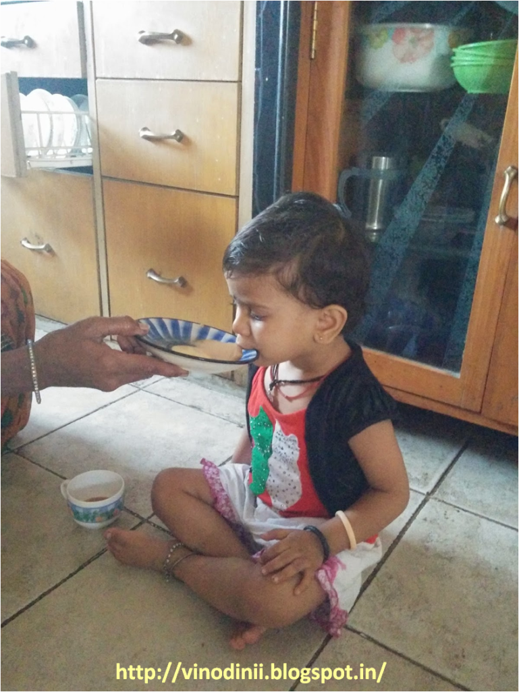

When [blogadda](http://blogadda.com/) invited bloggers to make a difference in the lives of underprivileged children by writing a post that promised that bloggadda would feed a child, who is an [Akshaya Patra](http://www.akshayapatra.org/) beneficiary for an entire year, I couldn't help but do my teeny bit as a blogger for that one needy child I might be able to reach out to, by means of this post. The Akshaya Patra Foundation is a not-for-profit organisation headquartered in Bangalore, India. The organisation strives to fight issues like hunger and malnutrition in India.

I know a lot of people who do have the best intentions to make a difference in the lives of the underprivileged but are not aware that the smallest of their contributions can make a significant difference in the lives of these people. Most of them shrug it off under the assumption that these initiatives are meant for the affluent class of millionaires who can afford to donate crores of rupees in charities without a worry in the world. But the truth is that only a few rupees that we so casually spend at the nearest multiplex on weekends - over a tub of cheese pop-corn to munch on as we sip the bubbly beverage, watching the latest blockbuster in the cool air-conditioned confines of the luxurious multiplex, sinking into our plush seats, could have helped a hungry child get one square meal a day for a whole year. Yes, exactly the same amount that you spent on the movie ticket and the refreshments for just that one evening out could have fed one child for a whole year. And, how many times do we salaried people manage to afford such outings? About once in a month at least? In that case, we are capable of feeding a minimum of twelve kids an year with one healthy meal a day! Think about it.

Watch this video to know about an easy way

you could do your bit with the said amount.

_Source: [Akshaya Patra](http://www.akshayapatra.org/video-galleries/about-akshaya-patra)_

On a day-to-day basis there are over a million ways in which one can help, only if we keep our eyes and heart open to the needs of many such children around us. Throughout my childhood we have had our house-help coming into our house with her kids who suffered from malnutrition. One couldn't blame the parents because beyond a point all they could afford to feed their children was dry _rotis_ and tea. I remember my mother doing her bit by serving both, her house-help an undernourished mother, who was then breast-feeding, and her children each with a cup of milk every day, just so that they could get their daily dose of nutrition.

Recently my cook’s two year old daughter accompanied her mother to our house. After an hour of pottering around when the little one was hungry, I was surprised to see that the mother made her sip the tea that I had offered her to her little daughter out of a saucer. When I inquired as to why she was letting such a young child have the caffeine laden tea, she informed me as a matter of fact that tea was what they could afford to feed their children as opposed to milk, on the meager wages they survived on. Ever since, I make it a point that whenever the little one comes to our house, she either gets a cup of milk or some other healthy option to munch on, while her mother is busy whipping up a wholesome meal for us. Such tiny gestures can go a long way in building a healthy future for the lesser fortunate children across the world. And it doesn't take much. Really. All we need is a lot of compassion, a bit of thought and some action.

- I am going to #BlogToFeedAChild with [Akshaya Patra](http://www.akshayapatra.org/ "Akshaya Patra") and [BlogAdda](http://blogadda.com/ "India's largest blogging community!").
