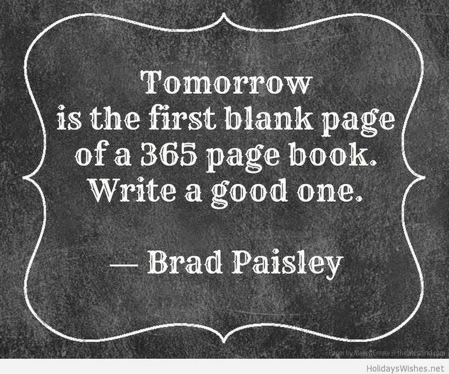

Yet another year comes to a close and a fresh new one awaits to take us off on a flight, to the unknown with mixed feelings of hope and anticipation. Resolutions are aplenty and so are a lot of lessons learnt from the past year that might just help achieve some of those resolutions. Well, some resolutions tend to disappear in thin air faster than you recover from the hangover of the new year eve's party. But the lessons learnt do stay longer with you. So let me share some of the lessons I learnt in 2014 that might help me or hopefully all of us raise the bar higher for ourselves in 2015.

1. You can never have enough of friends. Keep the old ones close but never shy away from making new ones. A few years down the line, the new ones will be on the list of the old close friends. And mind you, each new friend brings with them some unique valuable lesson that you could learn from.
2. No one can love you more than your parents and your children. These bonds are irreplaceable and incomparable with any other relationship in the world. When the world turns their back on you, 99.9% of the times it will be either your parents or your kids who will be the only ones standing by you. And yes, if you have a pet in your life, you're lucky to have one more unconditional source of love.
3. Failures are a part of life, just as much as success. Being hard on yourself leads nowhere. Rather shifting your focus to the path that leads to success helps but let success not become an obsession. With each failure comes a capacity to grow stronger and face tougher challenges in future.
4. Distance yourself from negative thoughts, people and attitudes. All it takes is shifting your attention to something joyful and  stimulating that feeds your soul.
5. No person is worth your life. If you cannot keep yourself happy, nobody else will. There's so much more to life 'OUTSIDE' you that can enrich the person within you. Explore, learn, observe, enjoy and adapt.
6. Faith can move mountains. Hold on to it. What you tell yourself comes true most of the times. Be mindful of your thoughts and words (I'm still working on this one myself. Work in progress!)
7. The more you give, the more you receive. This holds true for your wealth, assets, your services as well as something as simple as giving someone a smile. Let every single interaction you have with people make them feel good about themselves. And there, you just gave them a few happy moments!
8. Scars will heal and you might such do away with the extra weight someday but the time you spent worrying about it will be gone soon. So either make use of the time to work on the solution else just go with the flow and enjoy your imperfections. Obsessing on them is a waste of precious time.
9. But must add, nothing brings a spring in your steps the way a makeover does. Be it a new haircut, a change of wardrobe or just a simple addition to the accessories you are wearing. For me, a new haircut always works wonders and keeps me in good mood for days after. As long as you can smile at yourself in the mirror, what the world has to say about you doesn't really matter.
10. Nothing injects the kind of freshness in life than what travel does. A short trip to an interesting destination can add more zest to your life than the spinning cds of the DJ at the hippest club you hopped by on a Friday night.

<table class="tr-caption-container" style="margin-left: auto; margin-right: auto; text-align: center;" cellspacing="0" cellpadding="0" align="center"><tbody><tr><td style="text-align: center;"></td></tr><tr><td class="tr-caption" style="text-align: center;">Source: Google Images</td></tr></tbody></table>

So well, there's much more I could ramble about, but lets keep this short. I intend to live by these in 2015 and hopefully add a few more to them by next year. I would love to know what lessons you are taking forward in the coming year. Do feel free to share them in your comments below.

As goes the English translation of my favorite dialogue from a recently released Hindi film, 'Highway' wherein the actress, Alia Bhatt says:

**_"I do not wish to go back to where I have come from, nor do I wish to go where I am heading to. All I love are these roads and the journey I have embarked on."_** 

So folks, enjoy the journey while it lasts! Wish you all a blessed and fruitful year of 2015.

**_Happy New year!_**
