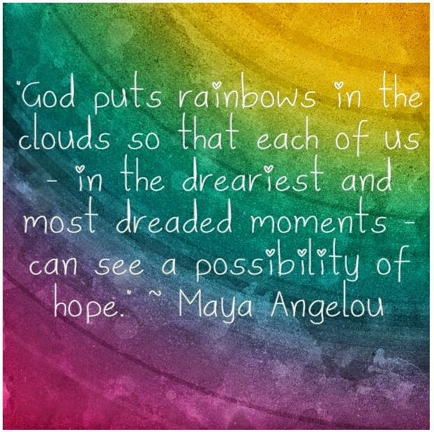

The array of colored glass bangles merrily reflected various hues on Rasika’s face, mocking her bare wrists in provocation.On her newlywed delicate wrists adorned these tinkling beauties to carefully match her vibrant saris - back then, when Pranav was alive. With him, all the colors in her life had got wiped out, replaced with the dreariness of white.

_"Why should a selfish man’s ending his life deprive her from reaching out for her rainbow?"_

Resolving her inner battles finally she reached for the brightest set of bangles. She was all set to re-introduce herself to the vibgyor within her.

