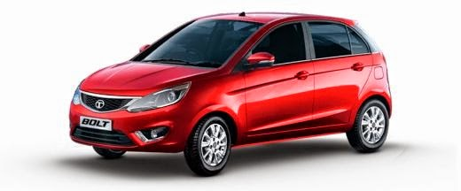
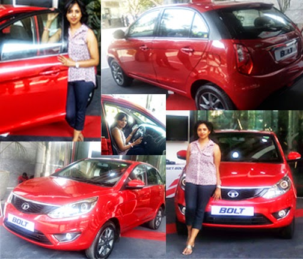

_"Yet another brand new snazzy car...waiting to wow people with its affordable yet swanky design."_  
This is the thought that came to my mind when I got to know about the Tata Bolt, the newest hatchback to be launched soon. So what was the big deal? Most of the new cars in this segment seem to offer great design with affordability. So, how was this different? It is only when I had the chance to set my eyes on the car and experience the new level of technology that Tata had successfully managed to incorporate using the features of a sedan, that blended beautifully with the good looks of this hatchback, that actually made rethink on how it was not just another newly launched car, that promised much more than an amalgamation of aesthetics and affordability in the small car segment.  

<table align="center" cellpadding="0" cellspacing="0" class="tr-caption-container" style="margin-left: auto; margin-right: auto; text-align: center;"><tbody><tr><td style="text-align: center;"></td></tr><tr><td class="tr-caption" style="text-align: center;">Image Source: Google Images Video source: YouTube. Do watch the video!</td></tr></tbody></table>

  
By the look of it, Tata has one more bright feather tucked in its cap after the success of the launch of Tata Zest a few months back. A lot of key attributes of the Zest have been incorporated in the Bolt. While Zest was more of a family car, Bolt seems to have been designed to win over those who truly take driving as a serious passion!  And, look at what they've come up with - a car with a strongly etched character.  
  
The obvious five features that make the Bolt stand apart from other cars in its niche are majorly:  
  
**The  Multi-Drive feature:** Sports/ Eco/ City that enables to choose the mode you wish to switch to as per your need. Sport mode for that rush of adrenalin which comes with roaring energy, Eco mode when you decide to get maximum fuel efficiency and City mode to get the best of both in a balanced manner.  
  
**The Revotron 1.2 turbocharged MPFI petrol engine:** For an incredible driving experience for all the driving enthusiasts out there, powering the Bolt, is a 1.2-litre Revotron turbocharged Multi-point Fuel Injection (MPFi) mill, good for 90 bhp and peak torque of 140 Nm and a 1.3-litre diesel unit, rated at 75 bhp and 190 Nm of peak torque. A five-speed manual gearbox will come as standard across all variants, with no AMT, even as optional.  
  
**The Generation Next safety feature:** With 9th Gen ABS by Bosch, that provides corner stability and dual airbags which provides that extra level of safety precaution. There's one airbag on the left and one on the steering wheel. In case of accident these airbags can be released which help the doors get unlocked while fuel power gets cut off.  
  
**ConnectNext touch screen infotainment by Harman:** This feature gives you the flexibility of connecting your smartphone to enable navigation from MapMyIndia and an advanced voice command recognition feature that makes small tasks like switching the radio channel or regulating the air-conditioner's temperature smoother - all at the convenience of a touchscreen.  
  
**Superior space and comfort:** Besides the comfort of leg space, head space and rear seats that bend, the added comfort comes in the form of the rugby shoulder seats.  
  

  

  
**So, the features mentioned above are those that the Tatas will obviously promote, but the ones that had me impressed an individual customer personally were:**  

  

_\- The Bolt comes with a shorter gearing._ _A short gear, will move a lot of weight in a short distance. This improves the torque and_ _does effect the fuel economy in a big way._

_\-Automatic push button adjusting of mirrors and speed sensing locks. I believe, these conveniences are rarely or probably not seen so far in a hatchback._

_\-A bumper with a honeycomb pattern steel grille that upturns into a C-shaped smile, from under the slight bulge on the hood, and headlamps with projectors that are swept back in class. A lot of attention seems to have been given to the cockpit with the stress given to bring out a premium feel. But it is the profile view that takes the cake! Loved the strong character these design features imparted to the car. A head-turner from the word go!_

_\- What's the point of owning an eye-candy if it is not a cozy proposition? Besides the looks, it scores high on comfort, offering more space than a majority of hatchbacks available in this segment. The seats are well contoured to suit comfortable sitting for sharp maneuvering, especially the rear seats, making it easy for three people to comfortably sit. Also, the rear seats can be folded down completely to offer more space to the boot._ 

_\-The Harman infotainment system along with a lot of other features mentioned above, gives you an option of connecting to a total of ten Bluetooth connections, two connections at a time. Isn't that cool?! I wonder if my latest smartphone has that feature. I doubt._  
  

<table align="center" cellpadding="0" cellspacing="0" class="tr-caption-container" style="margin-left: auto; margin-right: auto; text-align: center;"><tbody><tr><td style="text-align: center;"></td></tr><tr><td class="tr-caption" style="text-align: center;">Above all... it just seems to be my kinda car!</td></tr></tbody></table>

With a host of exclusive features that one would expect in a sedan, like an automated manual transmission, auto climate control, power windows, electric OVRM, fog lamps, rear defogger and central locking this sure seems a great deal to expect in a proper hatchback, with an estimated price for the basic petrol model starting at 4.20 lacs, going to 6.60 lacs for the top model. They also offer a diesel variant. Not bad at all for the gamut of features on offer! This is one comfortable commuter to maneuver within the city and a smooth cruiser for the highways.

  

Are you game for the BOLT of pleasure that this drive promises you? I am!  
  

  

**“This post is a part of the [Get. Set. Bolt.](http://boltarena.tatamotors.com/ "Get. Set. BOLT.") activity at [BlogAdda](http://www.blogadda.com/ "BlogAdda").”**
