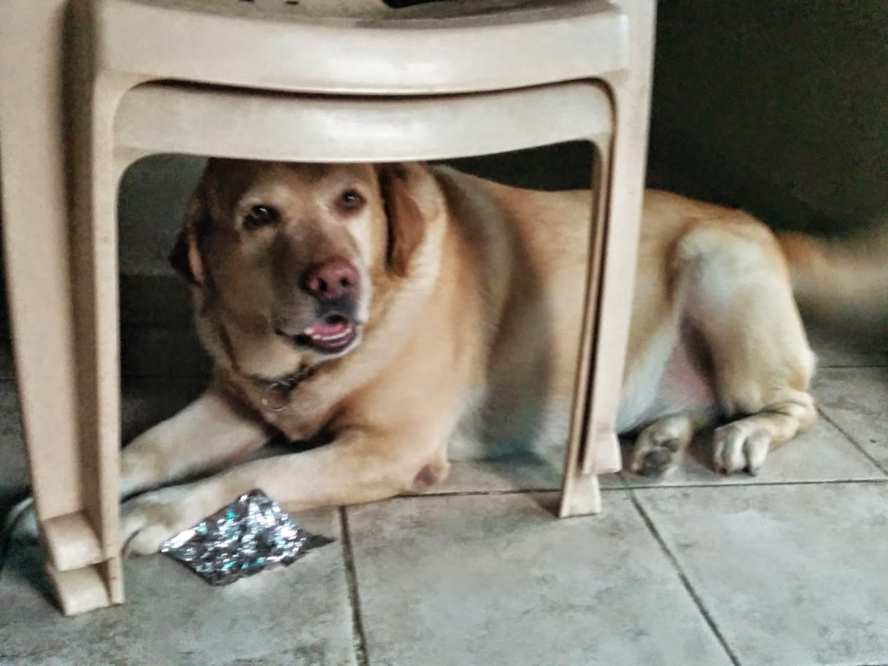

It's going to be a week tomorrow, since we lost a member of our family, our dear pet dog, Roger. A lot of you already know bits and pieces about him through my previous posts. No matter how prepared you are for the eventuality, death silently paws softly through sleep as easily as the drop of the droopy eyelids, closing in the memories that zoom past those brown eyes, reliving in those final moments, the beautiful years of a lifetime well spent...

_[**Woof With Luv**](http://woofwithluv.com/) is a platform purely for the dogs you have, and have had, loved, cherished and unfortunately lost. They say, once you have experienced the love of a dog, you can never live without one. A tribute, then, is the least we can do for them, for the undying, unconditional love we are bestowed with._ Soon after Roger passed away, I was approached by this website to write and dedicate a tribute to him. I am touched with the idea of this simple yet thoughtful platform that the guys at [**Woof With Luv**](http://woofwithluv.com/) had come up with, which allows dog lovers to vent their emotions and share their thoughts and memories that our lost beloved pets so rightfully deserve, just as much as our human loved ones do when we lose them. Here's a snippet of the words of tribute dedicated by me to my darling boy, Roger:

**Leaping through emotions – with Roger**

The house seems scrupulously clean now. More organized since you were around – and a lot more vacant. Every surface that was coated with the fur you shed is now squeaky clean and shining. But the shine is nowhere near your luminous eyes. Those loving bright eyes that used to come searching for me when I would be out of sight. The bushy tail that would wag nineteen to the dozen in tandem with the yelps of joy that greeted me with the same intensity when I would step into the house, no matter how long I was gone. I miss that the most when I step into this vacant lifeless house now.

 

 

<table class="tr-caption-container" style="margin-left: auto; margin-right: auto; text-align: center;" cellspacing="0" cellpadding="0" align="center"><tbody><tr><td style="text-align: center;"></td></tr><tr><td class="tr-caption" style="text-align: center;">Caught in the act of licking a chocolate wrapper clean!</td></tr></tbody></table>

Read my entire post of tribute to Roger, here on **[Woof With Luv: Leaping through emotions – with Roger](http://woofwithluv.com/pet/roger/).**

Do spend a few moments and read [this](http://ifsbutsandsetcs.com/2014/04/19/romp-ades-rogue-ades-with-roger/) previous blog post that I had written about Roger, if you hadn't read it in the past.
