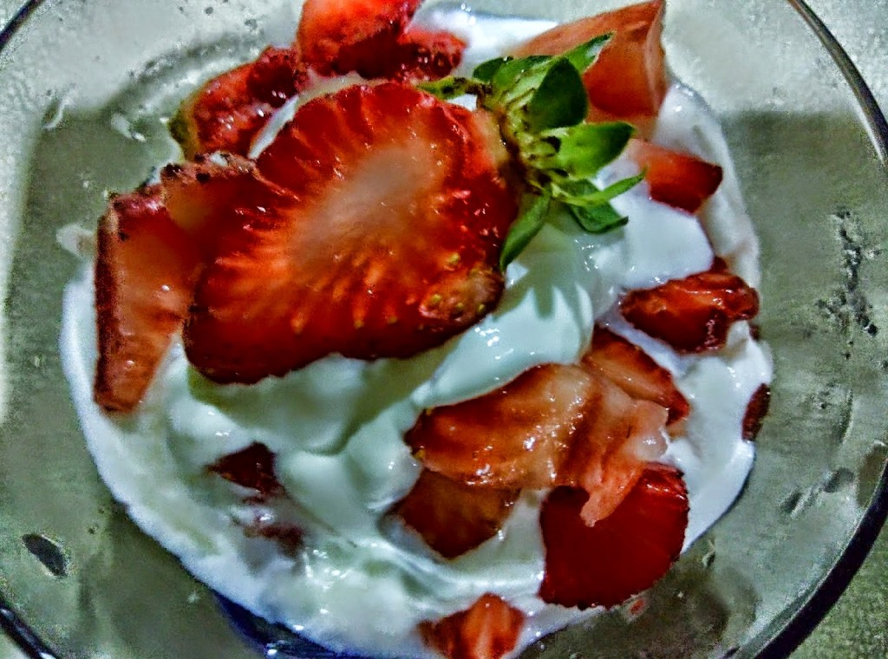

So well, I've been putting off blogging for a while now. At the risk of sounding repetitive, I admit that I've been feeling a bit emotionally spent after my pet dog Roger's death two weeks back. I somehow was not in a mood to share what I wrote. Yes, I did write all this while but not something that I would wish to share at this point.Valentine's day came with its usual cheer of red and pink hearts, although I'm no longer a big fan of this festival of love. I've had my share of mush in the past - roses, chocolates, exchanging gifts and the works. But over a period of time I've started feeling that dedicating just this one day to express your love is pretty illogical. What if you do not live to see the next Valentine's day? Would it then not make sense to reach out to your loved ones all year through instead of just pampering them on this one day that you and me are not even sure if we might get to see next time around. Just like my Roger. What if he was a dog?  His unconditional love for me was a big loss, and I missed his presence on this Valentine's day...just as on the other days. To top it, I dreamed of him last night, waiting for me at the vet's clinic, to take him back home hale and hearty. That dream was probably Roger's Valentine gift to me. The thought that I could love him back during those days that had nothing to do with Valentine's day was a big solace. So my friends - _seize the moment NOW_...don't wait for a special day to say it with gifts and flowers. Act and express. Coz' actions speak louder than words. Spend time, share thoughts, snuggle close with your dear ones and those moments could give a new meaning to the word 'love.'

On this Valentine's day, my son surprised me with a beautiful ornate clutch. I'd have to wait for the right occasion to carry this elegant piece though. The gesture touched me not for the materialistic part of it, but the surge of pride that I feel for having done something right to see my son turning into a fine young gentleman, sensitive enough to treat women right. And no, my definition of a gentleman is not with regards to the gift. He's been a little more of a sweetheart off late, helping me around in my chores or just hanging around to give me company when I'm trying to wind off with those monotonous errands, especially since I've been facing some issues with our daily domestic help lately. This is the kind of treatment every woman deserves from men around her. You don't need to shower her with gifts, but make her feel valued with your actions and she's sure to cherish that feeling of being treasured forever.

<table class="tr-caption-container" style="margin-left: auto; margin-right: auto; text-align: center;" cellspacing="0" cellpadding="0" align="center"><tbody><tr><td style="text-align: center;"></td></tr><tr><td class="tr-caption" style="text-align: center;">The Valentine's day gift from my son...super,&nbsp;isn't it&nbsp;?!</td></tr></tbody></table>

Well, that was quite a lot of heavy stuff for a happy day like Valentine's. So let me spread some cheer with these delicious looking pictures I clicked a few days back when I tried my hand at making some fresh strawberry jam. The streets here are dotted with an abundance of juicy red strawberries, huge and plump, greeting us merrily from wicker baskets. A friend recently had mentioned to me about his recipe of this yummy strawberry jam that was absolutely fuss free and super easy to make. It got me tempted to try it myself (Incidentally,  he's the same friend who had tempted me to lose some of my excess weight a few years back by gifting me a life changing book on food habits. Read the blog post in which I wrote about it [here](http://ifsbutsandsetcs.com/2014/04/17/how-i-lost-my-weight-and-not-my-mind/). Pretty ironical that he's lured me into trying this forbidden yet sweet treat). So here's the recipe, in case you might get tempted to try it too:

**Ingredients:**

Diced red ripe strawberries - 1 Kg Powdered sugar - About 8 teaspoons or as per taste. Salted Butter - 1 teaspoon, just enough to grease the pan.

**Method:** Heat the butter in a pan. Toss in the diced strawberries. Keep stirring till the strawberries are soft and runny. Ensure that the mix doesn't stick to the pan. Add sugar and adjust to taste. You could add more sugar depending on how tangy the berries are. On slow flame, stir till the mixture turns into a thick paste leaving the sides of the pan. Let cool. Store it in a dry jar and refrigerate.

<table class="tr-caption-container" style="margin-left: auto; margin-right: auto; text-align: center;" cellspacing="0" cellpadding="0" align="center"><tbody><tr><td style="text-align: center;"></td></tr><tr><td class="tr-caption" style="text-align: center;"><b>Enjoyed clicking these more than making the jam :) Recipe Credit: Nirav Sanghavi</b></td></tr></tbody></table>

This is one helluva heavenly option as compared to the commercially available bottled synthetic tasting jams, since it has no added preservatives or artificial colors and flavors. It goes well with toasts, pancakes, desserts and just about anything. The best part is the texture of the jam which has bits of fresh strawberry surprising your taste buds on and off when you're at it. It stays fresh in the refrigerator for about an year if the liquid oozing from the berries had evaporated well in the pan. Mine did not last for more than two weeks, coz' there was none left. We polished off every trace of it from the jar. My son absolutely loved it! Time to make more.

The next time around I made my usual strawberry-cream and missed having Roger around, begging for his share. Oh dear...I just can't seem to get him off my mind! I do hope he had an amazing Valentine's day up there with all the beautiful doggie souls around him. I'm sure God pampered all these furry angels with lots of creamy-slurpy strawberry treats! After all, aren't each of those dogs, so much more special to have loved their people unconditionally during their lifetimes, with no strings attached. So here's raising a toast slathered with the sinful strawberry jam for each of them. Happy Valentine's day dearies :)

 

<table class="tr-caption-container" style="margin-left: auto; margin-right: auto; text-align: center;" cellspacing="0" cellpadding="0" align="center"><tbody><tr><td style="text-align: center;"></td></tr><tr><td class="tr-caption" style="text-align: center;">Source: Google Images</td></tr></tbody></table>

Linking this to the Wordy Wednesday prompt at [B-A-R](http://www.inlinkz.com/new/index.php): ['Love for all seasons.'](https://blogarhythmblog.wordpress.com/2015/02/11/wordy-wednesday-4-at-b-a-r-and-blogging-tip/)

