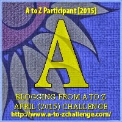

My theme for this year's

 Blogging from A to Z Challenge is called the

**_["THE POWER OF TWO."](http://ifsbutsandsetcs.com/2015/03/22/the-power-of-two/)_** 

And what goes into that is this:

 _A piece of fiction, a poem, a few random thoughts surrounding those two words called **phrasal verbs**. It could be just about any medium of expression through the written words, possibly with reference to a quote/ thought/ saying._

Although let me tell you, I am no expert in grammar - so these posts are not really educational posts. I will just play with the words that fall under the category of phrasal verbs and loosely try to weave my write-ups around these words!

\*\*\*

Today's words are '**AIM HIGH.'** 

Doesn't it add so much more to the word AIM when there's a HIGH behind it?

And yet another two words '**ACT UPON'** here in my post when linked together

 lend meaning to each other in a different way

<table class="tr-caption-container" style="margin-left: auto; margin-right: auto; text-align: center;" cellspacing="0" cellpadding="0" align="center"><tbody><tr><td style="text-align: center;"></td></tr><tr><td class="tr-caption" style="text-align: center;">Source:&nbsp;<a href="http://pixabay.com/">http://pixabay.com/</a></td></tr></tbody></table>

 

_**_The biggest problem in life_**_

_**_isn't the problem itself_**_

_**_But how people ACT UPON it._**_

She looked up at people all the time. While people looked down at her. Someday it would all change, she had told herself.

It was for her mother who always encouraged her to **aim high,** and **act upon** it no matter where she stood.

What if she was 4 feet something tall? Today she looked down at the crowd that cheered looking up to her as she carefully yet swiftly balanced her tiny frame walking on the tight rope, stretched several feet high above the ground against the blue skies above the stadium that hosted a prestigious international sports event.

It wasn't a shiny medal that she eventually bagged, that she had aimed for. It was the heights that had always mocked her that she had conquered.

_**AIM HIGH**_

_**Even if you fall short,**_

_**You'll still get**_

_**Where you are supposed to be**_

Linking this to the [Blogging from A to Z (April 2015)](http://www.a-to-zchallenge.com/) for the letter A.

