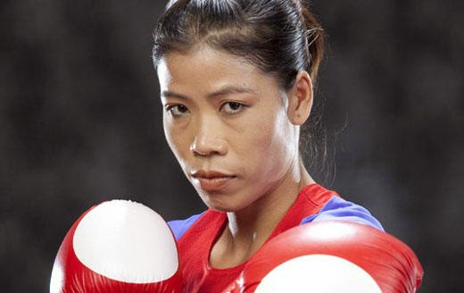
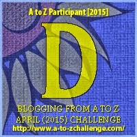

My theme for this year's

Blogging from A to Z Challenge is called the

**[_"THE POWER OF TWO."_](http://ifsbutsandsetcs.com/2015/03/22/the-power-of-two/)**

**Click [here](https://www.blogger.com/) to read more about it.**

**\*\*\***

Today's words are

**'Deal with.'**

which literally means to take action to do something,

 especially to solve a problem.

The world says you can't, but you know you should. What strikes to you as right but to others as wrong are collective fences we've built around ourselves, trapping our minds in the space that society created for us without an afterthought for individual needs. Sometimes one needs to figure out what's best for us individually by stepping out of this restricting mindset that we have been conditioned to think with. **Deal with** these dogmas and break free from the shackles that bind us into restrictions cause' one glove can never fit all and it sure is a big deal - to **deal with** something that fits you poorly. So, go find your glove and slip your soul into it with spirited abandon!

<table class="tr-caption-container" style="margin-left: auto; margin-right: auto; text-align: center;" cellspacing="0" cellpadding="0"><tbody><tr><td style="text-align: center;"></td></tr><tr><td class="tr-caption" style="text-align: center;">
<i style="text-align: left;"><b>In a country where living with dignity is an everyday fight for most women, Mary Kom has been awarded the third highest award of the State, The Padma Bhushan. This honor has been bestowed upon her for her contribution to Indian sports and boxing. As a mother of two, Mary Kom must have faced huge challenges In her sports career, but they did not deter her from winning at the Olympics 2012. Mary is an inspiration to all the women that sports can be taken up as a profession too. She was successful in her field, Even though Indians don't see boxing as a women's sport, she showed us that one can achieve anything if one puts her mind to it:&nbsp;<a href="http://www.memsaab.com/">Source</a></b></i>
</td></tr></tbody></table>

**_The only way to deal with an unfree world_**

**_is to become so absolutely free_**

**_that your very existence is an act of rebellion._**

Linking this to the [Blogging from A to Z (April 2015)](http://www.a-to-zchallenge.com/) for the letter D.

 

