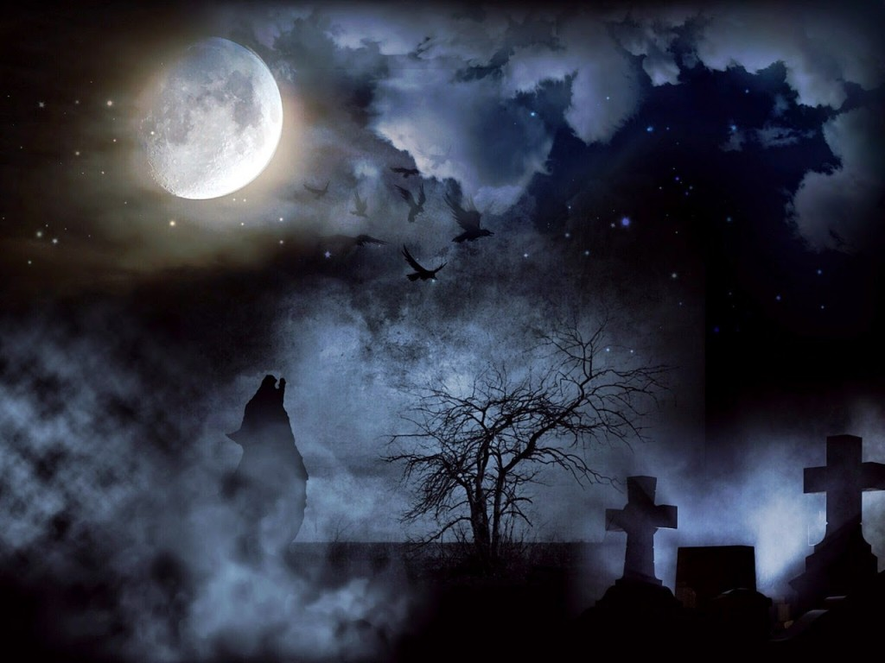

My theme for this year's

Blogging from A to Z Challenge is called the

**[_"THE POWER OF TWO."_](http://ifsbutsandsetcs.com/2015/03/22/the-power-of-two/)**

**Click [here](https://www.blogger.com/) to read more about it.**

**\*\*\***

Today's words are

**'Embark on'**

  which mean

to start doing something.

<table class="tr-caption-container" style="margin-left: auto; margin-right: auto; text-align: center;" cellspacing="0" cellpadding="0" align="center"><tbody><tr><td></td></tr><tr><td class="tr-caption" style="font-size: 12.8000001907349px;">Source:&nbsp;<a style="font-size: 12.8px;" href="http://pixabay.com/">http://pixabay.com/</a></td></tr></tbody></table>

All he wished was a little fun

Warm himself when out in the sun

Supposed to be no strings attached, yet

tangled she chose to get

Sharp he snipped

leaving loose ends trailing

 Off his limits she was cordoned off

to teach a lesson he thought she'd learn

One shrill ring

Two stiff hellos

And down the sucking drain of revelation

went his perfectly blinded marriage.

_**Before you embark on a journey**_

_**of revenge dig two graves**_

_**~Confucius~**_

Linking this to the [Blogging from A to Z (April 2015)](http://www.a-to-zchallenge.com/) for the letter E.

