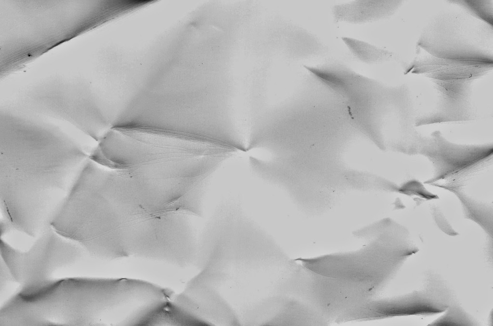
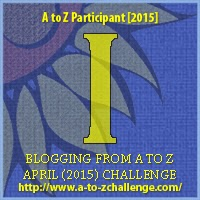

My theme for this year's

Blogging from A to Z Challenge is called the

**[_"THE POWER OF TWO."_](http://ifsbutsandsetcs.com/2015/03/22/the-power-of-two/)**

**Click [here](https://www.blogger.com/) to read more about it.**

**\*\*\***

Today's words are

**'Iron out****'**

  which mean to make smooth or flat by or as if by pressing

or to resolve or work out a solution.

<table class="tr-caption-container" style="margin-left: auto; margin-right: auto; text-align: center;" cellspacing="0" cellpadding="0" align="center"><tbody><tr><td style="text-align: center;"></td></tr><tr><td class="tr-caption" style="text-align: center;">Source:&nbsp;<a style="font-size: 12.8px;" href="http://pixabay.com/">http://pixabay.com/</a></td></tr></tbody></table>

Iron out the creases

wishfully I tried...

dissipate differences

 and ease out the folds

of  brittle undulations

that ruled my life

Digging deep furrows

 along the page

with yet another try

 to pat soft and level

 rough crinkled emotions

 into healing smoothness

Ending up

crushed beyond repair

 with every attempt to mend

the once-even sheet of my life

Leading me today

 to where I lie

No more creases

No more lines

As the crumpled me

Crumbles into ashes

 on my pyre.

 **_Life will forever unfold_**

 **_to reveal its creases,_** 

**_some of those creases_** **_will iron out,_**

**_while others will_** **_just remain permanent._**

Linking this to the [Blogging from A to Z (April 2015)](http://www.a-to-zchallenge.com/) for the letter I.

