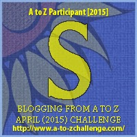

My theme for this year's

Blogging from A to Z Challenge is called the

**[_"THE POWER OF TWO."_](http://ifsbutsandsetcs.com/2015/03/22/the-power-of-two/)**

**Click [here](https://www.blogger.com/) to read more about it.**

**\*\*\***

Today's words are

**'Sail through****'**

which means to make progress with something quickly and easily.

<table class="tr-caption-container" style="margin-left: auto; margin-right: auto; text-align: center;" cellspacing="0" cellpadding="0" align="center"><tbody><tr><td style="text-align: center;"></td></tr><tr><td class="tr-caption" style="text-align: center;">Source:&nbsp;<a style="font-size: 12.8000001907349px;" href="http://pixabay.com/">http://pixabay.com/</a></td></tr></tbody></table>

He eyed the surfboard with longing. A longing to slice through the surf. Of crazy wind blowing through his tousled hair. Of the madness of the wild waves which he would skillfully conquer, bobbing up and down in rhythm to the rapturous tunes of violin, which seeped into each of his cell from the headphones plugged on his ears, as he handled the rebellious sea. It all zoomed by his eyes as he drifted away in a spell of day dreaming.

And suddenly the waves crashed hard on to the rocks breaking his reverie as the loud crash resounded taking him back to the fateful day when he crashed into that gaint rock, losing his control to land onto the jagged rocks that left him disabled for life.

The sun was up and bright. It was time the kids would arrive. There they were, the enthusiastic lot of them, waiting on the terrace of his beach house in anticipation for him to start. As he started to adjust his violin to his shoulder and saw the kids ape him to perfection, and their first few notes of rhapsody mingled with the sounds of the sea,  he realized how much pleasure this activity gave him...surprisingly much more pleasure and contentment than surfing in the sea. It wasn’t just a means of making a living for himself but a lifeline that helped him **sail through** his adversity, connecting him to his brand new enriched life.

**_God enabled us to sail through all winds of the storm_**

**_Winds that bring sickness, tragedy, failure and disappointment in our lives_**

**_We can soar above the storm._**

**_Remember, it is not the burdens of life that weigh us down;_**

**_It is how we handle them._**

 

Linking this to the [Blogging from A to Z (April 2015)](http://www.a-to-zchallenge.com/) for the letter S.

