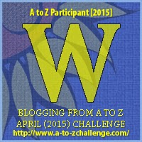

My theme for this year's

Blogging from A to Z Challenge is called the

**[_"THE POWER OF TWO."_](http://ifsbutsandsetcs.com/2015/03/22/the-power-of-two/)**

**Click [here](https://www.blogger.com/) to read more about it.**

**\*\*\***

Today's words are

**'Walk away****'**

which means to abandon someone or something;

 to go away and leave someone or something.

<table class="tr-caption-container" style="margin-left: auto; margin-right: auto; text-align: center;" cellspacing="0" cellpadding="0" align="center"><tbody><tr><td style="text-align: center;"></td></tr><tr><td class="tr-caption" style="text-align: center;">Source:&nbsp;<a style="font-size: 12.8000001907349px;" href="http://pixabay.com/">http://pixabay.com/</a></td></tr></tbody></table>

_"Where the hell have you been?"_ he barked at Shradha as she walked into their shabby apartment. _"Told you, I'd be late,"_ she replied quietly, getting busy trying to clear the mess that her unemployed husband of five years had managed to spread around his surroundings in the entire day. Empty cans of beer, bits of potato chips hung onto the sofa tapestry while making their way there half eaten from the packet that was flung about carelessly that spoke about his usual routine, ever since the day he was forced to resign from his workplace when he was caught red handed for accepting a hefty bribe from a client. The word spread around in the industry and prospective employers rejected him outright. Ever since then he had grown into this bitter parasite that sucked on his wife's earnings and respect, refusing to find a solution to his problems.

_"Late for what?"_ he questioned her rudely, stubbing his cigarette in the ashtray overflowing with a huge pile of ash interspersed with the day's stubs, _"Who were you with? Out on a secret rendezvous with your lover again...weren’t you?"_ She lowered her gaze and let out a cold sigh. _"There's no one. I've told you so many times. It's year ending and I had to wind up quite a bit at work. You know how it is, Suhas. You've worked in corporate offices too,"_ she replied her patience wearing out with the number of explanations that she was fed up of giving her mentally sick and paranoid husband, each day for no fault of hers.

_"Oh yes, I know how it is...or rather I knew how it was…since that was quite a while ago that I had been to work! Rub it in, you arrogant woman!"_ he snapped at her as he flung a glass vase at her in rage. The vase cracked on her forehead even as she tried to duck it. Ruby red blood trickled down the side of her face mingling with the day's sweat and tears from years of abuse, forming into a strong resolve to end it all.

She had no intention of killing a man who was already dead - brain dead. Someone, who refused to help himself and blamed the rest of the world for his miseries. All she needed to do was live her own life, with her head held high. She had to **walk away**. She collected herself, carefully wiped her wound with an antiseptic and dressed it with bandage. The next few moments saw her calmly get her essentials together in a suitcase. She left without looking back at the intoxicated man sprawled clumsily on the couch taking out all his anger punching on the poor remote control, flicking furiously between the blaring TV channels. He was oblivious of her departure, unaware of the fact that the only target for his frustrations from now on would be that tiny rectangular device that he held in his hand. She refused to be his remote control anymore.

**_Respect yourself enough to_** 

**_walk away from anything that_**

**_no longer serves you,_**

**_grows you,_**

 **_or makes you happy._**

 

Linking this to the [Blogging from A to Z (April 2015)](http://www.a-to-zchallenge.com/) for the letter W.

