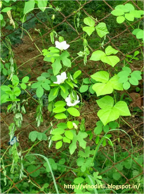
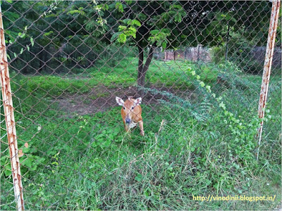
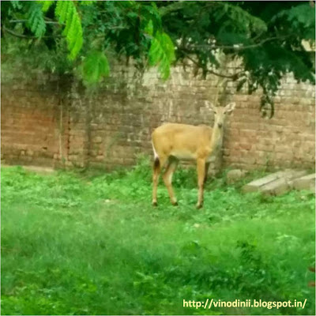
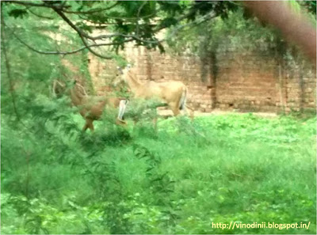
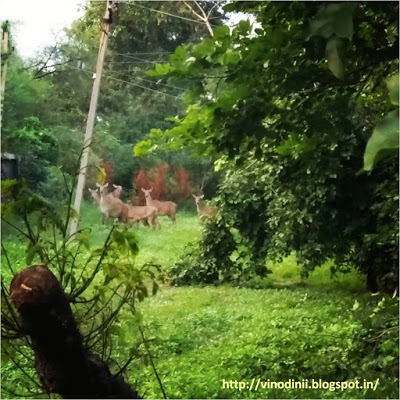
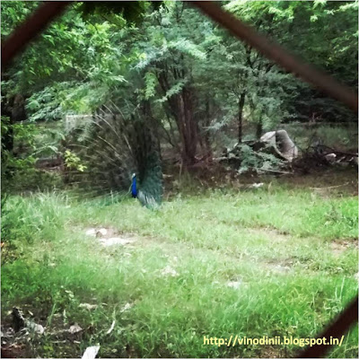

The peacocks scream noisily in the background, as I slowly whisper into my cellphone, _"Mum, do you hear that?"_ and, she replies amusingly with a yes. As I pace up and down holding my post-lunch conversation with her under the shade of trees trying to escape the searing heat of Santej, the only connect I have with the world outside, is my smartphone, the internet and the office full of corporate employees I work with who seem to have merged into this wilderness of my work campus with their daily routines.Engrossed in my conversation, I suddenly spot a butterfly winging by, the brightest shade of flaming orange. The kind you'd spot in those high definition television adverts. It lingers for a second on the stalk of a wild flower and I'm tempted to click it, but the ongoing telephonic conversation prevents me from doing so. I go on chatting with her my eyes still on it. And suddenly, something scampers by. By the time I shift my focus I realize it is a mongoose that just disappeared into the bushes. And hey, did I just spot the most beautiful pair of love birds? Or wait...are they miniature sparrows, if such species exist at all.

 

<table class="tr-caption-container" style="margin-left: auto; margin-right: auto; text-align: center;" cellspacing="0" cellpadding="0" align="center"><tbody><tr><td style="text-align: center;"></td></tr><tr><td class="tr-caption" style="text-align: center;"><strong>When three is not a crowd.</strong></td></tr></tbody></table>

On some days, I chance upon a tiny snake, about a feet long, slithering away from the porch that leads to my office sinking towards the cool comfort of grass, disappearing as soon as it appears. On a few occasions, there is long grey one crossing the road, causing people passing by to sensationalize its appearance. We watch, we let it go by, slipping into the pit of stagnant rain water that looks more like a pond and we offer reverence to it if it appears to look more like a cobra.

On my way back when the sun is dipping orange-pink, I spot my favorite herd of Nilgais. nibbling on grass blades. I start clicking them in excitement every time I spot them at a stone throw distance, forgetting how camera-shy they are, till one of them sees me, scampers away, alarmed as though he saw a ghost and the rest of the herd follows fleeing for their life. Now, every evening I try mastering the art of clicking them without them realizing that I'm clicking them on the sly, by walking on without halting. But damn! They are so sensitive. The moment they find my eyes on them now, they start playing hide and seek, which is amusingly adorable yet frustrating when I'm unable to get that perfect click. I almost feel like paparazzi.

 

<table class="tr-caption-container" style="margin-left: auto; margin-right: auto; text-align: center;" cellspacing="0" cellpadding="0" align="center"><tbody><tr><td style="text-align: center;"></td></tr><tr><td class="tr-caption" style="text-align: center;"><strong>What the hell is she doing?</strong></td></tr></tbody></table>

 

<table class="tr-caption-container" style="margin-left: auto; margin-right: auto; text-align: center;" cellspacing="0" cellpadding="0" align="center"><tbody><tr><td style="text-align: center;"></td></tr><tr><td class="tr-caption" style="text-align: center;"><strong>Did she just click a picture of mine?</strong></td></tr></tbody></table>

<table class="tr-caption-container" style="margin-left: auto; margin-right: auto; text-align: center;" cellspacing="0" cellpadding="0" align="center"><tbody><tr><td style="text-align: center;"></td></tr><tr><td class="tr-caption" style="text-align: center;"><strong>Guys, run! We're without makeup!</strong></td></tr></tbody></table>

<table class="tr-caption-container" style="margin-left: auto; margin-right: auto; text-align: center;" cellspacing="0" cellpadding="0" align="center"><tbody><tr><td style="text-align: center;"></td></tr><tr><td class="tr-caption" style="text-align: center;"><strong>Ah...safe now, from this distance. Gawd...is she ever going to</strong> <strong>&nbsp;give up&nbsp;on hounding us?</strong></td></tr></tbody></table>

But tell you what, as much as I love absorbing the nature and wildlife here, the peacocks screeching constantly in the background has got to me. Don't know why, but I've started feeling like they do it to mock me, coz' it looks like their cacophony goes up when I step closer. Till the time I come across a quiet one dancing in a solitary corner all fanned out in its vibrant blues, and I get mesmerized like a child at the wondrous sight yet again no matter how many times I get to see it.

<table class="tr-caption-container" style="margin-left: auto; margin-right: auto; text-align: center;" cellspacing="0" cellpadding="0" align="center"><tbody><tr><td style="text-align: center;"></td></tr><tr><td class="tr-caption" style="text-align: center;"><strong>A sight to behold.</strong></td></tr></tbody></table>
