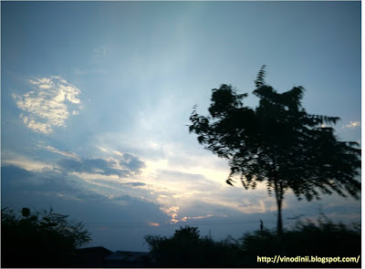
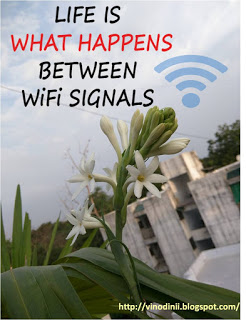

When was the last time you did not see a screen in front of you and feel comfortable with yourself? Be it your dearer-than-life smartphone, or your precious lappy/tab. And, if those were not enough the idiot box comes in to complete the picture. Speaking for myself, I'd say it is only a couple of seconds without these gadgets and my mind goes back to the most accessible of them all, my cellphone. The focus on whatever I was doing breaks like a spell right then and there, as I open my little window to the world, and its incessant updates, a lot of them that I could do without but I still absorb all the needless chatter.The recent riots related to the _Patidar_ issues in Gujarat, left us stranded without internet in the state, with the government deciding to control rumour-mongering that was happening through this media. Well, like anything you are habituated to, this ban on internet did hit us hard. But as we settled to the idea of not being accessible all the time, the next few days seemed like bliss. Things that one seemed to have forgotten doing in the past few years slowly made their way to the forefront. Small things that made a big difference in our day-to-day lives.

Gone are the days when we could just sit around in the warmth of our easy camaraderie and enjoy the simple joys of human company. With each of us immersed in our own private hell social media world we do not for a second realize that even as we're seated besides each other, lost in an unreal world within our screens, we have distanced ourselves into a cocoon of loneliness that most of us do not even have an inkling of.

Armed with this self-realization, these days I make small attempts to get away from this madness in small spurts. Still a long way to go, but the realization itself is an eye-opener. Here are some small pointers that I'm resorting to that might probably help all of us who are bereft of quality time:

-  _Twice in a day, I leave my phone for charging in another room and curb my temptation to check it for the duration that it takes to get charged completely._

 

- _I also make sure that I keep myself from checking my phone while I'm traveling, especially when I'm zipping through scenic landscapes, which I regularly do, and in turn I end up discovering the most enchanting sights that I would have otherwise missed had I been glued to my phone._

 

- _Clicking pictures of everything interesting that comes my way has also been rationed on. Somewhere along the line, I've realized that I could either completely enjoy the experience or have a diluted version of the experience if I busied myself clicking it. I would rather that I absorb the sight in my senses than freeze it on my camera._

 

- _I resist the urge to check the phone immediately as soon as it beeps every time, reminding myself that my life did not depend on that one message. And if it did, the person would have been concerned enough to call me to save my life!_

 

- _I keep the mute-mode on in a lot of online groups that I belong to for long periods. I participate in some of those chats once in a while to keep in touch with my buddies /ex-colleagues /bloggers /relatives, but on other days I prefer to filter through half the forwarded messages and videos, deciding stringently on the kind of stuff I want to be exposed to or devote my time to._

 

- _The lappy gets my attention these days only during work hours, that too with intermittent breaks to walk up to that colleague's work station and talk to him in person, rather than chat with or call him on the phone. And better still, I take a stroll outdoors on and off to get some fresh air. It took me a small attack of carpal's tunnel syndrome a few years back,_ _to be cautious on this one now._ _It required me to give up using my lappy for a couple of days as per the doc's advice, and I'm sure you'd agree that in the present age, being off your gadgets completely is not exactly a good antidote for a healthy professional life._

 

-  _I've been lucky as far as the television is concerned ever since it crashed a few days back. But, in any case I limit my television viewing to weekends. During weekdays its hopping through some music channels to kick start my day and a light English comedy to unwind with after a tiring day at work. I stay away from heavy-duty melodramatic soaps. Don't we have enough of that drama happening in our own lives anyway?_

 

- _Half an hour before bedtime, I switch my phone to aeroplane mode and read a good book in the soft yellow light of my bedside lamp till my eyes get droopy with sleep. And trust me, this is the most calming ritual of the day that I could ever follow. Only for the sake of being accessible in case of emergencies I need to keep switch my phone back to normal mode before I snooze but there is a conscious attempt to not check my phone randomly through the night._

 

Simple measures but they have added hours of quality moments to my normally packed days. I now have time to savor the juicy flavors of my food, to observe, listen and converse with real people around me, admire that tiny yellow wildflower sitting amidst the lush greenery of weeds, decipher the meaning of what the chirping birds are trying to tell me, mull on the depth of the lyrics of the soulful music I listen to, soak in the pastel hues of the setting evening sun, and get lost in the intriguing thoughts of my book's characters - the one that I'm reading and the one that I'm writing (yes...this routine sure has put some of my priorities firmly in place!).

<table class="tr-caption-container" style="margin-left: auto; margin-right: auto; text-align: center;" cellspacing="0" cellpadding="0" align="center"><tbody><tr><td style="text-align: center;"></td></tr><tr><td class="tr-caption" style="text-align: center;"><strong>A rare click on my way home.</strong></td></tr></tbody></table>

As I type this post on my phone (I need to stop this too!) lying next to my sleeping son, his soft breathing tempts me to break away from the noise of the screen yet again, and just be. Wanting to enjoy this moment of quietude...this moment of nothingness...of each other's calm company outside the screen. The way it used to be.

<table class="tr-caption-container" style="margin-left: auto; margin-right: auto; text-align: center;" cellspacing="0" cellpadding="0" align="center"><tbody><tr><td style="text-align: center;"></td></tr><tr><td class="tr-caption" style="text-align: center;"><strong>My&nbsp;favorite scent of life.</strong></td></tr></tbody></table>
